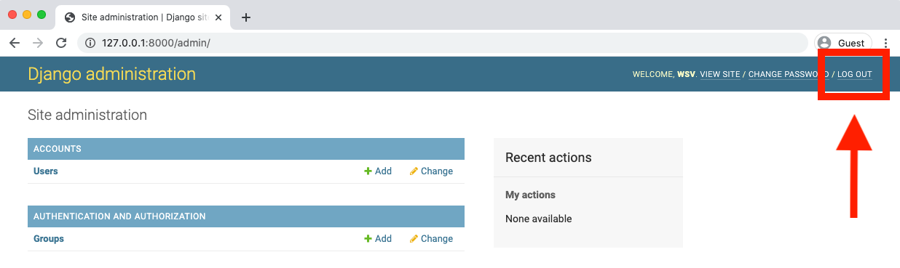
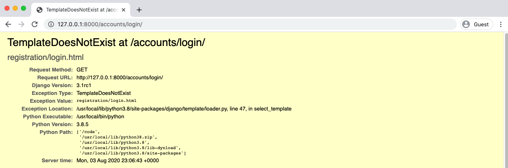
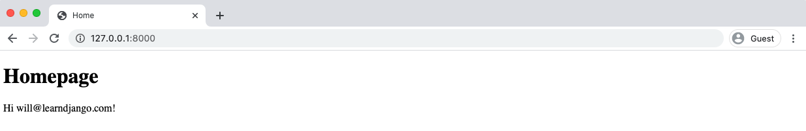
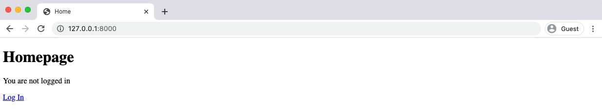
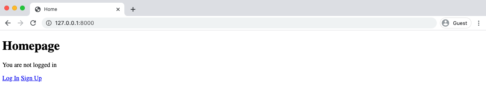
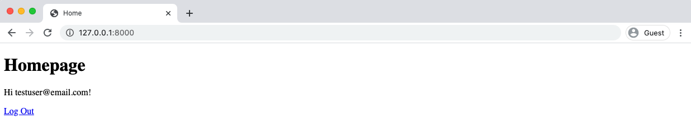

<div dir='rtl' align='right'>

# فصل  پنجم : User Registeration


یک ویژگی مهم در وب سایت های پویا، بحث ثبت نام کاربران است. این مسئله در پروژه فروشگاه کتاب مورد نظر ما نیز وجود دارد. در این فصل به پیاده سازی موارد ورود به سایت، خروج از سایت و ثبت نام در سایت می پردازیم. از آنجایی که جنگو ویوها و url لازم برای دو مورد ورود و خروج از سایت را در اختیار ما قرار می دهد، پیاده سازی دو مورد اول نسبتا راحت است اما پیاده سازی مورد ثبت نام به دلیل اینکه هیچ راه حل داخلی از پیش تعریف شده ای برای آن در جنگو وجود ندارد، چالش برانگیز است.

## Auth اپ


بیایید با پیاده سازی دو مورد ورود به سایت و خروج از سایت با استفاده از سیستم احراز هویت [auth](https://docs.djangoproject.com/en/3.1/topics/auth/default/) app جنگو شروع کنیم. جنگو، ویو ها و url های مهمی را دراختیارمان قرار میدهد و این یعنی ما فقط به یک تمپلیت ای برای بروزرسانی کارهایی که میبایست انجام دهیم نیاز داریم. این کار زمان زیادی را برای ما به عنوان یک توسعه دهنده ذخیره کرده و تضمین می کند که مرتکب اشتباهی نخواهیم شد. زیرا کد اصلی قبلا توسط میلیونها توسعه دهنده مورد آزمایش و بهره برداری قرار گرفته است.


با این حال، این سادگی در پیاده سازی موجب می شود افرادی که در جنگو تازه کار هستند دچار حس "جادویی بودن" شوند. ما برخی از این موارد را در کتاب خود  [Django for Beginnets](https://djangoforbeginners.com/)، پوشش داده ایم اما با این وجود سرعت خود را کاهش نداده و کد منبع اصلی نگاه نکرده ایم. مقصود برای یک تازه کار این بود که به صورت گسترده توضیح داده و نشان دهیم که "چگونه" به درستی ثبت نام کاربر را پیاده سازی نماییم اما این واقعا به قیمت فرو رفتن در اینکه "چرا" از آن کد استفاده کرده ایم تمام شد.


از آنجایی که این یک کتاب بسیار پیشرفته است ما برای فهم بهتر کد منبع عمیق تر خواهیم شد. رویکردی که در اینجا مطرح می شود می تواند برای کشف سایر عملکردهای داخلی جنگو هم به تنهایی مورد استفاده قرار گیرد.

اولین کاری که نیاز به انجام آن داریم این است که مطمئن شویم `auth` app  به تنظیمات `INSTALLED_APPS` اضافه شده است. ما قبلا appهای خود را به اینجا افزوده ایم، اما آیا تابه حال به app های داخلی که جنگو به صورت خودکار برایمان اضافه می نماید توجه کرده اید؟ به نظر میرسد جواب خیر باشد. بیایید حالا این کار را انجام دهیم.


<div dir="ltr" align='left'>

Code
```python
# config/settings.py
INSTALLED_APPS = [
    'django.contrib.admin',
    'django.contrib.auth', # Yoohoo!!!!
    'django.contrib.contenttypes',
    'django.contrib.sessions',
    'django.contrib.messages',
    'django.contrib.staticfiles',

    # Local
    'accounts',
    'pages',
]
```

</div>


درواقع جنگو 6 اپ برایمان آماده نموده است که باعث قدرتمندی سایت می شود. اولین آن admin و دومی auth است. ما به این شکل متوجه شدیم که auth app اکنون در پروژه جنگو ما وجود دارد.


وقتی که ما برای بار اول دستور migrate را اجرا می کنیم، تمامی این Appها با هم در پایگاه داده اولیه لینک و متصل شده اند. و به خاطر داشته باشید که ما از تنظیمات `AUTH_USER_MODEL` استفاده نموده ایم تا به جنگو اعلام کنیم تا از user model خودمان استفاده کند نه user model پیش فرضی که اینجا وجود دارد. به همین دلیل باید قبل از اولین اجرای migrate ، تا زمانی که این
پیکره بندی کامل شود، صبر نماییم.


## Auth های اپURL ها و View

به منظور استفاده از auth app داخلی جنگو، ما باید آن را به فایل `config/urls.py` اضافه کنیم. ساده ترین روش این است که فایل `/accounts` به عنوان پیشوند قرار بگیرد چون عموما در جامعه جنگو از این حالت استفاده می شود. یک خط را در زیر تغییر دهید. توجه کنید که هر چقدر طول فایل `urls.py` افزایش یابد، افزودن کامنت برای هر بخشی از URL-admin, user management, local apps,... به خوانایی کد کمک خواهد کرد.


<div dir="ltr" align='left'>

Code
```python
# config/urls.py
from django.contrib import admin
from django.urls import path, include

urlpatterns = [
    # Django admin
    path('admin/', admin.site.urls),

    # User management
    path('accounts/', include('django.contrib.auth.urls')), # new

    # Local apps
    path('', include('pages.urls')),
]
```

</div>


چه چیزی به auth app اضافه شده است؟ به نظر می رسد چیزهای زیادی اضافه شده باشد. قبل از همه تعداد زیادی url های مرتبط وجود دارد.


<div dir="ltr" align='left'>

Code
```python
accounts/login/ [name='login']
accounts/logout/ [name='logout']
accounts/password_change/ [name='password_change']
accounts/password_change/done/ [name='password_change_done']
accounts/password_reset/ [name='password_reset']
accounts/password_reset/done/ [name='password_reset_done']
accounts/reset/<uidb64>/<token>/ [name='password_reset_confirm']
accounts/reset/done/ [name='password_reset_complete']
```

</div>


من این را چطور متوجه شدم؟ به دو روش. اولین روش [official auth docs](https://docs.djangoproject.com/en/3.1/topics/auth/default/#module-django.contrib.auth.views) این را به ما می گوید. اما دومی، روش عمیق تر این است که به کد منبع جنگو که در [در گیت هاب قرار دارد](https://github.com/django/django) است نگاهی بیاندازیم. اگر آن را بالا و پایین و جستجو کنیم راه خودمان به [auth app](https://github.com/django/django/tree/b9cf764be62e77b4777b3a75ec256f6209a57671/django/contrib/auth) را پیدا خواهیم کرد و می توانیم فایل `urls.py` را [در این لینک](https://github.com/django/django/blob/b9cf764be62e77b4777b3a75ec256f6209a57671/django/contrib/auth/urls.py) بیابیم که کد منبع کامل را نمایش می دهد.


فهمیدن کد اصلی جنگو نیازمند تمرین است، اما ارزش وقت گذاشتن را دارد.

## صفحه اصلی (Homepage)

مرحله بعدی چیست؟ بیایید هوم پیج خود را به روز کنیم تا اگر کاربری لاگین نمود یا نه به ما اطلاع دهد که در حال حاضر فقط از طریق ادمین امکانپذیر است.


اینجا کد جدیدی برای فایل `templates/home.html` وجود دارد که از تگ های [if/else](https://docs.djangoproject.com/en/3.1/ref/templates/builtins/#if) موجود در template engin جنگو برای منطق اصلی استفاده می کند.


<div dir="ltr" align='left'>

Code
```html
<!-- templates/home.html -->


Home


  <h1>Homepage</h1>
  
    Hi {{ user.email }}!
  
    <p>You are not logged in</p>
    <a href="">Log In</a>
  

```

</div>

اگر کاربر وارد سیستم شده باشد(تایید شده باشد)، ما پیامی که شامل "سلام" و آدرس ایمیل است را به او نشان می دهیم.
هر دوی اینها [متغیرهایی](https://docs.djangoproject.com/en/3.1/topics/templates/#variables) هستند که ما می توانیم با template engine جنگو از طریق دو براکت باز {{ و بسته }} استفاده کنیم.

دیفالت یوزر(کاربر پیش فرض)، شامل فیلدهای متعددی از جمله [is_authenticated](https://docs.djangoproject.com/en/3.1/ref/contrib/auth/#django.contrib.auth.models.User.is_authenticated) و [email](https://docs.djangoproject.com/en/3.1/ref/contrib/auth/#django.contrib.auth.models.User.email) می باشد. که به آن ها ارجاع داده شده است.

و logout و login اسامی URL هستند. تگ [url](https://docs.djangoproject.com/en/3.1/ref/templates/builtins/#url) به این معناست که اگر ما نام URL را مشخص نمودیم، لینک به طور خودکار به مسیر آن URL متصل شود. به عنوان مثال در فصل قبلی ما نام URL صفحه homepage خودمان را به home تنظیم نمودیم. بنابراین یک لینک به homepage به فرمت `` خواهد بود.در ادامه بیشتر به این موضوع می پردازیم.

اگر حالا به homepage در /http://127.0.0.1:8000 نگاهی بیاندازید به احتمال زیاد آدرس ایمیل حساب کاربری ابرکاربر(superuser) شما را نشان خواهد داد چون قبلا برای لاگین شدن از آن استفاده کرده بودیم.


در بخش admin در /http://127.0.0.1:8000/admin، اگر روی دکمه "log out"  که در گوشه ی بالا سمت راست قرار دارد کلیک کنید، می توانیم از admin خارج شویم.




به هوم پیج در /http://127.0.0.1:8000 بازگردید و پیج را رفرش کنید.


## سورس کد جنگو

ممکن است بتوانید این مراحل را از طریق خواندن [داکیومنت رسمی](https://docs.djangoproject.com/en/3.1/topics/auth/default/) به تنهایی کنار هم قرار دهید اما رویکرد عمیق و بهتر این است که یاد بگیرید چگونه کد منبع جنگو را خودتان بخوانید.

یک سوال این است که، چطور `user` و متغیرهای مرتبط با آن در تمپلیت ظاهر شده اند؟ پاسخ این است که جنگو مفهومی به نام [template context](https://docs.djangoproject.com/en/3.1/topics/auth/default/#authentication-data-in-templates) دارد و به این معناست که هر تمپلیتی با داده هایی از فایل `views.py` مربوطه بارگذاری شده است. ما میتوانیم از یوزر درون template tag  کلاس برای دسترسی به ویژگی های User استفاده کنیم. به عبارت دیگر، جنگو این را به طور خودکار برایما محیا می سازد.


حال برای این که بدانیم یک یوزر وارد سایت شده است یا نه، به `user` دسترسی پیدا می کنیم و پس از آن می توانیم از [is_authenticated](https://docs.djangoproject.com/en/3.1/ref/contrib/auth/#django.contrib.auth.models.User.is_authenticated) که یک ویژگی بولین می باشد، استفاده کنیم. اگر کاربری وارد شده باشد مقدار True برگردانده شده و ما می توانیم کارهایی مانند نمایش ایمیل کاربر را اجرا کنیم. یا اگر هیچ کاربری وارد نشده باشد، نتیجه False خواهد بود.


در ادامه ما Url name `login` را داریم. این اسم از کجا می آید؟ البته که پاسخ خود جنگو است! بیایید قطعه کد `` را را بخش به بخش باز کنیم.


در ابتدا ما از [url template tag](https://docs.djangoproject.com/en/3.1/ref/templates/builtins/#url) استفاده کرده ایم که آرگومان اول آن یک [named URL pattern](https://docs.djangoproject.com/en/3.1/topics/http/urls/#naming-url-patterns) می باشد. این یک بخش دلخواه است که به عنوان تمرین به تمامی مسیرهای URL خود اضافه نموده ایم. بنابراین باید یک نام `login` ضمیمه ی URL شده باشد!

دو راه وجود دارد که ما باید با آن ها آشنا باشیم. به عبارت دیگر اگر من به شما نمی گفتم که می خواهیم از `` استفاده کنید، چطور متوجه آن می شدید؟

در ابتدا به [داکیومنت رسمی](https://docs.djangoproject.com/en/3.1/) نگاه کنید. من به شخصه اغلب اوقات از قابلیت جستجو استفاده می کنم و چیزی مثل "login" را تایپ نموده و جستجو می کنم تا زمانی که توصیفی از login بیابم. چیزی که ما می خواهیم [authentication views](https://docs.djangoproject.com/en/3.1/topics/auth/default/#module-django.contrib.auth.views) نام دارد و الگوهای URL مربوطه را برایمان لیست می کند.


<div dir="ltr" align='left'>

Code
```python
accounts/login/ [name='login']
accounts/logout/ [name='logout']
accounts/password_change/ [name='password_change']
accounts/password_change/done/ [name='password_change_done']
accounts/password_reset/ [name='password_reset']
accounts/password_reset/done/ [name='password_reset_done']
accounts/reset/<uidb64>/<token>/ [name='password_reset_confirm']
accounts/reset/done/ [name='password_reset_complete']
```

</div>

این به ما می گوید که مسیر /accounts/login در جایی قرار دارد که "login" قرار گرفته است و نامش login هست. در ابتدا کمی گیج کننده هست اما اطلاعاتی که نیاز داریم اینجا هست.

با یک قدم عمیق تر شدن در مرحله دوم، می توانیم سورس کد جنگو را بررسی کنیم تا "logout" را در عمل ببینیم. اگر در گیت هاب جستجو کنید، در نهایت خود [auth app](https://github.com/django/django/tree/b9cf764be62e77b4777b3a75ec256f6209a57671/django/contrib/auth) را خواهید یافت. خوب، حالا بیایید فایل `urls.py` را بررسی کنیم. لینک کامل کد در [اینجا](https://github.com/django/django/blob/b9cf764be62e77b4777b3a75ec256f6209a57671/django/contrib/auth/urls.py) قرار دارد:


<div dir="ltr" align='left'>

Code
```python
# django/contrib/auth/urls.py
from django.contrib.auth import views
from django.urls import path

urlpatterns = [
    path('login/', views.LoginView.as_view(), name='login'),
    path('logout/', views.LogoutView.as_view(), name='logout'),

    path('password_change/', views.PasswordChangeView.as_view(),
        name='password_change'),
    path('password_change/done/', views.PasswordChangeDoneView.as_view(),
        name='password_change_done'),
    path('password_reset/', views.PasswordResetView.as_view(),
        name='password_reset'),
    path('password_reset/done/', views.PasswordResetDoneView.as_view(),
        name='password_reset_done'),
    path('reset/<uidb64>/<token>/', views.PasswordResetConfirmView.as_view(),
        name='password_reset_confirm'),
    path('reset/done/', views.PasswordResetCompleteView.as_view(),
        name='password_reset_complete'),
]
```

</div>


در اینجا کد مربوطه که جنگو برای auth app استفاده می کند وجود دارد. امیدوارم ببینید که logout route جادویی نیست. دقیقا در معرض دید قرار دارد. از ویوی LogoutView استفاده می کند و URL name آن logout است. اصلا جادویی در کار نیست! فقط پیدا کردن آن برای بار اول کمی چالشی هست.

این فرایند سه مرحله ای یک راه عالی برای یادگیری است: یا Django shotcut را به خاطر بسپارید،  آن را در داکیومنت جستجو کنید و یا گاهی به سورس کد سری بزنید و واقعا درک کنید که این همه خوبی از کجاست.


## لاگین کاربر
به هوم پیج اصلی خودمان برمی گردیم. روی لینک "Log In" کلیک کرده و ... یک خطا داریم!





جنگو یک خطای TemplateDoesNotExist برایمان دارد. به نظر می رسد انتظار یک تمپلیت log in را در register/login.html دارد. به علاوه می توانیم [داکیومنت](https://docs.djangoproject.com/en/3.1/topics/auth/default/#all-authentication-views) جنگو را نگاه کنیم و ببینیم که `template_name` خواسته شده، آن لوکیشن را دارد.


اما بیایید واقعا مطمئن شویم و سورس کد را بررسی کنیم. بنابراین اینجا می توانیم هر جادویی را از بین ببریم. به هر حال این فقط جنگو است.


اگر به فایل [auth/views.py](https://github.com/django/django/blob/b9cf764be62e77b4777b3a75ec256f6209a57671/django/contrib/auth/views.py) برگردیم می توانیم در خط 47 ببینیم که برای LoginView نام تمپلیت 'registration/login.html' است. بنابراین اگر می خواستیم مسیر پیش فرض را تغیر دهیم، می توانستیم، اما این به معنای override کردن LoginView است که بیش از حد به نظر می رسد. بیایید فقط از چیزی که جنگو در اینجا به ما می گوید استفاده کنیم.

یک فولدر `registration` جدید در مسیر تمپلیت های موجود، ایجاد کرده و سپس فایل login.html را هم در آن قرار دهید.


<div dir="ltr" align='left'>

Command Line
```shell
$ mkdir templates/registration
$ touch templates/registration/login.html
```

</div>

کد اصلی به صورت زیر است. ما تمپلیت اصلی خود را گسترش می دهیم، یک title اضافه کرده و سپس مشخص می کنیم که می خواهیم از فرمی که در آن داده ها را ارسال یا “post” کند، استفاده نماییم.


<div dir="ltr" align='left'>

Code
```html
<!-- templates/registration/login.html -->


Log In


  <h2>Log In</h2>
  <form method="post">
    
    {{ form.as_p }}
    <button type="submit">Log In</button>
  </form>


```

</div>


شما **همیشه** باید در هر فرم قابل ارسالی حفاظت [CSRF protection](https://docs.djangoproject.com/en/3.1/ref/csrf/) را اضافه کنید. در غیراینصورت یک سایت آلوده و مخرب می تواند لینک را تغییر داده و به سایت و کاربر حمله نماید. جنگو دارای میان افزار CSRF است که این مسئله را برایمان مدیریت می کند. تنها کاری که باید انجام دهیم این است که تگ های `` را به ابتدای فرم اضافه کنیم.

در مرحله بعد می توانیم ظاهر محتویات فرم را کنترل کنیم. در حال حاضر ما از [()as_p](https://docs.djangoproject.com/en/3.1/ref/forms/api/#as-p) استفاده می کنیم تا هر فیلد form در یک تگ پاراگراف p نمایش داده شود.

با این توضیحات، بگذارید بررسی کنیم که آیا تمپلیت جدیدمان به درستی کار می کند یا خیر. وب پیج را در /http://127.0.0.1:8000/accounts/login را رفرش کنید.


و حالا صفحه ما! خیلی هم دوست داشتنی. در صورت تمایل می توانید به هوم پیج برگردیدو تایید کنید که لینک  “Log
In” کار میکند. در گام آخر، ادامه دهید و سعی کنید با حساب کاربری superuser خود در صفحه login کنید.


## ریدایرکت ها(Redirects)

توجه کردید که در جمله آخرم گفتم "سعی کنید"؟ اگر روی لینک "Log In" کلیک کنید، با خطای(404) صفحه یافت نشد مواجه می شوید.


جنگو ما را به /http://127.0.0.1:8000/accounts/profile هدایت می کند که هیچ صفحه ای در آن وجود ندارد. حالا چرا جنگو اینطور می کند؟ خوب، اگر در مورد آن فکر کنید، اینکه جنگو چگونه می داند که ما می خواهیم کاربر را پس از لاگین به کجا هدایت کنیم؟ شاید هوم پیج باشد. شاید صفحه پروفایل یک کاربر باشد یا هر گزینه دیگری.


آخرین تکه پازل لاگین این است که پیکره بندی مناسبی برای [LOGIN_REDIRECT_URL](https://docs.djangoproject.com/en/3.1/ref/settings/#login-redirect-url) تنظیم کنیم. چون به طور پیش فرض به قسمت `accounts/profile` هدایت می شود.


خوشبختانه این کار سریع انجام می شود. ما کاربر را به هوم پیج خود هدایت خواهیم کرد و از آن جایی که نام URL ما home هست، تنها چیزی است که برای هدایت کاربران لاگین شده به هوم پیج نیاز داریم.

به انتهای فایل `config/settings.py` این یک خط را اضافه کنید


<div dir="ltr" align="left">

Code
```python
# config/settings.py
LOGIN_REDIRECT_URL = 'home'
```

</div>

حالا تلاش کنید تا دوباره در /http://127.0.0.1:8000/accounts/login لاگین نمایید. پس با موفقیت، کاربر را به صفحه هوم پیج و خوشامد گویی به اکانتی که با آن لاگین نموده اید هدایت می شوید.




## لاگ اوت کاربر (Log Out)


حالا بیایید گزینه log out را هم به هوم پیج خود اضافه کنیم. چون فقط یک ابرکاربر یا سوپریوزر به ادمین دسترسی خواد داشت. چطور این کار را انجام دهیم؟


اگر به `auth` ویوهای بالا نگاهی بیاندازید می بینیم که ویژگی لاگ اوت از LogoutView استفاده می کند، و URL name آن logout است. و ما می توانیم با یک تمپلیت تگ به آن به عنوان logout بنگریم.


اما اگر بخواهیم، می توانیم با استفاده از [LOGOUT_REDIRECT_URL](https://docs.djangoproject.com/en/3.1/ref/settings/#logout-redirect-url) که می تواند به انتهای فایل `config/settings.py` اضافه شود، خودمان این را تنظیم کنیم. بیایید این کار را انجام دهیم تا کاربری که لاگ اوت نموده به هوم پیج هدایت شود.


<div dir="ltr" align="left">

Code
```python
# config/settings.py
LOGIN_REDIRECT_URL = 'home'
LOGOUT_REDIRECT_URL = 'home' # new
```

</div>

سپس لینک logout را به `templates/home.html` اضافه می کنیم.

<div dir="ltr" align="left">

Code
```html
<!-- templates/home.html -->


Home


  <h1>Homepage</h1>
  
    Hi {{ user.email }}!
    <p><a href="">Log Out</a></p>
  
    <p>You are not logged in</p>
    <a href="">Log In</a>
  

```

</div>


هوم پیج را در /http://127.0.0.1:8000 رفرش کنید و حالا لینک "log out" ظاهر شده است.


اگر روی آن کلیک نمایید از لاگ اوت می شوید و به هوم پیجی که لینک "Log In" را دارد هدایت می شوید.




## ثبت نام کاربر


پیاده سازی یک صفحه ثبت نام برای ثبت نام کاربر کاملا بر عهده خودمان هست. برای هر صفحه جدیدی یکسری گام های استاندارد وجود دارد:

- یک فایل `accounts/urls.py` در سطح اپ ایجاد نمایید
- `config/urls.py` را به روزرسانی کنید تا به اپ accounts اشاره کند
- یک ویویی به نام `SignupPageView` اضافه کنید
- یک تمپلیتی به نام`signup.html` ایجاد کنید
- صفحه `home.html` را به روز رسانی کنید تا صفحه ثبت نام را نمایش دهد


یک سوال رایج: درست ترین ترتیب پیاده سازی این مراحل چیست؟ صادقانه بگویم فرقی نمیکند چون ما همه این مراحل را برای اینکه صفحه ثبت نام به درستی کار کند، نیاز داریم. عموما، من خودم دوست دارم با url شروع کنم، سپس سراغ ویوها رفته، و در نهایت تمپلیت ها اما این به انتخاب خود شخص بستگی دارد.


برای شروع یک فایل `urls.py` در اپ accounts ایجاد کنید. تا اینجا این فقط شامل CustomUser هست که در فایل `models.py` قرار دارد; ما هنوز هیچ ویو یا مسیری را تنظیم نکرده ایم.


<div dir="ltr" align="left">

Command Line
```shell
$ touch accounts/urls.py
```

</div>


مسیر URL صفحه ثبت نام ویویی به نام SignupPageView(که بعدا آن را خواهیم ساخت) در مسیر /signup دارد و نام signup که بعدا می توانیم برای ارجاع به صفحه ای با یک تمپلیت تگ URL از آن استفاده کنیم. اسامی url موجود برای لاگین و signup در اپ فایل داخلی جنگو  `django/contrib/auth/urls.py` نوشته شده اند که در بالا آن را دیدیم.


<div dir="ltr" align="left">

Code
```python
# accounts/urls.py
from django.urls import path
from .views import SignupPageView

urlpatterns = [
    path('signup/', SignupPageView.as_view(), name='signup'),
]
```

</div>


در مرحله بعدی فایل config/urls.py را به روز نمایید تا شامل accounts app گردد. ما می توانیم هر مسیری را که دوست داریم ایجاد کنیم اما عموما همان /accounts که توسط auth app پیش فرض استفاده می شد، کاربرد دارد. توجه کنید که باید مسیر را برای accounts.urls زیر لحاظ کنید: مسیرهای URL از بالا به پایین لود می شوند و این را تضمین می کند که هر مسیر auth URL ابتدا لود می شود.


<div dir="ltr" align="left">

Code
```python
# config/urls.py
from django.contrib import admin
from django.urls import path, include

urlpatterns = [
    # Django admin
    path('admin/', admin.site.urls),

    # User management
    path('accounts/', include('django.contrib.auth.urls')),

    # Local apps
    path('accounts/', include('accounts.urls')), # new
    path('', include('pages.urls')),
]
```

</div>

حالا ویوی SignupPageView را می سازیم. که به CustomUserCreationForm ارجاع می دهد و یک `success_url` دارد که به صفحه لاگین اشاره می کند، یعنی بعد از اینکه فرم ارسال شد، یوزر به آن جا هدایت خواهد شد. template-name نیز `signup.html` خواهد بود.


<div dir="ltr" align="left">

Code
```python
# accounts/views.py
from django.urls import reverse_lazy
from django.views import generic
from .forms import CustomUserCreationForm


class SignupPageView(generic.CreateView):
    form_class = CustomUserCreationForm
    success_url = reverse_lazy('login')
    template_name = 'registration/signup.html'
]
```

</div>


به عنوان گام نهایی یک فایلی به نام signup.html در مسیر /registration موجود ایجاد کنید.


<div dir="ltr" align="left">

Command Line
```shell
$ touch templates/registration/signup.html
```

</div>

کد اساسا مشابه به صفحه ورود است.


<div dir="ltr" align="left">

Code
```html
<!-- templates/registration/signup.html -->


Sign Up


<h2>Sign Up</h2>
  <form method="post">
    
    {{ form.as_p }}
    <button type="submit">Sign Up</button>
  </form>

```

</div>

به عنوان قدم آخر می توانیم یک خط برای "Sign Up" به تمپلیت `home.html` دقیقا زیر لینک “Log In” اضافه کنیم. این یک تغییر یک خطی هست.


<div dir="ltr" align="left">

Code
```html
<!-- templates/home.html -->


Home


  <h1>Homepage</h1>
  
    Hi {{ user.email }}!
    <p><a href="">Log Out</a></p>
  
    <p>You are not logged in</p>
    <a href="">Log In</a>
    <a href="">Sign Up</a>
  

```

</div>


تمام شد! هوم پیج را از نو بارگذاری کنید تا کارمان را ببینید.



لینک "Sign Up" ما را به  /http://127.0.0.1:8000/accounts/signup هدایت خواهد کرد.


یک کاربر جدید با آدرس ایمیل `testuser@email.com` و نام کاربری testuser و پسورد testpass123 بسازید. این ما را به صفحه Log In هدایت خواهد نمود. با یک اکانت جدید لاگین نمایید که این ما را به هوم پیجی با صفحه خوشامدگویی شخصی شده هدایت می نماید.



## تست ها

از آن جایی که لاگین و لاگ اوت فیچرهایی built-in در جنگو هستند نیازی به تست ندارند. اما ما باید ویژگی sign up را تست نماییم!

بیایید ابتدا یک متد setUp که صفحه مان را لود کند ایجاد کنیم. سپس متد test_signup_template را برای تست status code و تمپلیت مورد استفاده مشابه با روشی که در فصل قبلی برای هوم پیج انجام داده ایم، ایجاد می کنیم.

در ادیتور متنی خود، فایل `accounts/tests.py` را با تغییرات زیر به روز کنید.


<div dir="ltr" align="left">

Code
```python
# accounts/tests.py
from django.contrib.auth import get_user_model
from django.test import TestCase
from django.urls import reverse # new


class CustomUserTests(TestCase):
    ...


class SignupPageTests(TestCase): # new

    def setUp(self):
        url = reverse('signup')
        self.response = self.client.get(url)

    def test_signup_template(self): # new
        self.assertEqual(self.response.status_code, 200)
        self.assertTemplateUsed(self.response, 'registration/signup.html')
        self.assertContains(self.response, 'Sign Up')
        self.assertNotContains(
            self.response, 'Hi there! I should not be on the page.')
```

</div>

سپس تست هایمان را اجرا کنید.

<div dir="ltr" align="left">

Command Line
```shell
$ docker-compose exec web python manage.py test
Creating test database for alias 'default'...
System check identified no issues (0 silenced).
........
----------------------------------------------------------------------
Ran 8 tests in 0.329s

OK
Destroying test database for alias 'default'...
```

</div>

پس از آن می توانیم تست کنیم که CustomerUserCreationForm مورد استفاده قرار گرفته است و صفحه SignupPageView به آن پاسخ می دهد.


<div dir="ltr" align="left">

Code
```python
# accounts/tests.py
from django.contrib.auth import get_user_model
from django.test import TestCase
from django.urls import reverse,  resolve # new
from .forms import CustomUserCreationForm # new
from .views import SignupPageView # new


class CustomUserTests(TestCase):
    ...


class SignupPageTests(TestCase):

    def setUp(self):
        url = reverse('signup')
        self.response = self.client.get(url)

    def test_signup_template(self):
        self.assertEqual(self.response.status_code, 200)
        self.assertTemplateUsed(self.response, 'registration/signup.html')
        self.assertContains(self.response, 'Sign Up')
        self.assertNotContains(
            self.response, 'Hi there! I should not be on the page.')

    def test_signup_form(self): # new
        form = self.response.context.get('form')
        self.assertIsInstance(form, CustomUserCreationForm)
        self.assertContains(self.response, 'csrfmiddlewaretoken')

    def test_signup_view(self): # new
        view = resolve('/accounts/signup/')
        self.assertEqual(
            view.func.__name__,
            SignupPageView.as_view().__name__
        )
```

</div>

دوباره تست هایمان را اجرا می کنیم.


<div dir="ltr" align="left">

Command Line
```shell
$ docker-compose exec web python manage.py test
Creating test database for alias 'default'...
System check identified no issues (0 silenced).
..........
----------------------------------------------------------------------
Ran 10 tests in 0.328s

OK
Destroying test database for alias 'default'...

```

</div>

تمام شد.


## setUpTestData()

جنگو 1.8 یک بروزرسانی مهمی در [TestCase](https://docs.djangoproject.com/en/3.1/releases/1.8/#testcase-data-setup) ارائه نموده است که در آن توانایی اجرای تست ها در هر دو حالت کل کلاس و یا برای هر تست به صورت انفرادی، افزوده شده است. به خصوص اینکه [()setUpTestData](https://docs.djangoproject.com/en/3.1/topics/testing/tools/#django.test.TestCase.setUpTestData) ایجاد دیتای اولیه در سطح کلاس را امکان پذیر می کند که می تواند در کل تست کیس قابل اجرا باشد. این امر برخلاف ()setUp منجر به سرعت بخشیدن به تست ها می شود اما باید توجه کنید که هیچ کدام از اشیاای که در ()setUpTestData ساخته اید را تغییر ندهید.


در این کتاب ما از ()setUp استفاده می کنیم اما توجه کنید اگر تست شما به نظر کند بود ()setUpTestData می تواند بهینه ساز خوبی باشد.


## گیت

مثل همیشه با اضافه کردن تغییرات به گیت کار خود را ذخیره نمایید.

<div dir="ltr" align="left">

Command Line
```shell
$ git status
$ git add .
$ git commit -m 'ch5'
```

</div>


اگر بخواهید کد خود را مقایسه نمایید، سورس کد اصلی در [گیت هاب](https://github.com/wsvincent/djangoforprofessionals/tree/master/ch5-user-registration) قرار دارد.


## جمع بندی

پروژه فروشگاه کتاب ما زیباترین سایت دنیا نیست، اما تا اینجا بسیار کاربردی است. در فصل بعدی به تنظیم اشیا استاتیک خود می پردازیم و از Bootstrap برای بهبود استایل دهی استفاده خواهیم کرد.


</div>
