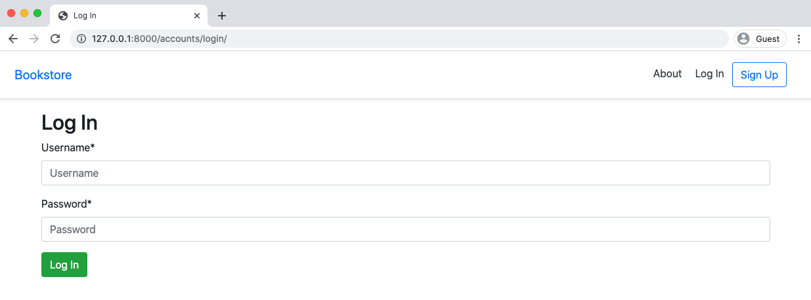
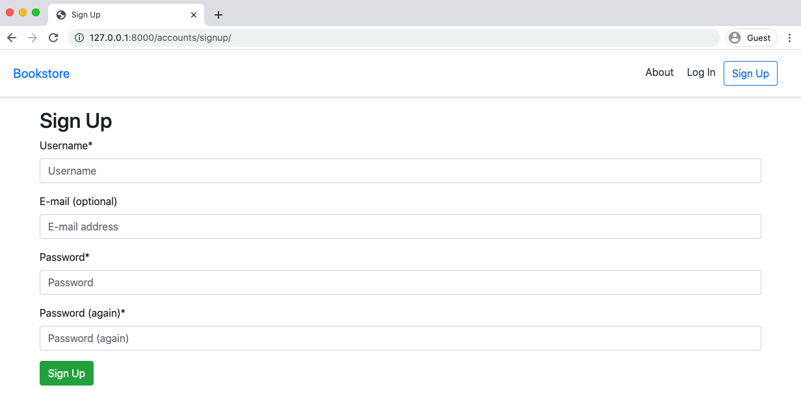
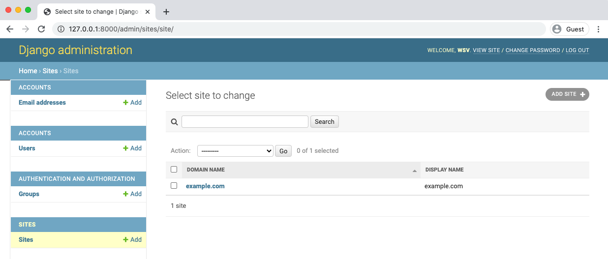

<h1 dir="rtl">
فصل ۷: Advanced user registration
</h1>
<p dir="rtl">
در این مرحله ما کاربر استاندارد جنگو  را داریم اما اغلب اوقات این تنها نقطه شروع پروژه‌های حرفه‌ای می‌باشد نظرتان راجع به سفارشی کردن چیزها چیست؟ مثلا الگوی نام کاربری/ایمیل/رمز عبور پیش فرض جنگو تا حدودی قدمت دارد. برای ثبت نام و ورود به سیستم نیاز به ایمیل/رمزعبور بسیار متداول است در واقع هر قسمت از جریان و روند احراز هویت فرم‌ها ایمیل‌ها و صفحات در صورت تمایل قابلیت سفارشی سازی دارد.
</p>

<p dir="rtl">
 یکی دیگر از عوامل مهم در بسیاری از پروژه‌ها احراز هویت با شبکه‌های اجتماعی می‌باشد که از طریق یک سرویس ثالث مانند گوگل فیسبوک و ... انجام می‌گیرد.
 </p>
 <p dir="rtl">
 ما می‌توانیم برای انجام این کار (احراز هویت با شبکه‌های اجتماعی) آن را از ابتدا خودمان پیاده‌سازی کنیم اما خطراتی وجود دارد: ثبت نام کاربر دارای یک محدوده‌ی پیچیده و اجزای متحرک بسیاری است و یک ناحیه‌ای است که ما واقعا نمی‌خواهیم باعث به وجود آمدن اشتباه امنیتی شویم.
 </p>

 <p dir="rtl">
 به این علت بسیاری از توسعه‌دهندگان جنگو از پکیج محبوب ثالث <a href="https://github.com/pennersr/django-allauth">django-allauth</a> استفاده می‌کنند. اضافه کردن هر پکیج ثالث باید با کمی احتیاط همراه باشد چون شما در حال اضافه کردن وابستگی دیگری به دسته‌ی فنی خود هستید.  بسیار مهم باشد که مطمئن شوید هر پکیجی که از آن استفاده می‌کنید هم آپدیت باشد و هم به خوبی تست شده باشد. خوشبختانه پکیج django-allauth هر دوی این ویژگی‌ها را دارد. این پکیج با مقداری جادو تمام این نگرانی‌ها را برطرف می‌کند و سفارشی سازی بسیار آسان می‌شود.
 </p>


### django-allauth

<p dir="rtl">
 با نصب پکیج شروع می‌کنیم به خاطر اینکه ما در حال استفاده از pipenv هستیم ما می‌خواهیم که از ناسازگاری‌ها با pipfile.lock دوری کنیم بنابراین ما در ابتدا آن را در داکر نصب خواهیم کرد سپس داکر را متوقف کرده و ایمیج فایل خود را با فلگ(flag) <span dir="ltr">--build</span> مجددا بیلد  می‌کنیم که مانع از ذخیره‌ی ایمیج فایل به صورت پیش فرض می‌شود و تضمین می‌کند که کل ایمیج فایل‌ها از صفر ساخته خواهد شد.
</p>


**Command line**
****
```bash
$ docker-compose exec web pipenv install django-allauth==0.42.0
$ docker-compose down
$ docker-compose up -d --build
```
***


<p dir="rtl">
وب سایت ما همچنان مانند قبل عمل می کند زیرا ما به طور واضح به جنگو در مورد این بسته جدید (django-allauth) نگفته ایم.
 برای انجام این کار ، ما باید پیکربندی INSTALLED_APPS را در تنظیمات خود به روز کنیم.
اضافه کردن فریمورک
<a href="https://docs.djangoproject.com/en/3.1/ref/contrib/sites/">sites</a>
همچنین allauth و ویژگی های اکانت allauth.account اختیاری می باشد.
<p>

<p dir="rtl">
فریمورک sites جنگو یک ویژگی قدرتمند هست که اجازه می دهد یک پروژه جنگو توسط چند سایت کنترل شود. با توجه به اینکه ما تنها یک سایت در پروژه خود داریم، SITE_ID  را ۱ تعیین خواهیم کرد. اگر سایت دومی را اضافه کنیم، دارای ID ۲ خواهد بود، سایت سوم دارای ID ۳، و به همین ترتیب خواهد بود.
</p>


**Code**
****
```python
# config/settings.py
INSTALLED_APPS = [
    'django.contrib.admin',
    'django.contrib.auth',
    'django.contrib.contenttypes',
    'django.contrib.sessions',
    'django.contrib.messages',
    'django.contrib.staticfiles',
    'django.contrib.sites', # new
    # Third-party
    'crispy_forms',
    'allauth', # new
    'allauth.account', # new
    # Local
    'accounts',
    'pages',
]
# django-allauth config
SITE_ID = 1 # new
```
****


### AUTHENTICATION_BACKENDS

<p dir="rtl">
فایل setting.py که توسط جنگو ساخته شده برای هر پروژه جدیدی شامل یک سری تنظیمات می باشد که به وضوح می توان آن را در فایل setting.py دید علاوه بر این ها یک سری تنظیمات نیز وجود دارد که قابل مشاهده در فایل setting.py نیستند. شاید در ابتدا گیج کننده باشد تمامی این تنظیمات در <a href="https://docs.djangoproject.com/en/3.1/ref/settings/">این قسمت داکیومنت</a> قابل مشاهده می باشد.
</p>

<p dir="rtl">
برای مثال می توان به <a href="https://docs.djangoproject.com/en/3.1/ref/settings/#authentication-backends">AUTHENTICATION_BACKENDS</a> اشاره کرد. در پشت صحنه جنگو مقدار این متغیر را برابر با 'django.contrib.auth.backends.ModelBackend' قرار می دهد. که برای اعتبارسنجی (authenticate) استفاده می شود.ما میتوانیم این خط را به فایل setting.py اضافه کنیم اما رفتار جنگو در خصوص اعتبارسنجی تغییری نخواهد کرد.
</p>


**Code**
****
```python
AUTHENTICATION_BACKENDS = (
'django.contrib.auth.backends.ModelBackend',
)
```
****
<p dir="rtl">
به هر حال برای پکیج django-allauth ما باید گزینه های احراز هویت خاص آن را اضافه کنیم که ما در هر لحظه این امکان داریم با استفاده از e-mail عملیات لاگین را انجام دهیم. بنابراین این تکه کد را در انتهای فایل setting.py خود اضافه کنید.
</p>


**code**
****
```python
# config/settings.py
# django-allauth config
SITE_ID = 1
AUTHENTICATION_BACKENDS = (
'django.contrib.auth.backends.ModelBackend',
'allauth.account.auth_backends.AuthenticationBackend', # new
)
```
****


### EMAIL_BACKEND

<p dir="rtl">
پیکربندی دیگری که به طور ضمنی در setting.py تنظیم شده است و ما آن را نمی بینیم <a href="https://docs.djangoproject.com/en/3.1/ref/settings/#email-backend">EMAIL_BACKED</a>  می باشد.
 به طور پیش فرض جنگو به دنبال تنظیمات <a href="https://en.wikipedia.org/wiki/Simple_Mail_Transfer_Protocol">SMTP server</a> برای ارسال ایمیل می باشد.
</p>

<p dir="rtl">
django-allauth به محض این که ثبت نام کاربر موفقیت آموز بود یک ایمیل می فرستد که ما میتوانیم این مورد را سفارشی(customize) کنیم. ، اما از آنجا که هنوز SMTP server به درستی پیکربندی نشده است ، منجر به خطا می شود.
</p>

<p dir="rtl">
فعلا برای حل این مورد جنگو خروجی هر ایمیل را به کنسول خط فرمان ارسال کند. بنابراین ما می توانیم تنظیمات پیش فرض جنگو را که بر روی smtp می باشد را به <a href="https://docs.djangoproject.com/en/3.1/topics/email/#console-backend">کنسول</a> تغییر دهیم این پیکربندی جزو پیکربندی های ضمنی می باشد و در ابتدای پروژه ما آن را نمی بینیم. این تکه کد را به انتهای فایل setting.py خود اضافه کنید.
</p>

**code**
****
```python
# config/settings.py
# django-allauth config
SITE_ID = 1
AUTHENTICATION_BACKENDS = (
'django.contrib.auth.backends.ModelBackend',
'allauth.account.auth_backends.AuthenticationBackend',
)
EMAIL_BACKEND = 'django.core.mail.backends.console.EmailBackend' # new
```
****


 ### ACCOUNT_LOGOUT_REDIRECT

<p dir="rtl">
فعلا یک تغییر کوچک دیگری نیز لازم است که باید آن را انجام دهیم. اگر شما مجددا به صفحه <a>confuguration</a> در داکیومنتت جنگو نگاهی بیندازید یک سری تنظیمات برای ACCOUNTـLOGOUTـREDIRECT  وجود دارد که به صورت پیش فرض در مسیر صفحه اصلی در root اصلی url قرار دارد.

</p>

<p dir="rtl">
در فایل settings.py فعلی ما دو خط زیر برای ریدایرکت کردن به صفحه اصلی از طریق پارامتر name در url (که مقدار آن برابر با home است) می باشد.
</p>

**code**

****
```python
# config/settings.py
LOGIN_REDIRECT_URL = 'home'
LOGOUT_REDIRECT_URL = 'home'
```
****

<p dir="rtl">
موضوع این است که متغیر ACCOUNT_LOGOUT_REDIRECT پکیج django-allauth متغیر داخلی (built-in) LOGOUT_REDIRECT_URL را بازنویسی (override) می کند. به هرحال وقتی که هر دوی این متغیر ها به صفحه home اشاره کنند تغییرات زیاد واضح نخواهد بود.شاید در آینده برای اپلیکیشن خودمان همواره نخواهیم که کاربر پس از log out به صفحه اصلی سایت ریدایرکت شود. در هر صورت ما باید به طور واضح مشخص کنیم که کاربر پس از لاگین به کدام صفحه ریدایرکت شود.
</p>

<p dir="rtl">
همچنین می توان دو خط مربوط به ریدایرکت را در زیر قسمت پیکربندی پکیج django-allauth انتقال داد. در این زمان پیکربندی مربوط به پکیج django-allauth ما باید چیزی شبیه به کد زیر باشد.
</p>


**code**
****
```python
# config/settings.py
# django-allauth config
LOGIN_REDIRECT_URL = 'home'
ACCOUNT_LOGOUT_REDIRECT = 'home' # new
SITE_ID = 1
AUTHENTICATION_BACKENDS = (
'django.contrib.auth.backends.ModelBackend',
'allauth.account.auth_backends.AuthenticationBackend',
)
EMAIL_BACKEND = 'django.core.mail.backends.console.EmailBackend'
```
****

<p dir="rtl">
ما تغییرات بسیار زیادی را در فایل config/setting.py خود انجام داده ایم بنابراین نیاز هست که ما یک بار دستور migrate را بزنیم تا تغییرات در دیتابیس هم اعمال شود.
</p>

**command line**

****
```bash
$ docker-compose exec web python manage.py migrate
```
****

<p dir="rtl">

### URLS
</p>

<p dir="rtl">
همچنین ما نیاز داریم که urlهای از پیش ساخته (built-in) مربوط به پکیج django-allauth را به urlهای اپ accounts خود منتقل کنیم. به هرحال ما از تمپلیت و روتر(router)های خود پکیج django-allauth استفاده میکنیم. همچنین ما میتوانیم urlهای مربوط به ثبت نام در اپ accounts را پاک کنیم.
</p>


**code**
****
```python
# config/urls.py
from django.contrib import admin
from django.urls import path, include
urlpatterns = [
# Django admin
path('admin/', admin.site.urls),
# User management
path('accounts/', include('allauth.urls')), # new
# Local apps
path('', include('pages.urls')),
]
```
****


<p dir="rtl">
در این مرحله ما میتوانیم فایل های urls.py و views.py اپ accounts که صرفا برای ثبت نام نوشتیم را پاک کنیم و دیگر مورد استفاده قرار نمیگیرند.
</p>

<p dir="rtl">

### TEMPLATES
</p>

<p dir="rtl">
سیستم احراز هویت جنگو به دنبال فایل های تمپلیت در دایرکتوری templates/registration می گردد اما پکیج django-allauth ترجیح می دهد که فایل های که فایل های تمپلیت در مسیر templates/account قرار بگیرد و تمپلیت های signup.html و signup.html خود را در آنجا کپی کند.
</p>


**command line**
****
```bash
$ mkdir templates/account
$ mv templates/registration/login.html templates/account/login.html
$ mv templates/registration/signup.html templates/account/signup.html
```
****

<p dir="rtl">
ممکن است که به صورت تصادفی به آخر account حرف s را اضافه کنید اما این کار باعث بروز خطا می شود مسیر درست همان templates/account/ می باشد.
</p>

<p dir="rtl">
 در این مرحله ما میتوانیم مسیر  templates/registration پاک کنیم چون دیگر نیازی به این دایرکتوری نخواهیم داشت.
</p>


**command line**
****
```bash
$ rm -r templates/registration
```
****

<p dir="rtl">
در دستور بالا rm به معنای حذف کردن و <span dir="ltr">-r</span> به معنای بازگشتی(recursive) بودن دستور حذف می باشد که نیاز می باشد تمام فایل ها و دایرکتوری های مسیر registration پاک شود. اگر میخواهید اطلاعات بیشتری راجب کامند rm بدانید با دستور man rm میتوانید اطلاعات بیشتری در این رابطه پیدا کنید.
</p>


<p dir="rtl">
آخرین قدم آپدیت لینک های url در templates/_base.html و templates/home.html برای استفاده از نام های url پکیج django-allauth به جای نام های url  جنگو می باشد.برای این کار ما پیشوند <span dir="ltr">_account</span> اضافه میکنیم. به این ترتیب نام های signup login logout به اسامی account_logout account_login account_signup به ترتیب تغییر خواهد کرد.
</p>


**code**
****
```html
<!-- templates/_base.html -->
...
<nav class="my-2 my-md-0 mr-md-3">
<a class="p-2 text-dark" href="">About</a>

    <a class="p-2 text-dark" href="">Log Out</a>

    <a class="p-2 text-dark" href="">Log In</a>
    <a class="btn btn-outline-primary" href="">Sign Up</a>

</nav>
...
```
***


**code**
****
```html
<!-- templates/home.html -->



Home

    <h1>Homepage</h1>
    
    
        <p>Hi {{ user.email }}!</p>
        <p><a href="">Log Out</a></p>
    
        <p>You are not logged in</p>
        <p><a href="">Log In</a> |
        <a href="">Sign Up</a></p>
    

```
****


<p dir="rtl">
و تمام ما توانستیم کار را انجام دهیم!!
</p>

<p dir="rtl">

### LOGIN
</p>

<p dir="rtl">
صفحه ی اصلی سایت به آدرس http://127.0.0.1:8000 را refresh  کنید اگر لاگین هستید لاگ اوت کنید. و بر روی لینک لاگین کلیک کنید. صفحه لاگین هم اکنون صفحه ی جدیدی می باشد.
</p>

<p dir="rtl">


</p>

<p align=center dir="rtl">
صفحه login
</p>

<p dir="rtl">
به چک باکس Remember Me توجه کنید.این گزینه اولین پیکربندی از پیکربندی های زیادی است که پکیج django-allauth در اختیار ما قرار می دهد. به طور پیش فرض از کاربر پرسیده نمی شود که اطلاعات در session ذخیره شود تا در موارد بعدی نیاز به لاگین مجدد نباشد.این گزینه می تواند False باشد تا اطلاعات ذخیره نشود همچنین می تواند true باشد تا اطلاعات در session ذخیره شود. در این قسمت ما true را انتخاب میکنیم همانطور که لاگین django کار میکند.
</p>
<p dir="rtl">
برای این مورد در فایل config/settings.py در قسمت پیکربندی django-allauth این یک خط را قرار می دهیم.
</p>

**code**
****
```python
# config/settings.py
# django-allauth config
...
ACCOUNT_SESSION_REMEMBER = True # new
```
****

<p dir="rtl">
اگر صفحه لاگین را refresh کنید می بینید که این چک باکس ناپدید شده و همواره مقدار آن true خواهد بود.
</p>

<p dir="rtl">


</p>
<p dir="rtl" align=center>
صفحه login بدون چک باکس Remember Me
</p>
<p dir="rtl">
اگر میخواهید با اکانت superuser خود فرم لاگین را امتحان کنید این کار باعث ریدایرکت شدن شما به صفحه اصلی با پیفام خوش آمد گویی می شود. بر روی لینک log out کلیک کنید.
</p>

<p dir="rtl">


</p>

<p dir="rtl" align=center>
صفحه logout
</p>

<p dir="rtl">
به جای اینکه مستقیم logout کنیم پکیج django-allauth یک صفحه ی واسط logout دارد ما می توانیم آن را با بقیه پروژه خود کاستومایز کنیم.
</p>

<p dir="rtl">

### LOG OUT
</p>
<p dir="rtl">
با ساختن فایل templates/account/logout.html صفحه logout پیش فرض را می شود override کرد.
</p>

****
```bash
$ touch templates/account/logout.html
```
****

<p dir="rtl">
مانند بقیه تمپلیت ها ما فایل _base.html را گسترش(extend) می دهیم و از استایل های بوت استرپ برای دکمه ثبت استفاده می کنیم.
</p>


**code**
****
```python
<!-- templates/account/logout.html -->



Log Out



    <h1>Log Out</h1>
    <p>Are you sure you want to log out?</p>
    <form method="post" action="">
        
        {{ form|crispy }}
        <button class="btn btn-danger" type="submit">Log Out</button>
    </form>

```
****

<p dir="rtl">
ادامه میدهیم و صفحه را refresh میکنیم.
</p>

<p dir="rtl">


</p>
<p dir="rtl" align=center>
صفحه کاستوم logout
</p>
<p dir="rtl">
روی logout کلیک کنید تا پروسه کامل شود.
</p>


### SIGN UP


<p dir="rtl">
در بالای وب سایت بر روی لینک "sign up" که با بوت استرپ و django-crispy-forms استایل دهی شده است کلیک کنید.
</p>




<p dir="rtl" align=center>
صفحه  signup
</p>

<p dir="rtl">
یکی از گزینه های کاستومایز کردن صفحه که اختیاری می باشد درخواست پسوورد تنها یک بار برای ثبت نام می باشد. به خاطر اینکه ما گزینه های تغییر رمز یا reset کردن پسوورد را برای کاربر قرار خواهیم داد این ریسک کمی است که کاربری که رمز عبور را اشتباه وارد می کند حساب کاربری اش قفل شود.
</p>

<p dir="rtl">
اگر به صفحه ی <a href="https://django-allauth.readthedocs.io/en/latest/configuration.html">پیکربندی پکیج</a> نگاهی بیاندازید برای انجام این کار باید یک خط را به setting.py اضافه کنیم.
</p>

**code**
****
```python
# config/settings.py
# django-allauth config
...
ACCOUNT_SIGNUP_PASSWORD_ENTER_TWICE = False # new
```
****

<p dir="rtl">
اگر صفحه ثبت نام را refresh کنید می بینید که فیلدهای رمز عبور از دو فیلد به یک فیلد کاهش یافته است.
</p>


<p dir="rtl" align=center>
ثبت نام تنها با یک فیلد پسوورد
</p>

<p dir="rtl">
حالا برای تایید شدن اینکه همه چیز به خوبی کار می کند یک یوزر جدید را میسازیم. مشخصات یوزر ما اینگونه می باشد. نام کاربری: testuser1 ایمیل: testuser1@email.com پسورد:testpass123
</p>

<p dir="rtl">
اگر دکمه ثبت را بزنیم به صفحه سایت منتقل(redirect) می شویم.
</p>


<p dir="rtl" align=center>
صفحه اصلی
</p>

<p dir="rtl">
به یاد می آورید که ما چگونه تنظیمات مربوط به ایمیل را انجام دادیم که خروجی در کنسول نمایش داده شود؟ به محض ثبت نام پکیج django-allauth به صورت اتومات یک ایمیل را می فرستد که از طریق دستور docker-compose logs ما میتوانیم آن ها را ببینیم.
</p>

**command line**
****
```bash
$ docker-compose logs
...
web_1 | Content-Type: text/plain; charset="utf-8"
web_1 | MIME-Version: 1.0
web_1 | Content-Transfer-Encoding: 7bit
web_1 | Subject: [example.com] Please Confirm Your E-mail Address
web_1 | From: webmaster@localhost
web_1 | To: testuser@email.com
web_1 | Date: Mon, 03 Aug 2020 14:04:15 -0000
web_1 | Message-ID: <155266195771.15.17095643701553564393@cdab877c4af3>
web_1 |
web_1 | Hello from example.com!
web_1 |
web_1 | You are receiving this e-mail because user testuser1 has given yours as
an e-mail address to connect their account.
web_1 |
web_1 | To confirm this is correct, go to http://127.0.0.1:8000/accounts/
confirm-emailMQ:1h4oIn:GYETeK5dRClGjcgA8NbuOoyvafA/
web_1 |
web_1 | Thank you from example.com!
web_1 | example.com
web_1 | -----------------------------------------------------------------------
...
```
*****

<p dir="rtl">
در آینده ما متن این پیام ها را کاستومایز خواهیم کرد و یک سرویس ایمیل مناسب را برای ارسال آن به کاربران واقعی پیکربندی می کنیم.
</p>

### ADMIN

<p dir="rtl">
به عنوان superuser به صفحه ی ادمین در آدرس http://127.0.0.1:8000/admin لاگین کنید.همانطور که می بینید یک سری تغییرات را پکیج django-allauth انجام داده است.
</p>


<p dir="rtl" align=center>
صفحه اصلی ادمین
</p>

<p dir="rtl">
دو قسمت جدید وجود دارد: accounts و sites که با کارهای اخیری که انجام دادیم ظاهر شده اند. اگر بر روی users کلیک کنید همان ویوی قدیمی را خواهیم دید با سه کاربر.
</p>


<p dir="rtl" align=center>
صفحه ی یوزرهای پنل ادمین
</p>

<p dir="rtl">
اسلایدبار جدیدی که در سمت چپ می بینید از ورژن 3.1 جنگو به پنل ادمین اضافه شده است که این امکان را می دهد ما مستقیم با قسمت sites برویم و ببینیم فریم ورک site جنگو چه چیزهایی را در اختیار ما قرار داده است. در قسمت بعدی (پیکربندی ایمیل) هر دو فیلد Domain name و display name را آپدیت خواهیم کرد.
</p>


<p dir="rtl" align=center>
قسمت sites پنل ادمین
</p>

### EMAIL ONLY LOGIN

<p dir="rtl">
حالا زمان آن فرارسیده است که از <a href="https://django-allauth.readthedocs.io/en/latest/configuration.html">لیست</a> گسترده پیکربندی های پکیج django-allauth استفاده کنیم به وسیله لاگین شدن توسط ایمیل به جای یوزرنیم.این مورد نیازمند چند تغییر در کدهای ما می باشد ابتدا فیلد یوزرنیم را از حالت اجباری به یک فیلد اختیاری تبدیل می کنیم و به جای آن فیلد ایمیل را به عنوان فیلد اجباری در نظر میگیریم. در انتها فیلد ایمیل را به یک فیلد یونیک تبدیل میکنیم و طریقه احراز هویت(authentication) را  بر روی ایمیل قرار میدهیم.
</p>

**code**
****
```python
# config/settings.py
# django-allauth config
...
ACCOUNT_USERNAME_REQUIRED = False # new
ACCOUNT_AUTHENTICATION_METHOD = 'email' # new
ACCOUNT_EMAIL_REQUIRED = True # new
ACCOUNT_UNIQUE_EMAIL = True # new
```
****
<p dir="rtl">
به خاطر اینکه قبلا به عنوان superuser لاگین کرده بودیم به صفحه اصلی برمیگردیم و بر روی لینک Log Out کلیک می کنیم. سپس بر روی لینک Sign Up کلیک می کنیم تا اکانت جدیدی با ایمیل: testuser2@email.com و رمزعبور: testpass123 بسازیم.
</p>

<p dir="rtl">
پس از ریدایرکت شدن به صفحه اصلی به محض موفقیت آمیز بودن عملیات ثبت نام به صفحه ادمین می رویم تا ببینیم چه اتفاقاتی افتاده است.توسط اکانت superuser به صفحه ادمین وارد میشویم و به قسمت Users می رویم.
</p>


<p dir="rtl" align=center>
صفحه ادمین قسمت Users
</p>

<p dir="rtl">
همانطور که میبینیم پکیج django-allauth به صورت خودکار نام کاربری را بر اساس قسمت قبل از @ ایمیل جمع آوری کرده است. این مورد به این دلیل است که ما همچنان برای مدل کاستوم یوزر خود فیلد یوزرنیم را داریم و آن را پاک نکرده ایم.
</p>
<p dir="rtl">
در حالی که به نظر می رسد این کار مقداری ناامن باشد اما به خوبی کار می کند. برای حدف کامل یوزرنیم از مدل شخصی سازی شده user  نیازمند استفاده از کلاس <a href="https://docs.djangoproject.com/en/3.1/topics/auth/customizing/#django.contrib.auth.models.AbstractBaseUser">AbstractBaseUser</a> می باشد که این یک گزینه اضافی می باشد که بعضی از برنامه نویس ها این کار را انجام می دهند.این کار نیازمند تجربه کدزنی و فهم درمورد سیستم احراز هویت بسیار بیشتری می باشد پس این کار توصیه نمی شود مگر اینکه شما در مورد احراز هویت اطلاعات زیادی داشته باشید.
</p>
<p dir="rtl">
اما یک مورد حاشیه ای در اینجا وجود دارد که بهتر است بگوییم: چه اتفاقی می افتد اگر ما اکانتی با ایمیل testuser2@email.com از قبل داشته باشیم و سعی کنیم که با ایمیل testuser2@example.com ثبت نام کنیم؟ آیا نتیجه ساخته شدن یوزری با آیدی testuser2 خواهد بود و در نتیجه دو اکانت با یک یوزرنیم خواهیم داشت و باعث conflic نخواهد شد؟ در قسمت بعد این مورد را امتحان میکنیم.
</p>

<p dir="rtl">
از اکانت ادمین خود خارج می شویم به صفحه ثبت نام می رویم تا اکانتی با ایمیل testuser2@example.com بسازیم.
</p>


<p dir="rtl" align=center>
فرم ثبت نام
</p>

<p dir="rtl">
حال به پنل ادمین قسمت Users برمیگردیم.


<p dir="rtl" align=center>
بخش users پنل ادمین
</p>

<p dir="rtl">
پکیج django-allauth  به صورت خودکار یک رشته با دو کاراکتر به انتهای یوزرنیم اضافه می کند. در این مثال یوزرنیم testuser2 به testuser28 تبدیل شده است و عدد 28 به صورت رندوم ساخته شده است.
</p>


### TESTS

<p dir="rtl">
زمان تست کدها فرارسیده است. مانند هر پکیج ثالثی پکیج django-allauth این پکیج تست خودش را دارد و دیگر نیازی نداریم که function های داخلی پکیج را تست کنیم. فقط باید تایید کنیم که پروژه ما مطابق انتظار کار می کند.
</p>

<p dir="rtl">
اگر تست های حال حاضر را اجرا کنید ، 3 خطا در رابطه با ثبت نام در صفحه وجود دارد ، به این علت که ما از django-allauth برای این کار استفاده می کنیم نه views ،forms و urls خود.
</p>

**command line**
****
```bash
$ docker-compose exec web python manage.py test
...
Ran 15 tests in 0.363s
FAILED (errors=3)
```
****
<p dir="rtl">
فایل تست را آپدیت می کنیم. اولین مشکل این است که url ثبت نام درست نمی باشد و به جای آن باید از account_signup که پکیج django-allauth در اختیار ما قرار می دهد استفاده کنیم. چطور نام urls را بفهمیم؟ من در داخل <a href="https://github.com/pennersr/django-allauth/blob/master/allauth/account/urls.py">source code</a> پکیج آن ها را پیدا کرده ام.
</p>

<p dir="rtl">
صفحه html ثبت نام هم در مسیر account/signup.html می باشد و ما دیگر از CustomUserCreationForm استفاده نمی کنیم بنابراین می توانیم تست مربوط به آن را پاک کنیم همینطور CustomUserCreationForm و SignupPageView که در بالای صفحه ایمپورت شده اند را نیز پاک می کنیم.
</p>

**code**
****
```python
# accounts/tests.py
from django.contrib.auth import get_user_model
from django.test import TestCase
from django.urls import reverse, resolve
class CustomUserTests(TestCase):
...
class SignupTests(TestCase): # new
    username = 'newuser'
    email = 'newuser@email.com'

    def setUp(self):
        url = reverse('account_signup')
        self.response = self.client.get(url)


    def test_signup_template(self):
        self.assertEqual(self.response.status_code, 200)
        self.assertTemplateUsed(self.response, 'account/signup.html')
        self.assertContains(self.response, 'Sign Up')
        self.assertNotContains(self.response, 'Hi there! I should not be on the page.')


    def test_signup_form(self):
        new_user = get_user_model().objects.create_user(
        self.username, self.email)
        self.assertEqual(get_user_model().objects.all().count(), 1)
        self.assertEqual(get_user_model().objects.all()[0].username, self.username)
        self.assertEqual(get_user_model().objects.all()[0].email, self.email)
```
****

<p dir="rtl">
فایل تست را مجدد را می کنیم.
</p>

**command line**
****
```bash
$ docker-compose exec web python manage.py test
Creating test database for alias 'default'...
System check identified no issues (0 silenced).
..............
----------------------------------------------------------------------
Ran 14 tests in 0.410s
OK
Destroying test database for alias 'default'...
```

****
### SOCIAL

<p dir="rtl">
اگر می خواهید با اکانت های اجتماعی احراز هویت را انجام دهید نیازمند یک سری تنظیمات می باشد من یک دوره کامل در این رابطه برای اکانت های گیتهاب دارم. این پروسه بسیار به google facebook و بقیه اکانت هایی که پکیج django-allauth در اختیار ما قرار می دهد شبیه می باشد. در <a href="https://django-allauth.readthedocs.io/en/latest/providers.html">اینجا</a> می توانید لیست کامل آن ها را مشاهده کنید.
</p>

### GIT

<p dir="rtl">
طبق روال همیشه تغییرات را در گیت کامیت می کنیم.
</p>

**command line**
****
```bash
$ git status
$ git add .
$ git commit -m 'ch7'
```
****

<p dir="rtl">
اگر به مشکلی برخوردید می توانید کد خودتان را با <a href="">کدهای گیت هاب</a> مقایسه کنید.
</p>

### جمع بندی
<p dir="rtl">
در حال حاضر ما یک جریان ثبت نام کاربر را در وبسایت خودمان داریم که به این مورد احراز هویت با شبکه های اجتماعی به سرعت می تواند اضافه شود.در فصل بعد ما متغیر های محیطی را به پروژه خودمان برای امنیت و انعطاف بیشتر وب اپلیکیشن اضافه می کنیم.
</p>