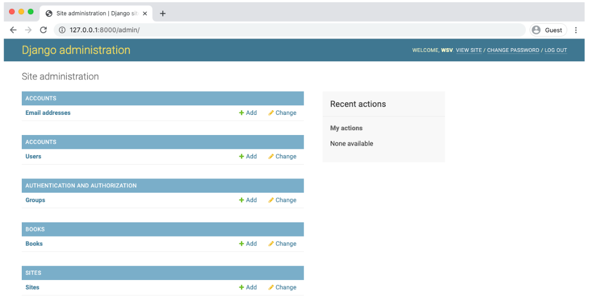
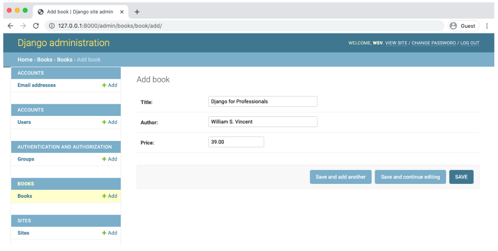
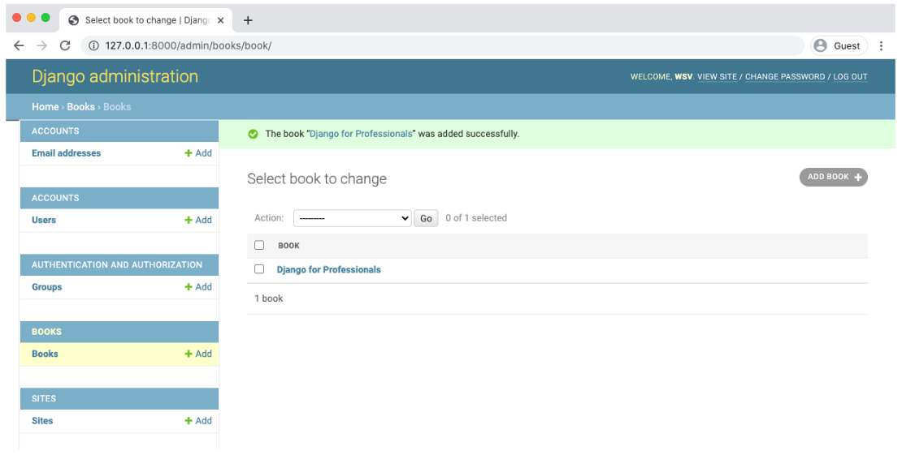
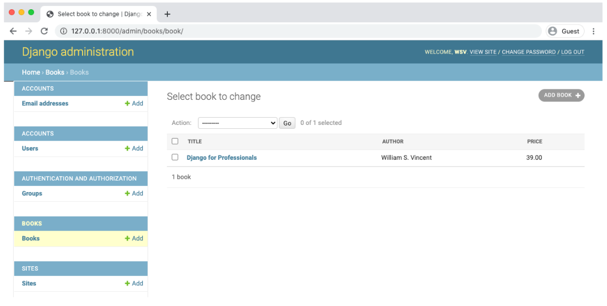
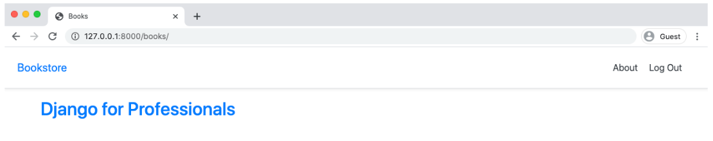
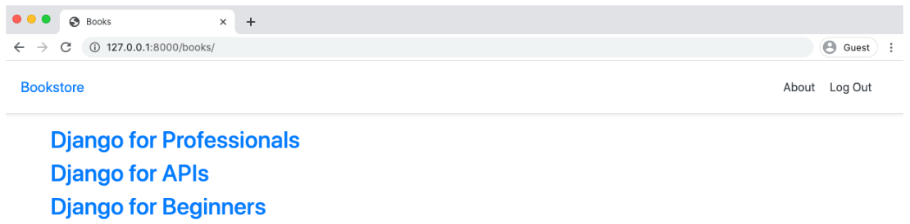
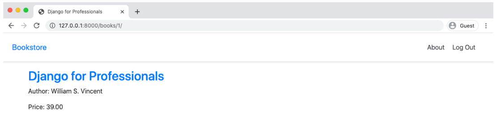
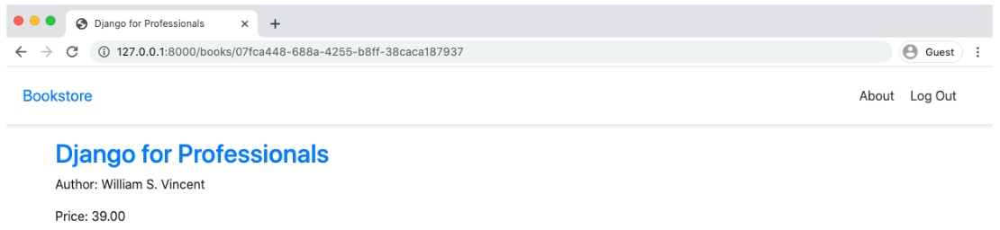
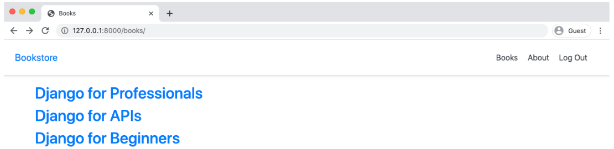

<div dir="rtl">

# Books App

در این فصل می‌خواهیم یک اپلیکیشن تحت عنوان Books بسازیم که قرار است یک page شامل همه کتاب‌های در دسترس و به صورت اختصاصی یک page برای هر کتاب را به ما نمایش دهد. در حین انجام این پروژه روش‌های مختلف نوشتن URL از جمله با استفاده از id ، سپس با استفاده از slug و در نهایت با استفاده از UUID را نیز بررسی خواهیم کرد.

برای شروع ابتدا یک اپلیکیشن با نام books می‌سازیم.

<div dir="ltr">

```shell
$ docker-compose exec web python manage.py startapp books
```

</div>

برای اینکه اطمینان حاصل کنید جنگو اپلیکیشن جدیدی که ساخته‌اید را می‌شناسد text editor خود را باز کنید سپس به config/settings.py رفته و نام اپلیکیشن را در INSTALLED_APPS اضافه کنید:

<div dir="ltr">

```python
# config/settings.py
INSTALLED_APPS = [
    'django.contrib.admin',
    'django.contrib.auth',
    'django.contrib.contenttypes',
    'django.contrib.sessions',
    'django.contrib.messages',
    'django.contrib.staticfiles',
    'django.contrib.sites',
    # Third-party
    'allauth',
    'allauth.account',
    'crispy_forms',
    # Local
    'accounts',
    'pages',
    'books', # new
]
```

</div>

بسیارخب ، مرحله ی ابتدایی این پروژه به پایان رسید.

### Models

به طور کلی برای هر صفحه که قرار است توسط اپلیکیشن نمایش داده شود نیاز به مدل(model) ، view ، url و template خواهیم داشت. اینکه از کدام یک شروع به نوشتن برنامه کنیم در شرایط مختلف می‌تواند متفاوت باشد اما معمولا شروع از model ، به دلیل اینکه ساختار کلی برنامه را مشخص می کند می‌تواند یک گزینه ی مناسب باشد. قبل از نوشتن کدهای مربوط به مدل باید به این فکر کنیم که مدل ما قرار است شامل چه فیلدهایی باشد. برای اینکه از ساده‌ترین حالت شروع کنیم فیلدهای مدل را title ، author و price در نظر می‌گیریم.

به books/models.py رفته و مدل جدید Book را به صورت زیر اضافه کنید.

<div dir="ltr">

```python
# books/models.py
from django.db import models

class Book(models.Model):
    title = models.CharField(max_length=200)
    author = models.CharField(max_length=200)
    price = models.DecimalField(max_digits=6, decimal_places=2)

    def __str__(self):
        return self.title
```

</div>

در قسمت بالایی از django.db ماژول models را ایمپورت کردیم و در ادامه مدل Book را ساختیم که از کلاس models.Model ارث بری می‌کند. به این ترتیب ما در کلاس Book به هر چیزی که در django.db.models.Model وجود دارد دسترسی خواهیم داشت درعین حال می‌توانیم فیلدها و متدهای مورد نظر خود را نیز به آن اضافه کنیم.

برای فیلدهای title و author تعداد کاراکترها را به 200 عدد محدود کردیم و برای price نیز از DecimalField استفاده کردیم که هنگام کار کردن با اعداد و ارقام و واحد پول گزینه ی بسیار مناسبی است.

در انتها یک متد `__str__` نوشتیم که نحوه ی نمایش نمونه های (object) این مدل در Admin و shell جنگو را مشخص می‌کند.

مدل ما آماده است. لازم است که یک migration record نیز از آن ایجاد کنیم

<div dir="ltr">

```shell
$ docker-compose exec web python manage.py makemigrations books

Migrations for 'books':
    books/migrations/0001_initial.py
        - Create model Book
```

</div>

و در قدم بعد migration record را به دیتابیس اعمال کنیم.

<div dir="ltr">

```shell
$ docker-compose exec web python manage.py migrate
```

</div>

نوشتن نام اپلیکیشن در انتهای دستورات مربوط به migration و migrate کاملاً اختیاری است اما با نوشتن آن ، این دستورات صرفاً برای همان اپلیکیشن اجرا خواهند شد. اگر این دستورات را بدون نام اپلیکیشن اجرا کنیم عملیات migration و migrate برای تمامی اپلیکیشن های برنامه اجرا می‌شود که در ادامه کار می‌تواند عیب یابی و دیباگ پروژه را سخت تر کند.

دیتابیس ما آماده شده است ، حالا می‌توانیم از قسمت ادمین نمونه‌هایی را اضافه کنیم.

### Admin

ما به ابزاری نیاز داریم که به کمک آن به داده‌های وبسایت خود دسترسی داشته باشیم. پنل ادمین جنگو کاملاً مناسب با این نیاز طراحی شده است. همچنین فراموش نکنید که فایل books/admin.py را به صورت زیر تغییر دهید در غیر اینصورت اپلیکیشن در بخش ادمین ظاهر نمی شود. بعد از سال‌ها کار با جنگو من تقریباً همیشه این مرحله رو فراموش می‌کنم.

<div dir="ltr">

```python
# books/admin.py
from django.contrib import admin
from .models import Book

admin.site.register(Book)
```

</div>

اگر الان به ادمین در آدرس http://127.0.0.1/admin نگاهی بیندازید ، می‌توانید اپلیکیشن Books را ببینید.

[](#)

بسیارخب بیایید یک نمونه از Book تحت عنوان ”Django for Professionals” ایجاد کنیم. روی دکمه ی add(+) کلیک کنید. قسمت title را ”Django for Professionls” ، قسمت author را ”William S.Vincent” و price را ”39.00$” قرار دهید. نیازی به نوشتن علامت دلار در قسمت price نیست ، در ادامه می‌توانیم در بخش template آن را به price اضافه کنیم.

[](#)

بعد از کلیک روی دکمه ی ”Save” به صفحه ی اصلی اپلیکیشن Books هدایت می‌شویم که title های کتاب‌های اضافه شده را به ما نمایش می دهد.

[](#)

بیاید فایل books/admin.py رو مجدداً تغییر دهیم و مشخص کنیم کدام فیلدها نمایش داده شود.

<div dir="ltr">

```python
# books/admin.py
from django.contrib import admin
from .models import Book

class BookAdmin(admin.ModelAdmin):
    list_display = ("title", "author", "price",)

admin.site.register(Book, BookAdmin)
```

</div>

سپس صفحه را refresh کنید.

[](#)

به این ترتیب مدل خود را در دیتابیس ایجاد کردیم. در قدم بعد برای اینکه بتوانیم اطلاعاتی را نمایش دهیم بایدURL ها ، View ها و Template های لازم را ایجاد کنیم. اینکه از کدامیک شروع کنیم همیشه می‌تواند سؤال برانگیز باشد.
شخصاً اکثر اوقات با URL ها شروع کرده ، سپس به سراغ View ها رفته و در نهایت Template ها را می‌نویسم.

### URLs

برای این قسمت باید دو فایل urls.py را به روزرسانی کنیم. اولین فایل ، فایل config/urls.py است که باید مسیر یا path مربوط به اپلیکیشن books را به آن اضافه کنیم.

<div dir="ltr">

```python
# config/urls.py
from django.contrib import admin
from django.urls import path, include

urlpatterns = [
    # Django admin
    path('admin/', admin.site.urls),

    # User management
    path('accounts/', include('allauth.urls')),

    # Local apps
    path('', include('pages.urls')),
    path('books/', include('books.urls')), # new
]
```

</div>

در قدم بعد فایل urls.py مرتبط با books را ایجاد می‌کنیم.

<div dir="ltr">

```shell
$ touch books/urls.py
```

</div>

ازآنجایی که همه ی URL های مربوط به اپلیکیشن books با /books شروع می‌شود ، استفاده از یک رشته خالی ' ' می‌تواند مسیر یا route اصلی اپلیکیشن books که درواقع page مربوط به همه ی کتاب‌ها است را برای ما مشخص کند.همچنین ‌BookListView که در path زیر به آن اشاره شده است را در قسمت بعد ایجاد خواهیم کرد.

<div dir="ltr">

```python
# books/urls.py
from django.urls import path
from .views import BookListView

urlpatterns = [
    path('', BookListView.as_view(), name='book_list'),
]
```

</div>

### Views

برای ایجاد BookListView از یک Generic Class-Based View به نام ListView استفاده می‌کنیم که به صورت پیش‌فرض در خود جنگو وجود دارد و برای مواردی از این دست ساخته شده است. تنها کاری که باید انجام دهیم این است که مدل و مسیر template مربوطه را مشخص کنیم.

<div dir="ltr">

```python
# books/views.py
from django.views.generic import ListView
from .models import Book

class BookListView(ListView):
    model = Book
    template_name = 'books/book_list.html'
```

</div>

البته توجه داریم که book_list.html را هنوز ایجاد نکرده‌ایم.

### Templates

ایجاد کردن یک پوشه جداگانه در پوشه templates مخصوص فایل‌های html هر اپلیکیشن ، یک کار کاملاً اختیاری است اما انجام دادن این کار زمانی که تعداد فایل‌های html یا تعداد اپلیکیشن ها زیاد می‌شود بسیار مفید و کمک کننده خواهد بود. پس ما نیز یک پوشه به نام books در templates درست می‌کنیم و فایل book_list.html را در این پوشه ایجاد می‌کنیم.

<div dir="ltr">

```html
<!-- templates/books/book_list.html -->


Books


    
        <div>
            <h2><a href="">{{ book.title }}</a></h2>
        </div>
    


```

</div>

در قسمت بالایی مشخص شده که این فایل در‌واقع از فایل base.html_ توسعه پیدا کرده است و به این ترتیب کدهای مورد نظر خود را می‌توانیم در block content قرار دهیم. برای اینکه کتاب‌ها را نمایش دهیم ، با استفاده از زبان template جنگو (Django template language) یک حلقه ی for ساده روی لیست کتاب‌ها می نویسیم. توجه داریم که object_list در‌واقع شامل همه ی کتاب‌های موجود در view که قبل تر نوشتیم است و به کمک ListView ایجاد شده است.
در آخرین مرحله لازم است که یک بار container های خود را down و مجدداً up کنیم تا تغییرات ایجاد شده با ریلود شدن فایل settings.py اعمال شود. در غیر اینصورت با یک صفحه ی error مواجه خواهیم شد و در قسمت logs پیام ”ModulNotFoundError: No module named ‘books.url’” را دریافت خواهیم کرد.

Container ها را down و مجدداً up می‌کنیم

<div dir="ltr">

```shell
$ docker-compose down
$ docker-compose up -d
```

</div>

حالا با مراجعه به آدرس http://127.0.0.1:8000/books به صفحه ی کتاب‌ها هدایت می شویم.

[](#)

### Object List

همانطور که دیدیم به صورت پیش‌فرض کلاس ListView از متغیری به نام object_list به عنوان context که قرار است برای template مربوطه ارسال شود استفاده می کند. اگرچه این روش کاملاً درست کار می‌کند اما روش بهتر و اصطلاحاً friendly تر استفاده از یک متغیر با نامی مرتبط است و این کار به کمک context_object_name ، یک attribute از کلاس ListView انجام پذیر است.

<div dir="ltr">

```python
# books/views.py
from django.views.generic import ListView
from .models import Book

class BookListView(ListView):
    model = Book
    context_object_name = 'book_list' # new
    template_name = 'books/book_list.html'
```

</div>

سپس در template مربوطه متغیر object_list را به book_list تغییر دهید.

<div dir="ltr">

```html
<!-- templates/books/book_list.html -->


Books


    
        <div>
            <h2><a href="">{{ book.title }}</a></h2>
        </div>
    

```

</div>

صفحه را refresh کنید و همه چیز مثل قبل کار می کند. این تکنیک به‌خصوص زمانی که پروژه ها بزرگ‌تر می‌شوند و developer های بیشتری روی آن کار می‌کنند مؤثر تر و کمک کننده تر خواهد بود. به طور مثال برای یک frontend developer حدس زدن اینکه متغیر object_list مربوط به چه قسمتی است بسیار سخت تر خواهد بود در مقایسه با زمانی که از یک نام مرتبط استفاده شده باشد.

برای اینکه اطمینان حاصل کنید این روش ، درست مثل قبل کار می‌کند از پنل admin دو کتاب دیگر را نیز اضافه کنید. من دو کتاب دیگرم ، Django for Beginners و Django for APIs ، هردو به نویسندگی (author) “William S. Vincent” و قیمت (price) “39.00” اضافه کرده‌ام.

[](#)

### صفحه اختصاصی برای هر کتاب

حالا می‌توانیم به کمک یک Generic Class-Based View دیگر به نام DetailView یک صفحه اختصاصی برای هر کتاب ایجاد کنیم.

مشابه قبل که page مربوط به نمایش همه ی کتاب‌ها را ایجاد کردیم ، در اینجا نیز ابتدا URL را می نویسیم . مشابه زیر در خط دوم BookDetailView را import می‌کنیم و مسیر url را primary_key مربوط به هر کتاب قرار می‌دهیم که به عنوان یک عدد صحیح به صورت <int:pk> نوشته می شود.

<div dir="ltr">

```python
# books/urls.py
from django.urls import path
from .views import BookListView, BookDetailView # new

urlpatterns = [
    path('', BookListView.as_view(), name='book_list'),
    path('<int:pk>/', BookDetailView.as_view(), name='book_detail'), # new
]
```

</div>

برای هر مدلی که ما در دیتابیس ایجاد می‌کنیم جنگو به صورت خودکار یک فیلد دیگر به صورت auto-incrementing primary key ایجاد می کند. پس در حالی که برای مدل Book فقط فیلد های title و author و body را نوشتیم ، جنگو در پشت صحنه یک فیلد دیگر با نام id به عنوان primary_key به مدل Book اضافه کرد. دسترسی به این فیلد از طریق هرکدام از نام های id یا pk امکان‌پذیر است.

pk اولین کتابی که اضافه کردیم یک است. Pk دومین کتاب دو است و به همین ترتیب برای کتاب‌های بعدی نیز یکی یکی افزایش پیدا کرده است. پس انتظار داریم URL مربوط به page اولین کتاب به صورت books/1 باشد.

حالا در فایل books/views.py کلاس DetailView را import کرده ، یک کلاس BookDetailView ایجاد می‌کنیم و فیلد های model و template_name آن را مشخص می‌کنیم.

<div dir="ltr">

```python
# books/views.py
from django.views.generic import ListView, DetailView # new
from .models import Book


class BookListView(ListView):
    model = Book
    context_object_name = 'book_list'
    template_name = 'books/book_list.html'


class BookDetailView(DetailView): # new
    model = Book
    template_name = 'books/book_detail.html'
```

</div>

در نهایت فایل template را ایجاد می کنیم.

<div dir="ltr">

```shell
$ touch templates/books/book_detail.html
```

</div>

فایل template را جوری ایجاد کنید که همه ی فیلد های کتاب مربوطه را نشان دهد. همچنین می‌توانیم title کتاب را در title tag قرار دهیم تا نام کتاب در تب مرورگر نیز نمایش داده شود.

<div dir="ltr">

```html
<!-- templates/books/book_detail.html -->


 {{ object.title }} 


    <div class="book-detail">
        <h2><a href="">{{ object.title }}</a></h2>
        <p>Author: {{ object.author }}</p>
        <p>Price: {{ object.price }}</p>
    </div>

```

</div>

در ادامه اگر به آدرس http://127.0.0.1/books/1 بروید page اختصاصی مربوط به اولین کتاب را خواهید دید.

[](#)

### context_object_name

DetailView نیز مشابه ListView به صورت پیش‌فرض متغیری با نامی مشخص به عنوان context به template مربوطه ارسال می‌کند. این متغیر برای کلاس object ، DetailView نام گذاری شده است و مشابه قبل به کمک context_object_name به منظور خوانایی بیشتر قابل تغییر است. ما نام این متغیر را به book تغییر می دهیم.

<div dir="ltr">

```python
# books/views.py
...
class BookDetailView(DetailView):
    model = Book
    context_object_name = 'book' # new
    template_name = 'books/book_detail.html'
```

</div>

فراموش نکنید که در template نیز تغییرات ایجاد شده ، قرار دادن book به جای object ، را اعمال کنید.

<div dir="ltr">

```html
<!-- templates/books/book_detail.html -->


 {{ book.title }} 


    <div class="book-detail">
        <h2><a href="">{{ book.title }}</a></h2>
        <p>Author: {{ book.author }}</p>
        <p>Price: {{ book.price }}</p>
    </div>

```

</div>

صفحه book_list در آدرس http://127.0.0.1/books را refresh کنید. با کلیک کردن روی لینک های نمایش داده شده به page اختصاصی کتاب مربوطه هدایت می‌شوید.

### get_absolute_url

یکی از کارهای دیگری که می‌توانیم انجام دهیم اضافه کردن متد ()get_absolute_url است که یک URL استاندارد برای مدل ایجاد می‌کند. استفاده از این متد زمانی که از متد ()reverse استفاده می‌شود ، که معمولاً هم استفاده می‌شود ، الزامی است.

مشابه زیر این متد را به books/models.py اضافه می‌کنیم. ابتدا متد ()reverse را import می‌کنیم سپس متد ()get_absolute_url را اضافه می‌کنیم که در‌واقع reverse نام URL (در اینجا book_detail) است و پارامتر id را به عنوان یک رشته دریافت می‌کند.

<div dir="ltr">

```python
# books/models.py
from django.db import models
from django.urls import reverse # new


class Book(models.Model):
    title = models.CharField(max_length=200)
    author = models.CharField(max_length=200)
    price = models.DecimalField(max_digits=6, decimal_places=2)

    def __str__(self):
        return self.title

    def get_absolute_url(self): # new
        return reverse('book_detail', args=[str(self.id)])
```

</div>

در قدم بعد می‌توانیم template ها را نیز مطابق تغییراتی که ایجاد کردیم ، به روز رسانی کنیم. در حال حاضر href های tag های a (لینک ها) به صورت  نوشته شده است. می‌توانیم مقدار href ها را به متد get_absolute_url ، که از قبل پارامتر pk به آن داده شده است تغییر دهیم.

<div dir="ltr">

```html
<!-- templates/books/book_list.html -->


Books


    
        <div>
            <h2><a href="{{ book.get_absolute_url }}">{{ book.title }}</a></h2>
        </div>
    

```

</div>

پس به این ترتیب به جای استفاده از url template tag یک مرجع استاندارد ایجاد کردیم که هر وقت نیاز باشد می‌تواند در books/models.py تغییر کند و تغییرات ایجاد شده نیز در کل پروژه اعمال شود. این روش به مراتب تمیزتر است و هنگامی که برای هر object نیاز به یک صفحه اختصاصی داریم باید از این روش استفاده کنیم.

### Primary Key در مقابل ID

در یک پروژه استفاده از primary key(PK) یا ID می‌تواند کمی گیج‌کننده باشد به‌خصوص که رفتار DetailView (یک built-in view از جنگو که قبل تر با آن کار کردیم) با این دو به نحوی است که کاملاً می‌توانند به جای یکدیگر استفاده شوند به طوری که مشابه یا برابر با یکدیگر تلقی شوند. با این حال یک تفاوت کوچک و البته مهم میان این دو وجود دارد.

Id در‌واقع یک فیلد از مدل است که توسط خود جنگو به صورت اتوماتیک به فیلد های دیگر مدل اضافه می‌شود و به صورت اتوماتیک نیز مقدار آن افزایش پیدا می‌کند. به طور مثال برای مدل Book اولین کتاب دارای id یک ، دومین کتاب دارای id دو و به همین ترتیب برای نمونه‌های بعدی اضافه می شود. به صورت پیش‌فرض فیلد id یک مدل ، همان primary key یا pk آن مدل نیز خواهد بود.

هرچند primary key یا pk یک مدل لزوماً id آن مدل نیست و این امکان وجود دارد تا primary key یک مدل را به صورت دستی تغییر دهیم. به طور مثال می‌توانیم pk را برابر با فیلد دیگری مثل object_id قرار دهیم که البته بسته به نیاز ما می‌تواند متفاوت باشد. همچنین زبان پایتون یک متد built-in به نام ()id دارد که ممکن است با فیلد id اشتباه گرفته شود و خطا یا باگ هایی را برای ما ایجاد کند.

به طور خلاصه pk به فیلد primary key یک مدل اشاره می‌کند که به صورت پیش‌فرض همان فیلد id مدل خواهد بود. در قسمت بعد می‌خواهیم فیلد id مدل خود را تغییر می دهیم.

### Slug در مقابل UUID

اگر به خاطر داشته باشید هنگام نوشتن URL مربوط به DetailView از فیلد pk استفاده کردیم که راهی آسان و سریع است و ما را به چیزی که می‌خواهیم می‌رساند. اما این سبک نوشتن URL مناسب پروژه هایی که قرار است در دنیای واقعی استفاده شوند نیست. همانطور که قبل تر گفته شد pk به صورت پیش‌فرض برابر با فیلد id مدل ما است. در این شرایط یک هکر با دیدن URL ، می‌تواند متوجه تعداد رکورد های موجود در دیتابیس ما شود و یا با استفاده از id که در URL قابل مشاهده است یک حمله (هک) به وبسایت ما انجام دهد. همچنین نوشتن URL به این شکل ، در شرایطی که چندین front-end داشته باشیم می‌تواند مشکلات synchronization را نیز ایجاد کند.

دو روش جایگزین به جای استفاده مستقیم از pk وجود دارد. روش اول استفاده از slug است. Slug در‌واقع یک label کوتاه است که معمولاً در URL ها استفاده می‌شود. به طور مثال زمانی که در مدل Book نمونه‌ای با عنوان Django for Professionals اضافه کردیم ، slug می‌توانست django-for-professionals باشد. هنگام نوشتن مدل در جنگو این امکان وجود دارد که فیلدی به صورت SlugField نیز تعریف کنیم. مقدار دهی به فیلد slug می‌تواند به صورت دستی و با توجه به مقدار یک فیلد دیگر (به طور مثال در مدل Book با توجه به فیلد title) و یا اینکه به صورت اتوماتیک هنگام save شدن object از مدل مربوطه (فراخونی متد save از مدل) باشد. چالش اصلی هنگام استفاده از slug ها ، هندل کردن slug های مشابه برای object های متفاوت است که می‌توانیم با اضافه کردن رشته ای از اعداد و حروف تصادفی در انتهای slug این مشکل احتمالی را برطرف کنیم. توجه داریم که حتی با استفاده از slug نیز مشکلات synchronization همچنان باقی می ماند.

روش دوم و بهتر استفاده از UUID (Universally Unique Identifier) است که جنگو هم‌اکنون به کمک یک فیلد اختصاصی به نام UUIDField از UUID نیز پشتیبانی می‌کند.

بسیار خب بیایید یک فیلد UUID را به مدل خود اضافه کنیم و سپس URL را نیز با استفاده از همین فیلد به روز رسانی کنیم.

ابتدا در بالا uuid را import کنید و بعد از آن فیلد id را به عنوان primary key مدل و به صورت یک UUIDField به روز رسانی کنید. همچنین از uuid4 برای encryption استفاده می‌کنیم. به این ترتیب می‌توانیم با DetailView که در حالت عادی به یکی از فیلدهای pk یا slug نیاز دارد ، کار کنیم. در صورتی که بخواهیم DetailView با فیلد UUID دیگری به غیر از pk یا slug کار کند باید اصلاحات بیشتری هنگام نوشتن View مربوطه انجام دهیم.

<div dir="ltr">

```python
# books/models.py
import uuid # new
from django.db import models
from django.urls import reverse


class Book(models.Model):
    id = models.UUIDField( # new
        primary_key=True,
        default=uuid.uuid4,
        editable=False)
    title = models.CharField(max_length=200)
    author = models.CharField(max_length=200)
    price = models.DecimalField(max_digits=6, decimal_places=2)

    def __str__(self):
        return self.title

    def get_absolute_url(self):
        return reverse('book_detail', args=[str(self.id)])
```

</div>

در URL path مرتبط با BookDetailView به جای uuid ، int قرار دهید.

<div dir="ltr">

```python
# books/urls.py
from django.urls import path
from .views import BookListView, BookDetailView

urlpatterns = [
    path('', BookListView.as_view(), name='book_list'),
    path('<uuid:pk>', BookDetailView.as_view(), name='book_detail'), # new
]
```

</div>

در این مرحله با یک مشکل روبرو هستیم. تا الان 3 نمونه از مدل Book ایجاد کرده‌ایم که هر کدام id خودشان را دارند که با id جدیدی که برای مدل ایجاد کردیم متفاوت است. در چنین شرایطی اجرا کردن دستورات migration برای تولید migration file های جدید ، می‌تواند مشکلاتی اساسی ایجاد کند. در حال حاضر ساده‌ترین کار (و مخرب ترین) حذف migration file ها و ایجاد کردن مجدد آن هاست.

<div dir="ltr">

```shell
$ docker-compose exec web rm -r books/migrations
$ docker-compose down
```

</div>

یک مشکل دیگر که با آن مواجه هستیم volume مربوط به دیتابیس postgresql است که همچنان سه رکورد مربوط به مدل Book به همراه id قدیمی آن‌ها را دارد. با دستور docker volume ls می‌توانید لیست volume های موجود را ببینید.

<div dir="ltr">

```shell
$ docker volume ls
DRIVER     VOLUME NAME
local      books_postgres_data
```

</div>

مشابه با migration file ها ساده‌ترین روش پاک کردن volume و ایجاد مجدد آن است. باید به این موضوع توجه داشته باشیم که انجام دادن کارهایی از این دست برای پروژه هایی که در ابتدای راه و در مراحل development است کاملاً عادی است اما برای پروژه هایی که از مراحل ابتدایی گذشته اند و یا اینکه در حالت production هستند باید از روش‌های دیگر و پیچیده‌تری استفاده کرد.

دستورات زیر شامل پاک کردن volume مربوط به دیتابیس ، up کردن container های web و db ، ایجاد کردن migration file های جدید برای اپلیکیشن book ، اعمال کردن migartion ها به دیتابیس با دستور migrate و ایجاد مجدد یک superuser می‌باشد.

<div dir="ltr">

```shell
$ docker volume rm books_postgres_data
$ docker-compose up -d
$ docker-compose exec web python manage.py makemigrations books
$ docker-compose exec web python manage.py migrate
$ docker-compose exec web python manage.py createsuperuser
```

</div>


حالا به پنل admin بروید و مجدداً سه رکورد از مدل Book ایجاد کنید. به page مربوط به همه ی کتاب‌ها بروید و روی یک از کتاب‌ها کلیک کنید. به URL صفحه‌ای که به آن هدایت شده‌اید نگاه کنید. UUID و تغییراتی که ایجاد کردیم را مشاهده می کنید.

[](#)

### Navbar

بسیارخب بیایید لینک مربوط به page همه ی کتاب‌ها را در navbar نیز اضافه کنیم. می‌توانیم این کار را به کمک url template tag و نام URL که book_list بود انجام دهیم.

<div dir="ltr">

```html
<!--templates/_base.html -->
<nav class="my-2 my-md-0 mr-md-3">
    <a class="p-2 text-dark" href="">Books</a>
    <a class="p-2 text-dark" href="">About</a>
```

</div>

[](#)

### Tests

در این قسمت می‌خواهیم برای model و view خود تست بنویسیم. باید اطمینان حاصل کنیم که مدل ما و متد هایی که برای آن نوشتیم (شامل متد __str__) به درستی کار می کنند. همچنین ListView و DetailView را نیز تست خواهیم کرد.

یک نمونه تست نویسی می‌تواند مشابه زیر باشد که در فایل books/tests.py نوشته می‌شود.

<div dir="ltr">

```python
# books/tests.py
from django.test import TestCase
from django.urls import reverse
from .models import Book


class BookTests(TestCase):

    def setUp(self):
        self.book = Book.objects.create(
            title='Harry Potter',
            author='JK Rowling',
            price='25.00',
        )

    def test_book_listing(self):
        self.assertEqual(f'{self.book.title}', 'Harry Potter')
        self.assertEqual(f'{self.book.author}', 'JK Rowling')
        self.assertEqual(f'{self.book.price}', '25.00')

    def test_book_list_view(self):
        response = self.client.get(reverse('book_list'))
        self.assertEqual(response.status_code, 200)
        self.assertContains(response, 'Harry Potter')
        self.assertTemplateUsed(response, 'books/book_list.html')

    def test_book_detail_view(self):
        response = self.client.get(self.book.get_absolute_url())
        no_response = self.client.get('/books/12345/')
        self.assertEqual(response.status_code, 200)
        self.assertEqual(no_response.status_code, 404)
        self.assertContains(response, 'Harry Potter')
        self.assertTemplateUsed(response, 'books/book_detail.html')
```

</div>

در ابتدا TestCase را در بالا import کردیم. سپس در متد setUp یک نمونه از مدل Book ایجاد کردیم که در ادامه تست نویسی ها به آن نیاز خواهیم داشت. test_book_listing بررسی می‌کند که نحوه نمایش فیلد های نمونه‌ای که اضافه کردیم با آن چیزی که انتظار می‌رود برابر باشد. test_book_list_view با فراخوانی page مربوط به همه کتاب‌ها یا همان homepage (با کمک متد reverse و نام URL) و گرفتن reponse ، بررسی می‌کند که HTTP status_code بازگردانده شده برابر با 200 باشد و یا اینکه در response body متنی که انتظار می‌رود موجود باشد و یا اینکه از template صحیح استفاده شده باشد. در آخر test_book_detail_view نیز بررسی می‌کند تا مطابق تست های قبل همه چیز مطابق انتطار ، اینبار برای page های اختصاصی کتاب ها پیش برود. همچنین در این تست بررسی شده است که اگر به یک page با آدرسی اشتباه مراجعه شود HTTP status_code بازگردادنده شده برابر با 400 باشد. در تست نویسی مطلوب است که همیشه ، هم مواردی که انتطار داریم جواب صحیح بدهند و هم مواردی که انتظار داریم با خطا مواجه شوند را بررسی کنیم.

بسیار خب تست ها را اجرا کنید. همگی باید با موفقیت اجرا شوند.

<div dir="ltr">

```shell
$ docker-compose exec web python manage.py test
Creating test database for alias 'default'...
System check identified no issues (0 silenced).
.................
----------------------------------------------------------------------
Ran 17 tests in 0.369s

OK
Destroying test database for alias 'default'...
```

</div>

### Git

در این فصل کارهای زیادی انجام دادیم پس بهتر است هرچه سریع‌تر تغییرات ایجاد شده را با استفاده از git و اضافه کردن یک commit message به version control system خود اضافه کنیم.

<div dir="ltr">

```shell
$ git status
$ git add .
$ git commit -m 'ch10'
```

</div>

سورس کد رسمی این فصل به عنوان مرجع روی [گیتهاب](https://github.com/wsvincent/djangoforprofessionals/tree/master/ch10-books) قابل دسترس است.

### نتیجه گیری

در پایان این فصل طولانی می‌توانیم ببینیم که ساختار پروژه ی Bookstore روشن‌ تر و واضح تر از قبل شده است. در این فصل ما یک مدل برای کتاب‌ها ایجاد کردیم ، با نحوه ی تغییر ساختار URL ها آشنا شدیم و یاد گرفتیم که چطور از یک UUID pattern امن استفاده کنیم.

در فصل بعد با foreign key relationship ها بیشتر آشنا خواهیم شد و یک review option به پروژه ی خود اضافه خواهیم کرد.

</div>