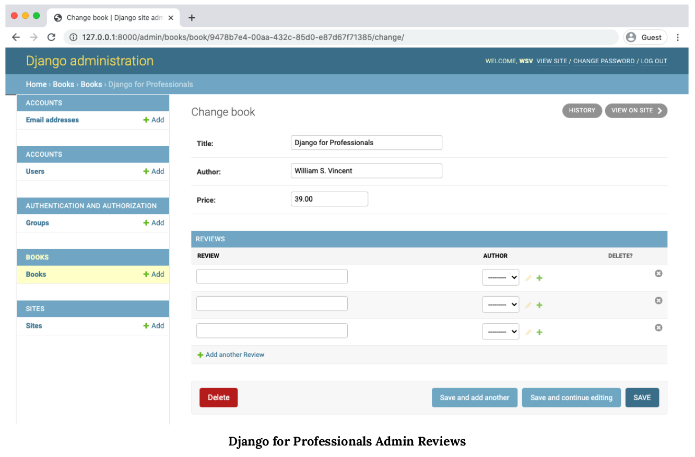
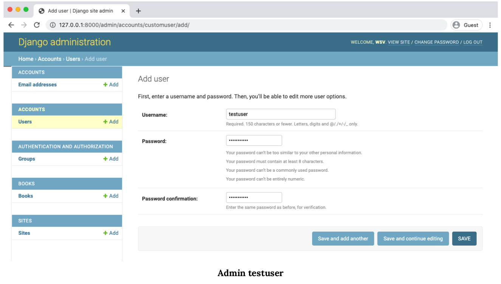
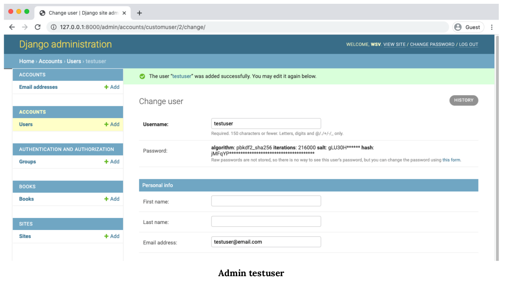
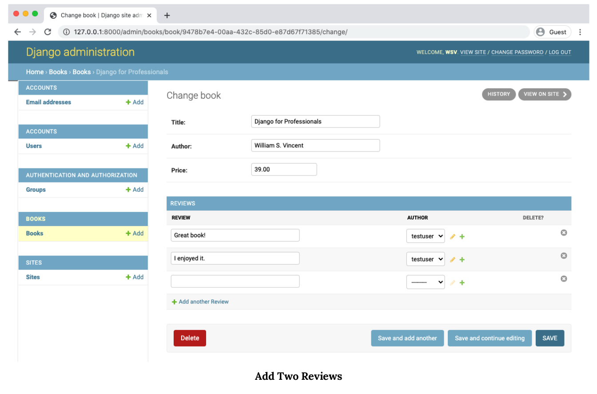
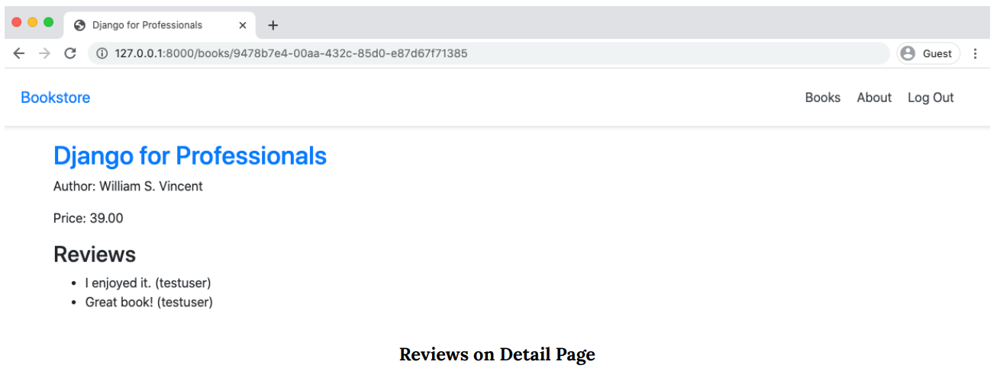

<div dir='rtl'>


# فصل 11 : اپ Reviews

ما در این فصل اپ Reviews را اضافه میکنیم تا خوانندگان نقد و بررسی کتاب مورد علاقه اشان را بنویسند. این به ما فرصت می دهد تا در مورد کلید های خارجی, ساختار برنامه و فرم ها بحث و بررسی کنیم .


## Foreign Keys (کلید خارجی)

ما قبلا از رابطه های کلید خارجی (Foreign Keys) که  استفاده کردیم ولی در مورد این فکرنکردیم . برای اینکه یک تصوری از پایگاه داده داشته باشیم آن را به یک صفحه بزرگ که شامل جدول های مختلف و این جدول ها نیز شامل سطر و ستون هایی هست و که باید دارای یک فیلد منحصر به فرد مثل id داشته باشند تا با استفاده از این, اطلاعات یک جدول را بتوانیم استخراج کنیم


<div dir='ltr'>

| Field name | Value |
| :---         |     :---:      |
| id(منحصر به فرد)   | عدد |
| city     | کاراکتر |

</div>


حالا اگر بخواهیم چن تا جدول را به هم وصل کنیم و ارتباط بین آنها ایجاد کنیم باید از رابطه ها   استفاده بکنیم که این رابطه ها سه نوع هستند :

<div dir='ltr'>

    • One-to-one (یک به یک )
    • One-to-many (یک به چند)
    • Many-to-many (چند به چند)

</div>


 #####  یک-به-یک (One-to-One) :

 این رابطه ساده ترین نوع هست, به عنوان مثال شماره های تامین اجتماعی ,که هر فرد فقط یک شماره تامین اجتماعی دارد و هر شماره فقط به یک نفر مرتبط است و مثال دیگر مثل شناسنامه که هر فرد فقط یک کد ملی دارد و هر کد ملی فقط متعلق به یک فرد هست.


 ##### یک-به-چند (One-to-Many) :

 این رابطه بسیار رایج است , به عنوان مثال یک دانش آموزش میتواند در کلاس های زیادی ثبت نام کند.


 ##### چند-به-چند (Many-to-Many) :

 به عنوان مثال یک کتاب را بیش از یک نوسنده و هر نویسنده میتواند کتاب های زیادی رو نوشته باشد .

این رابطه نیز مثل دو رابطه ی قبلی بسیار استفاده میشود , شما برای اتصال یه کلید به به چند کلید دیگر به این رابطه نیاز خواهید داشت , مثال هایی دیگر مثل بیماران (هر پزشک به چند بیمار و بالعکس مراجعه می کند) یا وظایف کارمندان (هر کدام
کارمند چندین وظیفه دارد در حالی که هر کار توسط چندین کارمند انجام می شود).

------------------------


## مدل های Reviews

نوشته مترجم:

"""

حال باید یک ایده کلی داشته باشیم که از چه نوع رابطه در نوشتن مدل ها و دیتا بیس استفاده کنیم این نوع نگرش به پروژه کاملا بستگی دارد و همچنین باید این نوع رابطه ها در بهینه ترین حالت نوشته شود که به مرور زمان و خواندن داکیومنت های جنگو این مهارت را کسب خواهید کرد , این بخش ها را میتوانید داخل این لینک ها بخواندید .


<div dir='ltr'>

https://docs.djangoproject.com/en/3.2/topics/db/optimization/

https://docs.djangoproject.com/en/3.2/topics/performance/

</div>

همچنین با این کلید واژه ها میتوانید داخل اینترنت جستجو کنید و مطالب بیشتری را بخوانید   ** django query optimization **

"""


حال بیایم فکر کنیم که  مدل Reviews با چه نوع رابطه باید نوشته شود این مدل باید متعلق به یک کتاب باشد یعنی نباید همزمان متعلق به چند تا کتاب باشد و همچنین یک کتاب بتواند بررسی های مختلفی داشته باشد پس در نتیجه میتوانیم از رابطه ی One-to-Many استفاده بکنیم


<div dir='ltr'>

```python
# books/models.py

import uuid

from django.contrib.auth import get_user_model # new
from django.urls import reverse
from django.db import models


class Book(models.Model):
    ...


class Review(models.Model): # new
    book = models.ForeignKey(
            Book,
            on_delete=models.CASCADE,
            related_name='reviews',
        )
    review = models.CharField(max_length=255)
    author = models.ForeignKey(
            get_user_model(),
            on_delete=models.CASCADE,
        )

    def __str__(self):
        return self.review
```

</div>


در ایمپورت های بالا مطمئنا متوجه get_user_model شدید, حال اگر شما بخواهید مدل کاربر را شخصی سازی بکنید باید در همه مدل هایی که با مدل کاربر در ارتباط هستند را تغییر به اسم مدل شخصی کاربر خودتان بدهید برای اینکه این کار را انجام ندهید و کد داینامیک تری داشته باشیم از این روش استفاده میکنیم تا دیگر نیازی به این کار نباشد .
داخل فیلد های (book , author) on_delete را قرار دادیم که به منظور حذف شاخه به شاخه هست یعنی وقتی یک کتاب از دیتابیس حذف شد  نقد وبررسی های آن نیز حذف خواهند شد
.

 برای اعمال تغییرات در دیتابیس از دستورات زیر استفاده خواهیم کرد


<div dir='ltr'>

##### Command Line


```docker
$ docker-compose exec web python manage.py makemigrations books
$ docker-compose exec web python manage.py migrate
```

</div>

-------------------------------------

## ادمین

برای اینکه بتوانیم مدل های نوشته را در پنل ادمین داشته باشیم و بتوانیم اطلاعات دیتابیس را مدیریت کنیم و همچنین بتوانیم داخل مدل کتاب ها به صورت Inline  بررسی ها را اضافه کنیم از  [TabularInline](https://docs.djangoproject.com/en/3.2/ref/contrib/admin/#django.contrib.admin.TabularInline) استفاده میکنیم

<div dir='ltr'>

```python

# books/admin.py
from django.contrib import admin
from .models import Book, Review


class ReviewInline(admin.TabularInline):
    model = Review


class BookAdmin(admin.ModelAdmin):
    inlines = [
        ReviewInline,
    ]
    list_display = ("title", "author", "price",)
    admin.site.register(Book, BookAdmin)
```
</div>

اکنون به بخش کتابها در http://127.0.0.1:8000/admin/books/book/ بروید و سپس کلیک کنید
در هر یک از کتابها برای مشاهده نظرات قابل مشاهده در صفحه کتاب جداگانه.



ما قبلا کاربر هایی را اضافه کرده بودیم, ولی هنگام حذف پایگاه داده در آن حذف شد , ما دو گزینه برای اضافه کردن کاربر داریم : می توانیم به سایت اصلی برویم و از پیوند "ثبت نام " استفاده بکنیم یا اینکه از پنل ادمین اضافه بکنیم . بیاییم دومی را انجام بدهیم , داخل پنل ادمین روی دکمه "Add" کلیک کنید و کاربر جدید به اسم "testuser" اضافه کنید .



سپس در صفحه بعدی testuser@email.com را به عنوان آدرس ایمیل اضافه کنید. به پایین پیمایش کنید
صفحه را فشار دهید و روی دکمه "Save" کلیک کنید.



خوب ، سرانجام ، ما می توانیم با استفاده از testuser نظرات خود را به کتاب "جنگو برای حرفه ای ها" اضافه کنیم. به بخش کتابها برگردید و روی کتاب کلیک کنید. دو نظر بنویسید
 , حتما نویسنده را "testuser" قرار بدهید .




-------------------------------------

## تمپلیت ها (Templates)

بعد از ساختن مدل های اپ نقد و بررسی, زمان آن رسیده است که نقد و بررسی های هر کتاب را در تمپلیت نمایش بدهیم , برای این کار شما باید ی بخشی با عنوان نقد و بررسی برای هر کتاب اضافه کنید و سپس  نقد و بررسی ها را حلقه(for) بزنید .
 و چون این یک رابطه ی کلید خارجی هست میتوانیم اینطور عمل کنیم : book.reviews.all
  و سپس متن نقد را با : review.review و نویسنده ی آن را با review.author نمایش بدهیم

<div dir='ltr'>

```html

# templates/books/book_detail.html


{{ book.title }}


    <div class="bool-detail">
        <h2> <a href=""> {{ book.title }} </a> </h2>
        <p>Author: {{ book.author }}</p>
        <p>Price: {{ book.price }}</p>

        <div>
            <h3>Reviews</h3>
            <ul>
                
                    <li>{{ review.review }} ({{ review.author }})</li>
                
            </ul>
        </div>
    </div>



```
</div>

بسیار عالی ما این مراحل را درست انجام دادیم الان زمان آن رسیده تا به جزییات کتاب بروید و نقد و بررسی های آن را ببنید

url  متفاوت است زیرا ما از UUID استفاده میکنیم




-------------------------------------


## تست ها (Tests)

نوشته مترجم :

""

زمان نوشتن تست ها اطلاعاتی که وارد پایگاه داده میکنیم , این اطلاعات  در پایگاه داده ی جدا و به صورت موقت ذخیره شده و پس از اتمام تست این اطلاعات حذف خواهند شد .

""

ما در قدم اول به روش setUp یک کاربر جدید را اضافه میکنیم  و همچنین یک کتاب جدید , حال ما میتوانیم یک نقد و بررسی را نیز اضافه کنیم .


<div dir='ltr'>

```python

# books/tests.py
from django.contrib.auth import get_user_model # new
from django.test import TestCase
from django.urls import reverse

from .models import Book, Review # new


class BookTests(TestCase):
    def setUp(self):
        self.user = get_user_model().objects.create_user( # new
            username='reviewuser',
            email='reviewuser@email.com',
            password='testpass123'
        )
        self.book = Book.objects.create(
            title='Harry Potter',
            author='JK Rowling',
            price='25.00',
        )
        self.review = Review.objects.create( # new
            book = self.book,
            author = self.user,
            review = 'An excellent review',
        )
    def test_book_listing(self):
        self.assertEqual(f'{self.book.title}', 'Harry Potter')
        self.assertEqual(f'{self.book.author}', 'JK Rowling')
        self.assertEqual(f'{self.book.price}', '25.00')

    def test_book_list_view(self):
        response = self.client.get(reverse('book_list'))
        self.assertEqual(response.status_code, 200)
        self.assertContains(response, 'Harry Potter')
        self.assertTemplateUsed(response, 'books/book_list.html')

    def test_book_detail_view(self):
        response = self.client.get(self.book.get_absolute_url())
        no_response = self.client.get('/books/12345/')
        self.assertEqual(response.status_code, 200)
        self.assertEqual(no_response.status_code, 404)
        self.assertContains(response, 'Harry Potter')
        self.assertContains(response, 'An excellent review') # new
        self.assertTemplateUsed(response, 'books/book_detail.html')

```


##### Command Line

```
$ docker-compose exec web python manage.py test
Creating test database for alias 'default'...
System check identified no issues (0 silenced).
.................
----------------------------------------------------------------------
Ran 17 tests in 0.675s
OK
Destroying test database for alias 'default'...
```

</div>


-------------------------------------


## گیت (Git)

  تغییرات جدید کدمان را به گیت و یک پیام و توضیحات  وارد میکنیم

<div dir='ltr'>

##### Command Line

```
$ git status
$ git add .
$ git commit -m 'ch11'

```

</div>

[لینک کد های این فصل در گیت هاب
](https://github.com/wsvincent/djangoforprofessionals/tree/master/ch11-reviews)


---------------------------

## جمع بندی (Conclusion)

با گذشت زمان و بزرگ تر شدن پروژه نیاز به یک صفحه فرم که با استفاده از AJAX و iQuery , React , Vue یا کتبخونه ها و فریمورک های دیگر JavaScript خواهیم داشت ولی از مبحث این کتاب خارج است .
و با پیشرفت پروژه ممکن است تبدیل کردن این بخش به یک اپ جدا منطقی باشد .

در فصل بعد ، بارگذاری تصویر را به سایت خود اضافه می کنیم تا جلد هر کتاب وجود داشته باشد.

</div>


