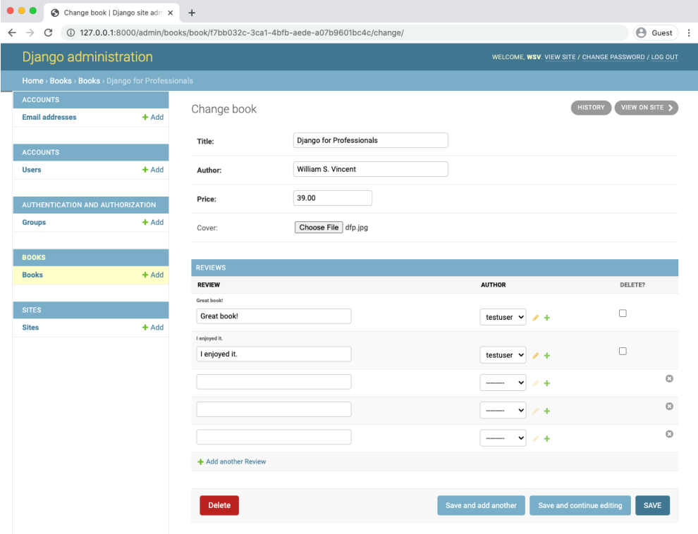
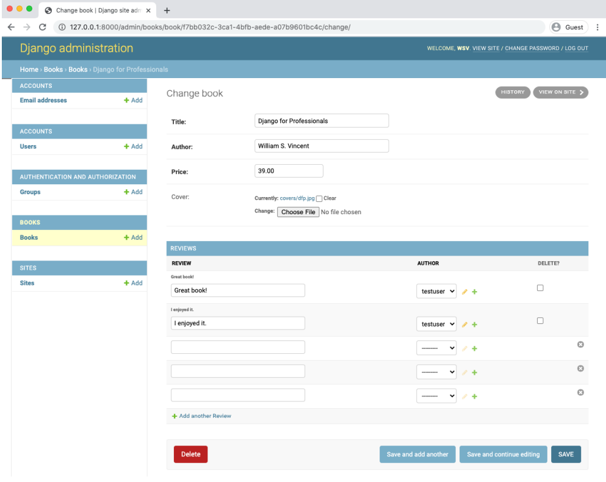
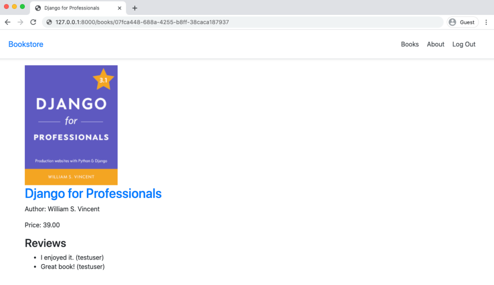
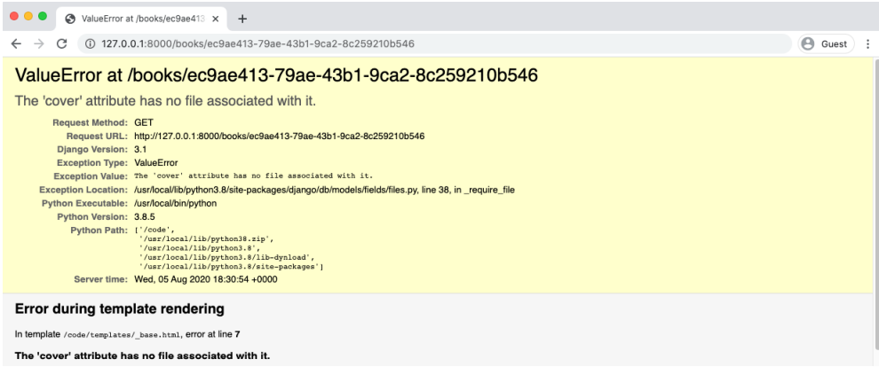

<div dir="rtl">

# آپلود تصویر و فایل

ما قبلتر در فصل 6 منابع static را، مانند عکس پیکربندی کردیم؛ اما فایلهای بارگذاری شده توسط کاربر، همچون جلد کتاب، کمی متفاوت است. برای شروع، جنگو به قالب static اشاره میکند، در حالی که هر چیزی که توسط user آپلود میشود، چه فایل و چه عکس، media نامیده میشود.

روند افزودن این ویژگیها برای فایلها یا تصاویر مشابه هست؛ اما، برای تصاویر، باید کتابخانه پردازش تصویر پایتون به نام [Pillow](https://python-pillow.org/) را نصب کرد که شامل ویژگیهای اضافه مانند اعتبارسنجی اولیه است.

بیایید Pillow را با استفاده از روش آشنای خود در Docker نصب کنیم، container هایمان را متوقف کنیم، و ساخت image جدیدی را force کنیم.

<div dir="ltr">

```shell
$ docker-compose exec web pipenv install pillow==7.2.0
$ docker-compose down
$ docker-compose up -d --build
```

</div>

### فایلهای Media

فایل های static قابل اطمینان هستند در صورتی که فایل های مدیا غیرقابل اطمینان میباشد. همیشه [نگرانی های امنیتی](https://docs.djangoproject.com/en/3.1/ref/models/fields/#file-upload-security) زمان مواجهه با [محتوای بارگذاری شده توسط user](https://docs.djangoproject.com/en/3.1/topics/security/#user-uploaded-content) وجود دارد. قابل ذکر است که اعتبارسنجی همه‌ی فایلهای آپلود شده برای اطمینان حاصل کردن از اینکه آنها همان چیزی هستند که میگویند، مهم است. چندین روش وجود دارد که یک فرد مخرب میتواند به وبسایتی که کورکورانه آپلودهای کاربران را میپذیرد ،حمله کند.

برای شروع بیایید دو کانفیگ جدید به فایل config/settings.py اضافه کنیم. به طور پیش فرض MEDIA_URL و MEDIA_ROOT داخل فایل settings وجود ندارند، پس ما نیاز به کانفیگ کردن آنها داریم.


- [MEDIA_ROOT](https://docs.djangoproject.com/en/3.1/ref/settings/#media-root) مسیر سیستمی دقیق به پوشه های فایلهای بارگذاری شده توسط کاربر است.

- [MEDIA_URL](https://docs.djangoproject.com/en/3.1/ref/settings/#media-url) نشانی اینترنتی (url) است که میتوانیم در templat های خود برای فایلهایمان استفاده کنیم.

ما میتوانیم هر دوی این تنظیمات را بعد از STATICFILES_FINDERS در انتهای فایل config/settings.py اضافه کنیم. برای راحتی کار هردو را media نامگذاری میکنیم. فراموش نکنید اسلش (/) را برای MEDIA_URL قرار دهید.

<div dir="ltr">

```python
# config/settings.py
MEDIA_URL = '/media/' # new
MEDIA_ROOT = str(BASE_DIR.joinpath('media')) # new
```

</div>

سپس یک پوشه جدید به نام media و یک پوشه دیگر به نام covers در داخل آن اضافه میکنیم.

<div dir="ltr">

```shell
$ mkdir media
$ mkdir media/covers
```

</div>

و سرانجام، از آنجایی که فرض بر این است که محتوای بارگذاری شده توسط کاربر در یک production context (محیط عملی) وجود دارد، برای مشاهده آیتم های local، نیاز داریم تا فایل config/urls.py هم به روزرسانی کنیم تا فایلها به صورت local نمایش داده شوند. این مرحله شامل import کردن settings و static در بالا و اضافه کردن یک خط کد در پایین فایل میشود.

<div dir="ltr">

```python
# config/urls.py
from django.conf import settings # new
from django.conf.urls.static import static # new
from django.contrib import admin
from django.urls import path, include
urlpatterns = [
  # Django admin
  path('admin/', admin.site.urls),

  # User management
  path('accounts/', include('allauth.urls')),

  # Local apps
  path('', include('pages.urls')),
  path('books/', include('books.urls')),
] + static(settings.MEDIA_URL, document_root=settings.MEDIA_ROOT) # new
```

</div>

### مدل ها

با پیکربندی های عمومی media اکنون ما میتوانیم به مدلهای خود مراجعه کنیم. برای ذخیره سازی تصاویر از [ImageField](https://docs.djangoproject.com/en/3.1/ref/models/fields/#django.db.models.ImageField) جنگو استفاده میکنیم که خود شامل برخی از اعتبارسنجی های اولیه پردازش تصویر میباشد. نام فیلد cover (جلد) میباشد و ما پوشه‌ی MEDIA_ROOT/covers را برای بارگذاری تصاویر انتخاب میکنیم (قسمت MEDIA_ROOT بر اساس تنظیمات قبلی فایل settings.py انجام شده است).

<div dir="ltr">

```python
# books/models.py
class Book(models.Model):
  id = models.UUIDField(
    primary_key=True,
    default=uuid.uuid4,
    editable=False)
  title = models.CharField(max_length=200)
  author = models.CharField(max_length=200)
  price = models.DecimalField(max_digits=6, decimal_places=2)
  cover = models.ImageField(upload_to='covers/') # new

  def __str__(self):
    return self.title

  def get_absolute_url(self):
    return reverse('book_detail', kwargs={'pk': str(self.pk)})
```

</div>

اگر میخواستیم آپلود یک فایل معمولی را به جای یک فایل تصویری مجاز کنیم، تنها تفاوت تغییر ImageField به FileField بود.

تا اینجا مدل را آپدیت کردیم. وقت این است که یک فایل migrations بسازیم.

<div dir="ltr">

```shell
$ docker-compose exec web python manage.py makemigrations books
You are trying to add a non-nullable field 'cover_image' to book without a default; we can't do that (the database needs something to populate existing rows).
Please select a fix:
1) Provide a one-off default now (will be set on all existing rows with a null value for this column)
2) Quit, and let me add a default in models.py
Select an option:
```

</div>

اوپس! چی شد؟ ما داریم یک فیلد جدید به دیتابیس اضافه میکنیم، اما قبلا برای هر کتاب سه ورودی در دیتابیس داشتیم. هنوز نتوانستیم مقدار پیش فرض را برای جلد تنظیم کنیم.

برای حل این مشکل، گزینه 2 را انتخاب میکنیم و یک فیلد [blank](https://docs.djangoproject.com/en/3.1/ref/models/fields/#blank) به فیلد تصویرمان اضافه میکنیم و آنرا برابر True قرار میدهیم.

<div dir="ltr">

```python
# books/models.py
cover = models.ImageField(upload_to='covers/', blank=True) # new
```

</div>

این اتفاق رایج است که blank و null با هم برای تعیین مقدار پیش فرض در یک فیلد استفاده می شوند. یک گاتچا این است که نوع فیلد - ImageField در مقابل CharField و غیره - نحوه استفاده صحیح از آنها را نشان میدهد، بنابراین داکیومنتهای این بخش را برای استفاده در آینده نزدیک مطالعه کنید.

حال میتوانیم یک فایل migrations بدون ارور بسازیم.

<div dir="ltr">

```shell
$ docker-compose exec web python manage.py makemigrations books
```

</div>

و سپس migration (مهاجرت) را به پایگاه داده ما را اعمال کنید.

<div dir="ltr">

```shell
$ docker-compose exec web python manage.py migrate
```

</div>

  ### ادمین

ما اکنون در خانه هستیم! به پنل ادمین و در کتاب‌ها به 'Django for Professionals' بروید. فیلد cover(جلد) را مشاهده می‌کنید که اضافه شده‌است و   ما یک کپی ازآن تصویر مورد نظر از قبل به صورت محلی در مسیر static/images/dfp.png داریم پس آنرا برای این فیلد بارگزاری کنید و سپس دکمه ذخیره 'save' را که در قسمت پایین و در سمت راست قرار دارد را کلیک کنید.


<p align="center">
  
  <br>
  <b>اضافه کردن تصویر جلد</b>
</p>

که این مارا به صفحه کتاب‌ها (Books) برمی‌گرداند. دوباره بر روی لینک کتاب 'Django for Professionals' کلیک کنید و میبینیم که تصویر جلد در محل مورد نظر ما در covers/ وجود دارد.


<p align="center">
  
  <br>
  <b>پنل ادمین با اضافه شدن جلد</b>
</p>

  ### قالب

  اوکی، قدم نهایی. بیایید قالبمان را برای نمایش جلد کتاب در هر صفحه مشخص آپدیت کنیم. مسیر ما book.cover.url که به محل تصویر جلد در فایل سیستم ما اشاره دارد، می‌باشد.</br>
 در زیر فایل بروزرسانی شده book_detail.html را با این یک خط تغییر بالاتر از عنوان(title) را می‌بینید.

<div dir='ltr'>

<b>Code</b>
```html

# templates/books/book_detail.html

{{ book.title }}

<div class="book-detail">
  
  <h2><a href="">{{ book.title }}</a></h2>
  <p>Author: {{ book.author }}</p>
  <p>Price: {{ book.price }}</p>
  <div>
    <h3>Reviews</h3>
    <ul>
    
    <li>{{ review.review }} ({{ review.author }})</li>
    
    </ul>
  </div>
</div>

```
</div>


  حال اگر صفحه‌ی 'Django for Professionals' را ببینید جلد تصویر را مشاهده می کنید!


<p align="center">
  
  <br>
    <b>تصویر جلد</b>
</p>
</br>
  یک سناریو وجود دارد که قالب ما اکنون به یک جلد برای هر کتاب جهت نمایش نیاز دارد. در صورتی که اگر به صفحه‌ی دو کتابی که قبلاً داشتیم و هیچ عکس جلدی برای آنها اضافه نکرده بودیم، بروید، خطای زیر را مشاهده می‌کنید.

</br>
<p align="center">
  
  <br>
  <b>خطای تصویر جلد</b>
</p>

  ما باید یک منطق اساسی به الگویمان اضافه کنیم تا زمانی که آن جلد وجود نداشت به جستجوی آن نپردازد! و این با یک جمله شرطی (if) که book.cover را چک می‌کند که اگر موجود بود آن را نمایش بدهد، انجام پذیر است.
<div dir='ltr'>

<b>Code</b>
```html

# templates/books/book_detail.html

{{ book.title }}


  <div class="book-detail">
  
  
  
  <h2><a href="">{{ book.title }}</a></h2>
    ...
```

</div>
  حال اگر یکی از آن دو صفحه را دوباره درخواست کنید، میبینید که صفحه درست را اگرچه بدون تصویر جلد برای ما نمایش می‌دهد.

  ### قدم بعدی

  چند اقدام اضافی وجود دارد که می‌تواند خوب باشد در پروژه استفاده کنیم، اما خارج از محتوای این کتاب هستند. که شامل اضافه کردن فرم‌های اختصاصی برای ایجاد/ویرایش/حذف کتاب‌ها و تصاویر جلد آنها می‌شود. یک لیست کاملاً طولانی از اعتبارسنجی‌های اضافی می‌توان و از طرفی باید برای فرم بارگزاری عکس‌ها پیاده‌سازی کرد برای اینکه مطمئن شد که فقط تصاویر استاندارد به پایگاه داده ما اضافه می‌شوند.
  قدم اضافی‌تر این میباشد که فایلهای مدیا را در یک شبکه‌ی CDN(Content Delivery Network) که یک شبکه‌ی تحویل محتوا می‌باشد، برای امنیت بیشتر ذخیره کرد. این می تواند در عملکرد وب سایت‌های بزرگ برای فایل‌های static موثر باشد ، اما برای فایلهای مدیا بر خلاف اندازه آنها، ایده ی خوبی می‌باشد.
در نهایت تست‌ها را نیز خوب بود که استفاده می‌کردیم اگرچه آنها در درجه اول تمرکزشان روی ناحیه اعتبارسنجی فرم است تا اینکه آپلود اولیه تصویر توسط ادمین   .این مبحث می تواند بسیار پیچیده شود، اما برای مطالعه در آینده ارزشش را دارد.

  ### گیت

دقت داشته باشید که تغییرات این فصل رو کامیت کرده باشید.

<div dir="ltr">

```shell
$ git status
$ git add .
$ git commit -m 'ch12'
```

</div>

مثل همیشه، کد های خودتون رو با [منبع اصلی](https://github.com/wsvincent/djangoforprofessionals/tree/master/ch12-file-image-uploads) مقایسه کنید.

### جمع بندی

در این فصل نحوه آپلود فایل های کاربر را یاد گرفتیم. این کار در عمل ساده میباشد اما  به علت وجود مشکلات امنیتی این بخش نیاز به توجه ویژه دارد.

در فصل بعد مجوزهایی را برای ایمن کردن سایتمان ایجاد خواهیم کرد.

</div>
