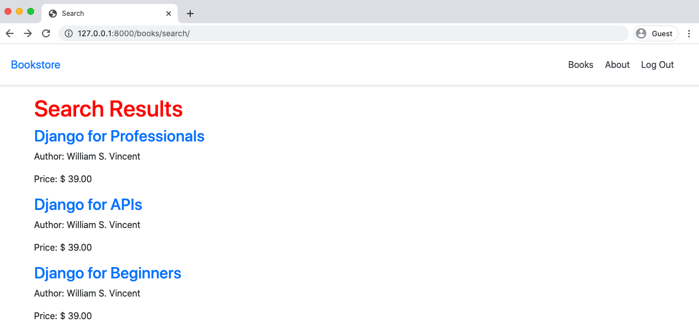
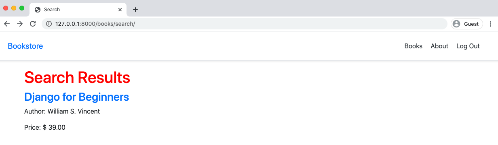
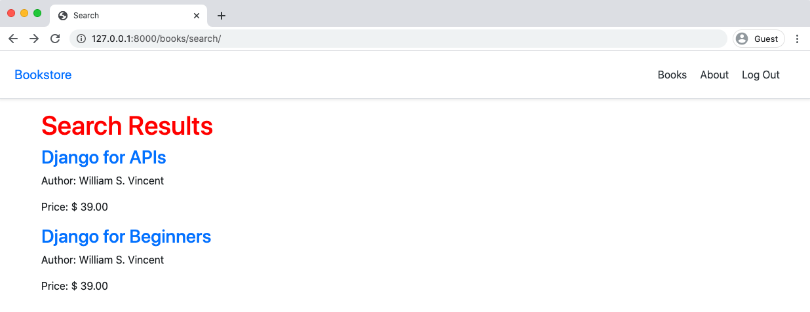
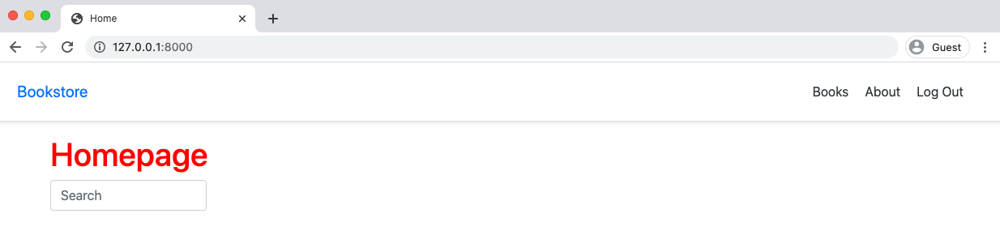
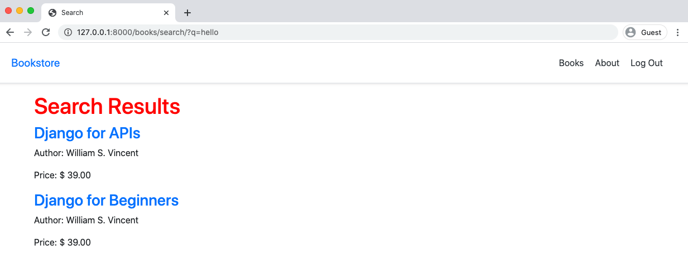

<div dir='rtl'>

# فصل ۱۴ : جستجو


جستجو یکی از ویژگی های اساسی اکثر وبسایت ها و هر چیزی مربوط به تجارت الکترونیک(e-commerce) است؛ مانند کتابفروشی ما.
در این فصل نحوه پیاده سازی جستجوی ساده را با فرم و فیلتر هارا یاد می گیریم.
سپس آن را با بهبود می بخشیم و نگاه عمیق تری به آپشن های سرچ در جنگو می اندازیم.
درحال حاضر فقط سه کتاب در دیتابیس خود داریم اما این کد به تعداد کتاب های دلخواهمان مقیاس پذیر است.


جستجو شامل دو بخش است:
- یک فرم که کوئری جستجو کاربر را با خود ارسال می کند.
- سپس یک صفحه که نتایج جستجو را بر اساس کوئری ارائه می کند.


تعیین نوع مناسب فیلتر جایی است که جستجو, سخت و جالب می شود.
اما ابتدا باید فرم و صفحه ی نتایج جستجو را ایجاد کنیم.


در این بخش می توان با یکی از دوتا شروع کرد که ما اول بخش فیلتر و سپس فرم را آماده می کنیم.

### صفحه نمایش نتایج

با صفحه ی نتایج شروع می کنیم. مانند سایر صفحات جنگو باید view, URL و template اختصاصی ایجاد کنیم.
ترتیب پیاده سازی اهمیت چندانی ندارد ولی ما به همان ترتیب پیش می رویم.

داخل `books/urls.py`, مسیر `search/` را با نام `search_results` اضافه کنید که از view با نام `SearchResultsListView` استفاده می کند.


<div dir='ltr'>

Code
```python
# books/urls.py
from django.urls import path
from .views import BookListView, BookDetailView, SearchResultsListView # new

urlpatterns = [
    path('', BookListView.as_view(), name='book_list'),
    path('<uuid:pk>', BookDetailView.as_view(), name='book_detail'),
    path('search/', SearchResultsListView.as_view(),
        name='search_results'), # new
]
```

</div>


ویو (view) بعدی `SearchResultsListView` است که در حال حاضر لیستی از تمام کتاب های موجود است.
این گزینه اصلی برای استفاده از `ListView` است.
template آن `search_results.html` نامیده می شود و در پوشه ی `templates/books/` قرار دارد.
تنها کد جدید, مربوط به `SearchResultsListView` است همانطور که قبلا هم `ListView` و مدل `Book` را در بالای فایل ایمپورت کردیم.


<div dir='ltr'>

Code
```python
# books/views.py
class SearchResultsListView(ListView): # new
    model = Book
    context_object_name = 'book_list'
    template_name = 'books/search_results.html'
```

</div>


در آخر template با نام `search_results.html` را ایجاد می کنیم.


<div dir='ltr'>

Command Line
```
$ touch templates/books/search_results.html
```

</div>

حال تمام کتاب های موجود, بر اساس عنوان ,نویسنده و قیمت لیست می شوند.


<div dir='ltr'>

code
```html
<!-- templates/books/search_results.html -->


Search


  <h1>Search Results</h1>
  
    <div>
      <h3><a href="{{ book.get_absolute_url }}">{{ book.title }}</a></h3>
      <p>Author: {{ book.author }}</p>
      <p>Price: $ {{ book.price }}</p>
    </div>


```

</div>


اگر هنوز در حساب کاربری لاگین هستید, اکنون از حساب کاربری خارج شوید . صفحه نتایج جستجو اکنون در آدرس
`http://127.0.0.1:8000/books/search/` در دسترس است .





 و آن اینجاست!


### فیلتر مقدماتی
 در جنگو از [کوئری ست](https://docs.djangoproject.com/en/3.1/topics/db/queries/#retrieving-objects) برای فیلترکردن نتایج مدل در  دیتابیس (پایگاه داده) استفاده می شود .
در حال حاضر صفحه نتایج جستجوی ما بنظر نمی رسد که یکی باشند زیرا همه نتایج را از مدل `Book`
 نشان می دهد . در نهایت ما می خواهیم فیلتر را بر اساس کوئری جستجوی کاربر اجرا کنیم, اما ابتدا چندین روش فیلتر کردن را کار میکنیم .


به نظر می رسد راه های متعددی برای سفارشی کردن کوئری ست وجود دارد،
 از جمله از طریق یک [Manager](https://docs.djangoproject.com/en/3.1/topics/db/managers/#django.db.models.Manager)
 در خود مدل، اما برای ساده نگه داشتن کارها, میتوانیم فقط با یک خط یک فیلتر اضافه بکنیم . بریم که انجامش بدیم !


 ما میتوانیم ویژگی(attribute) کوئری ست را در `ListView` که به طور  پیش فرض همه نتایج را نشان می دهد، لغو کنیم .
 مستندات کوئری ست کاملا قوی و جزئیات است,
 اما اغلب [contains](https://docs.djangoproject.com/en/3.1/ref/models/querysets/#contains) (که به حروف کوچک و بزرگ حساس است) یا
 [icontains](https://docs.djangoproject.com/en/3.1/ref/models/querysets/#icontains) (که به حروف بزرگ و کوچک حساس نیست) نقطه شروع خوبی هستند.
 ما فیلتر را بر اساس عنوانی که "شامل" نام "مبتدیان" است اجرا خواهیم کرد .


<div dir='ltr'>

code
```python
# books/views.py
class SearchResultsListView(ListView):
    model = Book
    context_object_name = 'book_list'
    template_name = 'books/search_results.html'
    queryset = Book.objects.filter(title__icontains='beginners') # new
```

</div>

صفحه نتایج جستجو را رفرش کنید و اکنون فقط کتابی را که حاوی عنوان "مبتدیان" است نمایش داده می شود. موفق شدیم !




 برای فیلتر کردن اولیه اکثر مواقع [متد های داخلی کوئری ست ها](https://docs.djangoproject.com/en/3.1/topics/db/queries/#other-queryset-methods) از
 ()get و ()all و ()filter یا ()exclude کافی خواهد بود . با این حال یک [QuerySet API](https://docs.djangoproject.com/en/3.1/ref/models/querysets/#queryset-api) بسیار قوی و دقیق نیز وجود دارد که ارزش مطالعه بیشتر را دارد.


 ### اشیاء (Q Objects)


استفاده از ()filter قدرتمند است و حتی می توان فیلتر هارا با هم [زنجیره کرد](https://docs.djangoproject.com/en/3.1/topics/db/queries/#chaining-filters) مانند جستجوی تمام عناوینی که حاوی "beginners" و "django" هستند. با این حال اغلب شما جستجوهای پیچیده تری می خواهید که فقط نیازی
 نیست از `AND` استفاده کنید بلکه از `OR` هم میتوانید استفاده کنید ,آن وقت زمان استفاده از [Q objects](https://docs.djangoproject.com/en/3.1/topics/db/queries/#complex-lookups-with-q-objects) فرا میرسد.


در اینجا مثالی وجود دارد که در آن فیلتر را برای جستجوی نتیجه ای که با عنوان
"beginners" یا  "api" مطابقت دارد, تنظیم می کنیم. این کار به سادگی با import کردن `Q` در بالای فایل انجام میشود
 و سپس به طور نامحسوس query موجود خود را تغییر می دهیم . نماد عملگرد `|` به معنی `یا` است .
 ما میتوانیم در هر فیلد در دسترس فیلتر انجام دهیم: نه فقط عنوان، بلکه نویسنده یا قیمت به دلخواه.


با افزایش تعداد فیلتر ها, جدا کردن `queryset` از طریق اورراید
`()get_queryset` میتواند مفید باشد . این کاری است که ما در اینجا انجام خواهیم داد، اما توجه داشته باشید که این کار اختیاری است .

<div dir="ltr">

code
```python
# books/views.py
from django.db.models import Q # new
...

class SearchResultsListView(ListView):
    model = Book
    context_object_name = 'book_list'
    template_name = 'books/book_list.html'

    def get_queryset(self): # new
        return Book.objects.filter(
        Q(title__icontains='beginners') | Q(title__icontains='api')
        )
```

</div>

صفحه نتایج جستجو را رفرش کنید تا نتیجه جدید را ببینید.





اکنون بیایید توجه خود را به فرم جستجوی مربوطه معطوف کنیم که به جای hardcode
میتوانیم فیلترها را بر اساس جستجوی کاربر پر کنیم.


### فرم ها (Forms)

اساسا فرم وب ساده هستند: ورودی کاربر را می گیرد و آن را از طریق متد GET یا POST به URL ارسال می کند.
با این حال, در عمل, این رفتار اساسی وب میتواند بسیار پیچیده باشد .

اولین مسئله, ارسال داده های فرم است: داده ها واقعا کجا می روند و ما آن را
در آنجا چگونه هندل می کنیم؟
ناگفته نماند که هر زمان که به کاربران اجازه می دهیم داده ها را به یک سایت ارسال کنند، نگرانی های امنیتی متعددی به وجود می آید .

تنها دو گزینه برای نحوه ارسال فرم وجود دارد: از طریق متد های (HTTP) GET یا POST.


داده های POST یک فرم را بسته بندی می کند, آن را برای انتقال رمزگذاری می کند, آن را به سرور ارسال می کند, و سپس
یک پاسخ دریافت می کند . هر درخواستی که وضعیت دیتابیس را تغییر دهد `create, edits and deletes (ایجاد, ویرایش, حذف)`
باید از متد POST استفاده شود .


بسته بندی می کند GET داده های فرم را به صورت string که آن به URL مقصد اضافه می شود. متد GET فقط باید برای درخواست هایی استفاده
شود که بر وضعیت برنامه تأثیر نمی گذارد, مانند جستجویی که در آن هیچ چیز در دیتابیس تغییر نمی کند
اساساً ما فقط یک ویو (view) لیست فیلتر شده را انجام می دهیم .


اگر بعد از بازدید `Google.com` به URL نگاه کنید عبارت جستجوی خود را در خود URL صفحه نتایج جستجوی واقعی مشاهده خواهید کرد.


برای اطلاعات بیشتر, موزیلا راهنماهای دقیقی در مورد [ارسال داده های فرم](https://developer.mozilla.org/en-US/docs/Learn/Forms/Sending_and_retrieving_form_data)
و [اعتبار سنجی داده های فرم](https://developer.mozilla.org/en-US/docs/Learn/Forms/Form_validation) دارد که اگر قبلاً با اصول اولیه فرم آشنا نیستید، ارزش بررسی دارد.


### فرم جستجو (Search Form)

بیایید اکنون یک فرم جستجوی اولیه را به صفحه اصلی فعلی اضافه کنیم. به راحتی میتوان آن را در یک navbar
یا یک صفحه جستجوی اختصاصی در آینده قرار داد .

ما با `HTML` از تگ های `<form>` شروع می کنیم و از استایل bootstrap استفاده می کنیم تا زیبا به نظر برسد .
اکشن (action) مشخص می کند که کاربر پس از ارسال فرم به کجا هدایت شود ,
که صفحه نتایج جستجو خواهد بود. مثل همه ی لینک URL ها اسم URL این صفحه هم این است . سپس متد مورد نظر را مشخص می کنیم
که get به جای post باشد .

قسمت دوم فرم ورودی است که شامل عبارت جستجوی کاربر است. ما آن را با متغیر name ارائه می کنیم, q, که بعدا در url قابل مشاهده
و در فایل views در دسترس خواهد بود . استایل بوت استرپ را با کلاس اضافه می کنیم، نوع ورودی text را مشخص کنید, یک Placeholder
اضافه کنید که متنی پیش فرض است که از کاربر درخواست می کند. آخرین قسمت , `aria-label`, نامی است که برای کاربران خواننده نمایش داده می شود .
دسترسی, بخش بزرگی از توسعه وب است و همیشه باید از ابتدا مورد توجه قرار گیرد: از جمله وجود `aria-labels` در تمامی فرم های شما!


سخن مترجم :

- خصوصیت aria-label به کاربر اطلاعات اضافه در مورد عنصر می دهد و در واقع  عنصر را با یک برچسب معرفی می کند. و بین عنصر و برچسب آن ارتباط ایجاد می کند تا کاربرد و هدف عنصر بهتر مشخص شود. معمولا استفاده از این ویژگی برای عناصری که برچسب متنی قابل مشاهده ای ندارند که آنها را توصیف کند، توصیه می شود.


<div dir='ltr'>

Code
```html
<!-- templates/home.html -->



Home


  <h1>Homepage</h1>
  <form class="form-inline mt-2 mt-md-0" action=""
   method="get">
     <input name="q" class="form-control mr-sm-2" type="text" placeholder="Search"
     aria-label="Search">
  </form>

```

</div>


به صفحه اصلی بروید و باکس جستجوی جدید وجود دارد.



سعی کنید یک جستجو انجام دهید مثل : "hello" . با زدن Return به صفحه نتایج جستجو هدایت می شوید.
توجه داشته باشید , URL به طور خاص حاوی کوئری (عبارت) جستجو است.




با این حال نتایج تغییر نکرده است! و این به این دلیل است که ListView
نتایج جستجوی شما همچنان مقادیر کدگذاری شده قبلی را دارد. آخرین مرحله این است که درخواست جستجوی کاربر را
که در URL با q نشان داده شده است, و آن را به فیلتر های جستجوی واقعی ارسال کنید.


<div dir='ltr'>

Code
```python
# books/views.py
class SearchResultsListView(ListView):
    model = Book
    context_object_name = 'book_list'
    template_name = 'books/search_results.html'

    def get_queryset(self): # new
        query = self.request.GET.get('q')
        return Book.objects.filter(
        Q(title__icontains=query) | Q(author__icontains=query)
        )
```

</div>


چه چیزی تغییر کرد ؟ ما یک متغیر query اضافه کردیم که مقدار q را از ارسال فرم می گیرد.
سپس فیلترمان را برای استفاده از query در فیلد title و author آپدیت میکنیم. خودشه! صفحه نتایج جستجو را رفرش
کنید URL همچنان همان query را دارد و انتظار می رود: نتیجه ای برای "hello" در title یا author وجود نداشته باشد.

به صفحه اصلی برگردید و جستجوی جدیدی مانند "api" یا "beginners" را امتحان کنید تا عملکرد جستجوی کامل را در عمل ببینید .


### گیت (Git)

مطمئن شوید که کار فعلی ما در این فصل را با کامیت کردن کد جدید در Git ذخیره شده باشد.


<div dir='ltr'>

Command Line
```shell
$ git status
$ git add .
$ git commit -m 'ch14'
```

</div>


سورس کد رسمی این فصل در [گیت هاب](https://github.com/wsvincent/djangoforprofessionals/tree/master/ch14-search) در دسترس است.


### نتیجه (Conclusion)

جستجوی اولیه ما اکنون کامل شده است , اما فقط یه بخش سطحی از حد مطلوب بالقوه ی جستجو را انجام داده ایم.
به عنوان مثال، شاید بخواهیم دکمه ای به فرم جستجو اضافه شود که علاوه بر زدن کلید Return بتوان روی آن کلیک کرد؟
یا بهتر است اعتبار فرم را در نظر بگیرید.
اگر بخواهیم جستجویی با کیفیت گوگل را داشته باشیم، به غیر از فیلتر کردن با AND و OR، فاکتورهای دیگری نیز وجود دارد. چیزهایی مانند ارتباط و موارد دیگر.

چندین پکیج جانبی (third-party packages) با ویژگی های پیشرفته مانند [django-watson](https://github.com/etianen/django-watson) یا
[django-haystack](https://github.com/django-haystack/django-haystack) وجود دارد , با این حال با توجه به این که ما از
PostgreSQL به عنوان دیتابیس استفاده می کنیم میتوانیم از [full text search](https://docs.djangoproject.com/en/3.1/ref/contrib/postgres/search/)
و سایر ویژگی هایی که در خود جنگو تعبیه شده است استفاده کنیم .

گزینه نهایی یا استفاده از یک راه حل در سطح سازمانی مانند [ElasticSearch](https://www.elastic.co/) است که باید
روی یک سرور جداگانه اجرا شود (که با داکر سخت نیست) , یا به راه حل هاست مانند[Swiftype](https://swiftype.com/)
یا [Algolia](https://www.algolia.com/) تکیه کنید.

در فصل بعدی، بسیاری از بهینه سازی های عملکرد موجود در جنگو را بررسی می کنیم و پروژه کتابفروشی خود را برای استقرار نهایی آماده می کنیم.

</div>
