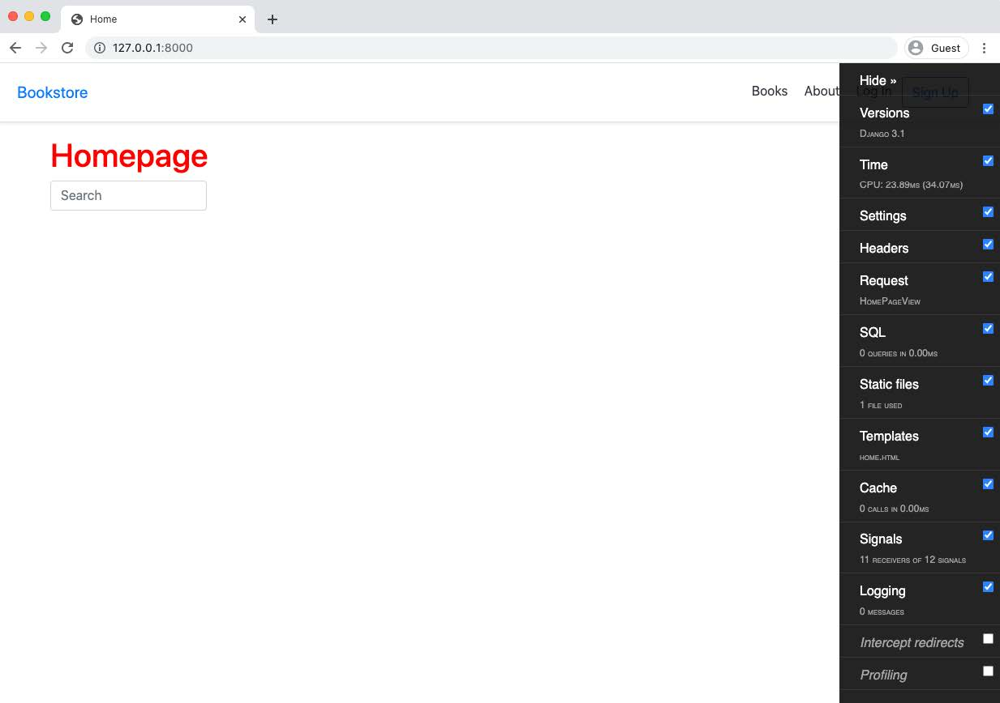
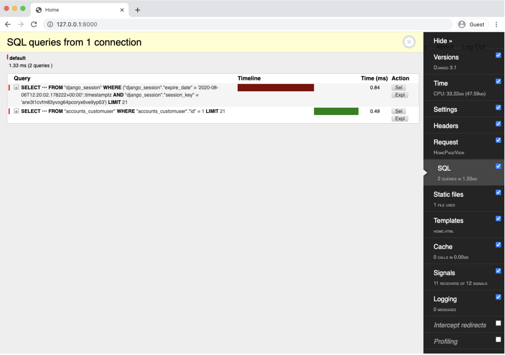

<div dir='rtl'>

# فصل ۱۵: کارایی و بهینه سازی

اولویت اول برای هر وبسایتی به درستی اجرا شدن و همچنین دربرداشتن تست های درست و مناسب هست. اما اگر پروژه شما آنقدر خوشانس
باشد که حجم زیادی از ترافیک دریافت کند، به سرعت تمرکز به سرعت به عملکرد و کارایی تغیر پیدا میکند و تا حدامکان کارآمدتر
می‌کند. این یک سرگرمی و تمرین چالش ‌برانگیر برای بسیاری از مهندسین است، اما میتواند یک تله نیز باشد.

یک
[نقل قول معروف](http://www.paulgraham.com/knuth.html)
از دونالد کنوت (دانشمند کامپیوتر) که ارزش خواندن کامل آن را دارد :


> مشکل اصلی برنامه نویسان این است که زمان زیادی را صرف نگرانی درباره کارایی در مکان‌ و زمان‌های اشتباه کرده‌اند. بهینه سازی زودهنگام ریشه تمام کارهای شیطانی :) یا حداقل بیشتر آنها در برنامه نویسی میباشد.


در عین حال که توجه و نظارت برای بهینه کردن پروژه (کدهایتان) در آینده بسیار مهم است. از همان اول تمرکز زیادی روی آن
نگذارید. هیچ راه دقیقی برای شبیه سازی محیط واقعی (پروداکشن) در محیط محلی (environments locally)
وجود ندارد حتی اگر بخوایم تشخیص دهیم ترافیک یک سایت چگونه خواهد بود. اما ممکن است در مراحل اولیه زمان زیادی را صرف پیدا
کردن راهی برای بهینه کردن عملکرد سیستم بجای صحبت با کاربران و بهبود کد های مهم تر کنید.

در این فصل تمرکز اصلی به روی جنبه های مهمتر عملکرد مرتبط با جنگو و همچنین برجسته کردن مناطقی که ارزش بیشتری در مقیاس
بزرگتر دارند میباشد. به طور کلی عملکرد به چهار بخش اصلی تقسیم میشود

- بهینه سازی query های پایگاه داده
- ذخیره سازی (caching)
- فهرست بندی (indexes)
- فشرده سازی فایل های اصلی assets مانند تصاویر کد های JavaScript و CSS

</div>

## django-debug-toolbar

<div dir='rtl'>

قبل از اینکه بتوانیم کوئری های دیتابیس خودمان را بهینه کنیم باید آنها را مشاهده کنیم.
برای این منظور از پکیج پیشفرض Third-party انجمن جنگو django-debug-toolbar میباشد.
این ابزار دارای مجموعه ای از پنل ها برای بررسی چرخه‌ی کامل request/response در هرصفحه ای که طراحی شده میباشد.
طبق معمول میتوانیم آن را در Docker نصب کنیم و container های درحال اجرایمان را متوقف کنیم.

</div>

#### Command line
```shell
$ docker-compose exec web pipenv install django-debug-toolbar==2.2
$ docker-compose down
```

<div dir='rtl'>

سه پیکربندی (configurations) جدا برای تنظیم شدن در فایل تنضیمات وجود دارد config/settings.py :
</div>

1. INSTALLED_APPS
2. Middleware
3. INTERNAL_IPS

<div dir='rtl'>
ابتدا Debug Toolbar را به پیکربندی INSTALLED_APPS اضافه کنید.
توجه داشته باشید که نام مناسب debug_toolbar است نه django_debug_toolbar ، همانطور که انتظار می رود.
</div>

#### code
```python
# config/settings.py
INSTALLED_APPS = [
    'django.contrib.admin',
    'django.contrib.auth',
    'django.contrib.contenttypes',
    'django.contrib.sessions',
    'django.contrib.messages',
    'django.contrib.staticfiles',
    'django.contrib.sites',

    # Third-party
    'crispy_forms',
    'allauth',
    'allauth.account',
    'debug_toolbar', # new

    # Local
    'accounts',
    'pages',
    'books',
]
```

<div dir='rtl'>
قدم دوم ، Debug Toolbar را به Middleware اضافه کنید که در درجه اول اجرا میشود.
</div>

#### code
```python
# config/settings.py
MIDDLEWARE = [
    'django.middleware.security.SecurityMiddleware',
    'django.contrib.sessions.middleware.SessionMiddleware',
    'django.middleware.common.CommonMiddleware',
    'django.middleware.csrf.CsrfViewMiddleware',
    'django.contrib.auth.middleware.AuthenticationMiddleware',
    'django.contrib.messages.middleware.MessageMiddleware',
    'django.middleware.clickjacking.XFrameOptionsMiddleware',
    'debug_toolbar.middleware.DebugToolbarMiddleware', # new
]
```
<div dir='rtl'>

و قدم سوم ، INTERNAL_IPS را نیز تنظیم کنید.
اگر ما در Docker نبودیم ، می توانستیم آن را روی 127.0.0.1 تنظیم کنیم ،
اما از آنجا که ما سرور وب خود را به روی بستر Docker اجرا می کنیم ،
یک مرحله اضافی لازم است تا با آدرس دستگاه Docker مطابقت داشته باشد. خطوط زیر را در پایین config/settings.py اضافه کنید.

</div>

#### code
```python
# config/settings.py
...
# django-debug-toolbar
import socket
hostname, _, ips = socket.gethostbyname_ex(socket.gethostname())
INTERNAL_IPS = [ip[:-1] + "1" for ip in ips]
```
<div dir='rtl'>
این کمی ترسناک به نظر می رسد ، اما اساساً تضمین می کند که INTERNAL_IPS ما با Host  داکر (Docker) ما مطابقت دارد.
حالا از image ها rebuild بگیرید تا شامل پکیج و پیکربندی تنظیمات به روز شود.
</div>

#### Command Line
```shell
$ docker-compose up -d --build
```

<div dir='rtl'>
آخرین مرحله به روز رسانی URLconf میباشد.
ما فقط می خواهیم Debug Toolbar در صورت DEBUG=True درست ظاهر شود ، بنابراین منطق را در این مورد در پایین فایل config/urls.py اضافه می کنیم تا نمایش داده شود.
</div>

#### code
```python
# config/urls.py
from django.conf import settings
from django.conf.urls.static import static from django.contrib import admin
from django.urls import path, include

urlpatterns = [
    # Django admin
    path('admin/', admin.site.urls),
    # User management
    path('accounts/', include('allauth.urls')),
# Local apps
    path('', include('pages.urls')),
    path('books/', include('books.urls')),
] + static(settings.MEDIA_URL, document_root=settings.MEDIA_ROOT)

if settings.DEBUG: # new
    import debug_toolbar
    urlpatterns = [
        path('__debug__/', include(debug_toolbar.urls)),
    ] + urlpatterns
```

<div dir='rtl'>
حالا اگر صفحه‌ای را refresh کنید نوار ابزار django-debug-toolbar را در سمت راست مشاهده خواهید کرد.
</div>



<center><b>Debug Toolbar</b></center>

<br>
<div dir="rtl">
اگر به روی لینک Hide در بالای نوار ابزار کلیک کنید، نوار کوچکتر و در سمت راست قرار میگیرد.
</div>

## Analyzing Pages


<div dir='rtl'>
debug toolbar <a href="https://django-debug-toolbar.readthedocs.io/en/latest/index.html">موارد زیادی برای سفارشی سازی</a> دارد
اما تنظیمات پیشفرض نیز موارد زیادی را درباره صفحه homepage به ما نشان میدهد.
به عنوان مثال، می‌توانیم نسخه جنگو استفاده شده و همچنین زمان بارگذاری صفحه را مشاهده کنیم.
همچنین درخواست مشخصی رو که به نام HomePageView.
ممکن است بدیهی به نظر برسد، اما در سیستم هایی با کدبیس بزرگ، به‌ویژه اگر به عنوان یک توسعه‌دهنده جدید وارد آن می‌شوید،
ممکن است مشخص نباشد که کدام view کدام صفحه را فراخوانی می‌کند. Debug Toolbar یک شروع سریع و مفید برای درک سایت های (مسیر ها و درخواست ها) موجود است.
</div>
<br>
<div dir='rtl'>
در حال حاضر از سیستم خارج شده اید، هیچ درخواست SQL در صفحه اصلی وجود ندارد.
پس ادامه بدهید و با اکانت ابرکاربر خود وارد شوید و سپس صفحه اصلی را برگردانید.
Debug Toolbar دو کوئری و زمان  کدام که در حال اجرا هستند را نشان می دهد.
</div>


<center><b>Debug Toolbar</b></center>
<br>
<div dir='rtl'>
سایت های بزرگ و ضعیف بهینه سازی شدهمی توانند صدها یا حتی هزاران پرس و جو را در یک صفحه اجرا کنند!
</div>

## select_related and prefetch_related

<div dir='rtl'>
اگر متوجه شدید که در یک سایت جنگو با تعداد کوئری SQL بسیار زیادی در هر صفحه کار می کنید، چه گزینه هایی وجود دارد؟
با این حال، به طور کلی، تعداد کوئری های سنگین(داده های زیادی را حمل میکنند - join های زیاد)سرعت کمتری نسبت به کوئری های سبکتر دارد، اگرچه آزمایش این مورد در عمل ممکن و ضروری است.
دو تکنیک رایج برای انجام این کار استفاده از select_related و prefetch_related میباشد.
</div>

<br>

<div dir='rtl'>
select_related برای روابط تک مقداری از طریق یک رابطه رو به جلو یک به چند یا یک به یک استفاده می شود.
 این یک اتصال SQL ایجاد می کند و فیلدهای شی مرتبط را در عبارت SELECT شامل می شود،
 که در نتیجه همه اشیاء مرتبط در یک کوئری پایگاه داده پیچیده تر گنجانده می شوند.
 این کوئری واحد معمولاً عملکرد بهتری نسبت به کوئری های متعدد و کوچکتر دارد.

<br>

prefetch_related برای مجموعه یا لیستی از اشیاء مانند رابطه چند به چند یا چند به یک استفاده می شود.
در بطن جستجو برای هر رابطه انجام می شود و “join” در پایتون اتفاق می افتد، نه SQL. این به آن اجازه می دهد تا اشیاء چند به چند و چند به یک را از قبل واکشی کند، که با استفاده از select_related نمی توان انجام داد، علاوه بر کلید خارجی و روابط یک به یک که توسط select_related پشتیبانی می شوند.
پیاده‌سازی یک یا هر دو در یک وب‌سایت اولین راه رایج برای کاهش درخواست‌ها و زمان بارگذاری برای یک صفحه مشخص است.
</div>

## Caching

<div dir='rtl'>
در نظر بگیرید که پروژه کتابفروشی ما یک وب سایت پویا است.
هر بار که کاربر صفحه ای را درخواست می کند، سرور ما باید محاسبات مختلفی از جمله کوئری های پایگاه داده، رندر قالب و غیره را قبل از سرویس آن انجام دهد. این زمانبر بوده و بسیار کندتر از خواندن یک فایل از یک سایت ثابت است که در آن محتوا تغییر نمی کند.
</div>

<br>

<div dir='rtl'>
با این حال، در سایت‌های بزرگ، این نوع سربار می‌تواند بسیار کند باشد و کش کردن یکی از اولین راه‌حل‌ها در کیف ابزار توسعه‌دهندگان وب است.
اجرای حافظه پنهان (کش کردن) در پروژه فعلی ما قطعاً بیش از حد است، اما با این وجود گزینه ها را بررسی می کنیم و یک نسخه اولیه را پیاده سازی می کنیم.
</div>

<br>

<div dir='rtl'>
کش یک حافظه ذخیره سازی in-memory جهت محاسبه قیمت هست.
پس از اجرا، نیازی به اجرا مجدد نیست!
دو گزینه محبوب
<a href="https://docs.djangoproject.com/en/3.1/topics/cache/#memcached">Memcached</a>
که دارای پشتیبانی بومی جنگو است و
<a href="https://redis.io/">Redis</a>
که معمولاً با بسته شخص ثالث
<a href="https://github.com/niwinz/django-redis">django-redis</a>
پیاده سازی می شود.
</div>

<br>

<div dir='rtl'>
جنگو
 <a href="https://docs.djangoproject.com/en/3.1/topics/cache/">چارچوب کش مخصوص به خود</a>
را دارد که شامل چهار گزینه مختلف ذخیره سازی به ترتیب نزولی از جزئیات است:
</div>

<div dir='rtl'>

1) کش
<a href="https://docs.djangoproject.com/en/3.1/topics/cache/#the-per-site-cache">per-site</a>
ساده ترین راه اندازی است و کل سایت شما را ذخیره می کند.
2) حافظه پنهان برای
 <a href="https://docs.djangoproject.com/en/3.1/topics/cache/#the-per-view-cache">(per-view)</a>
به شما امکان می دهد تا نماهای جداگانه را ذخیره کنید.
3) <a href="https://docs.djangoproject.com/en/3.1/topics/cache/#template-fragment-caching">ذخیره سازی قطعه قالب</a> به شما امکان می دهد بخش خاصی از یک قالب را برای کش تعیین کنید.
4) API کش سطح پایین به شما امکان می دهد اشیاء خاصی را در حافظه پنهان به صورت دستی تنظیم، بازیابی و نگهداری کنید.
</div>

<br>

<div dir='rtl'>
چرا همه چیز را همیشه در حافظه پنهان نگه نمی‌داریم؟
یکی از دلایل این است که حافظه کش گران است، زیرا به عنوان RAM ذخیره می شود: به هزینه افزایش رم از 8 گیگابایت به 16 گیگابایت در لپ تاپ خود در مقابل فضای هارد 256 گیگابایت به 512 گیگابایت فکر کنید.
 یکی دیگر از موارد این است که حافظه پنهان باید "گرم" باشد، که با محتوای به روز شده پر شده است،
 بنابراین بسته به نیاز یک سایت، بهینه سازی حافظه پنهان به گونه ای که دقیق باشد، اما بیهوده نباشد، نیاز به تنظیم کمی دارد.
</div>

<br>

<div dir='rtl'>
اگر می‌خواهید per-site کش را پیاده‌سازی کنید، که ساده‌ترین روش است، UpdateCacheMiddleware را در بالای پیکربندی MIDDLEWARE در config/settings.py و FetchFromCacheMiddleware را در پایین اضافه کنید. همچنین سه فیلد اضافی CACHE_- MIDDLEWARE_ALIAS، CACHE_MIDDLEWARE_SECONDS، و CACHE_MIDDLEWARE_KEY_- PREFIX را تنظیم کنید.
</div>

#### code
```python
# config/settings.py
MIDDLEWARE = [
    'django.middleware.cache.UpdateCacheMiddleware', # new
    'django.middleware.security.SecurityMiddleware',
    'django.contrib.sessions.middleware.SessionMiddleware',
    'django.middleware.common.CommonMiddleware',
    'debug_toolbar.middleware.DebugToolbarMiddleware',
    'django.middleware.csrf.CsrfViewMiddleware',
    'django.contrib.auth.middleware.AuthenticationMiddleware',
    'django.contrib.messages.middleware.MessageMiddleware',
    'django.middleware.clickjacking.XFrameOptionsMiddleware',
    'debug_toolbar.middleware.DebugToolbarMiddleware',
    'django.middleware.cache.FetchFromCacheMiddleware', # new
]
CACHE_MIDDLEWARE_ALIAS = 'default'
CACHE_MIDDLEWARE_SECONDS = 604800
CACHE_MIDDLEWARE_KEY_PREFIX = ''
```
<div dir='rtl'>
تنها پیش‌فرضی که ممکن است بخواهید تنظیم کنید CACHE_MIDDLEWARE_SECONDS است که تعداد پیش‌فرض ثانیه‌ها (600) برای کش کردن یک صفحه است. پس از اتمام دوره، حافظه پنهان منقضی می شود و خالی می شود.
<br>
یک پیش‌فرض خوب هنگام شروع، 604800 ثانیه یا 1 هفته (60 ثانیه در 60 دقیقه در 168 ساعت) برای سایتی با محتوایی است که اغلب تغییر نمی‌کند.
 اما اگر متوجه شدید که حافظه پنهان شما به سرعت پر می شود یا سایتی را اجرا می کنید که محتوای آن به طور مکرر تغییر می کند، اولین قدم خوب کوتاه کردن این تنظیمات است.
</div>
<br>
<div dir='rtl'>
با این حال، پیاده‌سازی حافظه پنهان در این مرحله کاملاً اختیاری است.
هنگامی که یک وب سایت راه اندازی و اجرا می شود، نیاز به caching_per_site، در هر صفحه به سرعت آشکار می شود.
همچنین پیچیدگی بیشتری وجود دارد زیرا Memcache باید به عنوان یک نمونه جداگانه اجرا شود.
در سرویس میزبانی Heroku، که در فصل 18 برای استقرار از آن استفاده خواهیم کرد، یک ردیف رایگان از طریق Memcachier در دسترس است.
</div>

## Indexes

<div dir='rtl'>
ایندکس کردن یک تکنیک رایج برای افزایش سرعت عملکرد پایگاه داده است.
این یک ساختار داده جداگانه است که امکان جستجوی سریع‌تر را فراهم می‌کند و معمولاً فقط برای کلید اصلی در یک مدل اعمال می‌شود.
نکته منفی این است که ایندکس ها به فضای بیشتری روی دیسک نیاز دارند، بنابراین باید با احتیاط از آنها استفاده کرد.

<br>

همانطور که وسوسه انگیز است که به سادگی فهرست ها را از ابتدا به کلیدهای اصلی اضافه کنید،
بهتر است بدون آنها شروع کنید و فقط بعداً بر اساس نیازهای تولید آنها را اضافه کنید.
یک قانون کلی این است که اگر یک فیلد معین به طور مکرر مورد استفاده قرار می گیرد، مانند 10-25٪ از تمام پرس و جوها، کاندیدای اصلی برای ایندکس شدن است.

<br>

از لحاظ تجربی می توان با افزودن db_index=True به هر فیلد مدل، یک فیلد ایندکس ایجاد کرد. به عنوان مثال، اگر بخواهیم یکی را به فیلد id در مدل Book خود اضافه کنیم، به شکل زیر خواهد بود (هر چند در واقع این را اجرا نکنید).

</div>

#### code
```python
# books/models.py
...
class Book(models.Model):
    id = models.UUIDField(
        primary_key=True,
        db_index=True, # new
        default=uuid.uuid4,
        editable=False)
...
```

<div dir='rtl'>
این تغییر باید از طریق یک فایل migration به پایگاه داده اضافه و منتقل شود.

<br>
با شروع جنگو 1.11، ایندکس های مدل مبتنی بر کلاس اضافه شدند،
بنابراین می‌توان آن را در بخش متاکلاس قرار داد.
همچنین می توانید به جای آن شاخص قبلی را به صورت زیر بنویسید:

</div>

#### code
```python
# books/models.py
...
class Book(models.Model):
    id = models.UUIDField(
        primary_key=True,
        default=uuid.uuid4,
        editable=False)
...
class Meta:
indexes = [ # new
            models.Index(fields=['id'], name='id_index'),
        ]
        permissions = [
            ("special_status", "Can read all books"),
]
```

<div dir='rtl'>
از آنجایی که مدل را تغییر دادیم، باید یک فایل migration ایجاد و آن را اعمال میکنیم.
</div>

#### Command Line
```shell
$ docker-compose exec web python manage.py makemigrations books
$ docker-compose exec web python manage.py migrate
```

## django-extensions

<div dir='rtl'>
یکی دیگر از بسته های شخص ثالث بسیار محبوب برای بازرسی پروژه جنگو،
 <a href="https://github.com/django-extensions/django-extensions">django-extensions</a>
است که تعدادی
<a href="https://django-extensions.readthedocs.io/en/latest/command_extensions.html">extension سفارشی</a>
مفید را اضافه می کند.

<br>

یکی از مواردی که بسیار مفید است
 <a href="https://django-extensions.readthedocs.io/en/latest/shell_plus.html">shell_plus</a>
است که همه مدل ها را به طور خودکار در پوسته بارگذاری می کند که کار با ORM جنگو را بسیار آسان تر می کند.
</div>

## Front-end Assets
<div dir='rtl'>
آخرین منبع اصلی تنگناها در یک وب سایت بارگذاری front-end assets است.
CSS
و جاوا اسکریپت می توانند حجم بسیار زیادی را اشغال کنند و بنابراین ابزارهایی مانند
<a href="https://github.com/django-compressor/django-compressor">django-compressor</a>
می توانند به کاهش اندازه آنها کمک کنند.
</div>

<br>

<div dir='rtl'>
تصاویر اغلب اولین جایی هستند که از نظر اندازه asset باید بهشون نگاه کرد.
فایل استاتیک/رسانه‌ای که ما در اختیار داریم به در مقیاس بزرگ اندازه گیری می‌شود، اما برای سایت‌های واقعاً بزرگ، ارزش بررسی استفاده از
 <a href="https://en.wikipedia.org/wiki/Content_delivery_network">یک شبکه تحویل محتوا (CDN)</a>
برای تصاویر به جای ذخیره آن‌ها در سیستم فایل سرور را دارد.

<br>

همچنین می توانید تصاویر با اندازه های مختلف را به کاربران ارائه دهید.
برای مثال، به جای کوچک کردن یک جلد کتاب بزرگ برای یک فهرست یا صفحه جستجو، می‌توانید به جای آن یک نسخه کوچک‌تر را ذخیره کنید و در صورت نیاز آن را ارائه کنید. بسته
<a href="https://github.com/SmileyChris/easy-thumbnails">easy_thumbnails</a>
third_party
محل خوبی برای شروع این کار است.
</div>

<div dir='rtl'>
یک کتاب الکترونیکی فوق‌العاده رایگان در این زمینه،
<a href="https://images.guide/">Essential Image Optimization</a>
اثر Addy Osmani
است که به عمق بهینه‌سازی تصویر و اتوماسیون می‌پردازد.

<br>

به عنوان آخرین بررسی، تست‌های خودکاری برای سرعت front_end مانند
<a href="https://developers.google.com/speed/pagespeed/insights/">Google's PageSpeed Insights </a>
وجود دارد که بر اساس سرعت بارگیری یک صفحه امتیازی را تعیین می‌کند.
</div>


## Git

<div dir='rtl'>
در این فصل تغییرات زیادی در کد ایجاد شده است، بنابراین مطمئن شوید که همه چیز را با Git انجام دهید.
</div>

#### Command Line
```shell
$ git status
$ git add .
$ git commit -m 'ch15'
```
<div dir='rtl'>
اگر ارروری دارید، حتما به لاگ های خود با لاگ های docker-compose نگاه کنید
و کد خود را با کد منبع رسمی در Github مقایسه کنید.
</div>

## نتیجه
<div dir='rtl'>
لیست تقریباً بی پایانی از بهینه سازی عملکرد وجود دارد که می تواند در یک پروژه اعمال شود.
اما مراقب باشید و توصیه حکیم دونالد کنوت را به خاطر بسپارید که زیاد دیوانه نشوید.
تنگناها خود را در تولید نشان خواهند داد و باید تا حد زیادی در آن زمان برطرف شوند. نه از قبل
</div>

<div dir='rtl'>
باید به یاد داشته باشید که مشکلات عملکرد مشکل خوبی است!
آنها قابل تعمیر هستند و به این معنی است که پروژه شما به شدت مورد استفاده قرار می گیرد.
</div>
