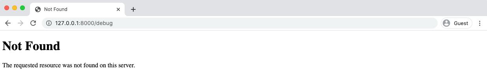

<div dir='rtl'>

# فصل شانزدهم: امنیت

دنیای اینترنت، دنیای خطرناکی هست. در آن تعداد زیادی افراد بد حتی بیشتر از آنها ربات های هستند که بصورت خودکار تلاش میکنند وبسایت شما را هک و ایجاد مشکل کنند. از این رو فهمیدن و پیاده سازی فیچر های امنیتی در هر وبسایتی الزامی است.

خوشبختانه، جنگو به دلیل سال‌ها تجربه در رسیدگی به مسایل مربوط به امنیت وب و همچنین یک چرخه بروز رسانی امنیتی قوی از سابقه بسیار خوبی بر خوردار می‌باشد.

فیچر های جدید تقریبا هر ۹ ماه یک بار مثل ورژن ۲.۲ تا ۳.۰ منتشر می‌شوند اما وصله های امنیتی تقریبا هر ماه بصورت ۲.۲.۲ تا ۲.۲.۳ منتشر می‌شوند.

به هرحال، مانند هر ابزاری، این مهم است که فیچر های امنیتی بطور صحیح پیاده سازی شوند و ما در این قسمت آموزش می‌دهیم که چطور این موراد امنیتی را در پروژه کتاب فروشی (Book Store) پیاده سازی کنید.

### مهندسی اجتماعی (Social Engineering)

درنهایت بزرگترین ریسک برای هر وبسایتی مشکلات فنی نیست، مشکلات انسانی است!

اصطلاح مهندسی اجتماعی به مجموعه روش های پیدا کردن افراد با دسترسی به یک سیستم اشاره می‌کند که خواسته یا ناخواسته اطلاعات اهراز هویت خود را در اختیار فرد حمله کنند قرار میدهد (مترجم: فرد حمله کننده با اطلاعات فرد مورد اطمینان وارد سیستم می‌شود)

این روز ها بزرگترین مقصر، فیشنگ می‌باشد. همه این‌ها از یک کلیک بر روی لینک مخرب که در یک ایمیل قرار دارد شروع می‌شود که باعث می‌شود که دسترسی کارمند را به فرد هکر بدهد یا لااقل دسترسی اش را به خطر بیندازد. برای جلوگیری از این اتفاق (فیشنگ)، باید دسترسی های مختلف ایجاد کنید و به افراد فقط دسترسی هایی که به آن لازم دارن داده شود و نه بیشتر! آیا همه مهندسین احتیاج دسترسی بع دیتابیس محصول را دارند؟ احتمالا نه. آیا سایر کارمندان احتیاج به دسترسی نوشتن(در دیتابیس) را نیاز دارند؟ دوباره، احتمالا نه. بهترین کار این است که بطور پیشفرض فقط دسترسی های مورد نیاز داده شود، نه اینکه پیشفرض همه را superuser درنظر بگیریم!

### بروزرسانی های جنگو (Django updates)

یکی از راه های مهم امن نگهداشتن پروژه شما، بروز نگهداشتن ورژن به آخرین ورژن جنگو می‌باشد. این به این معنی نیست که فقط به ورژن های آخرین بروزرسانی (latest feature release) مانند ورژن های ۲.۲، ۳.۰، ۳.۱ یا ... بروزرسانی کنید که حدودا هر ۹ ماه منتشر می‌شود. همچنین بروزرسانی های امنیتی هر ماه منتشر می‌شود که به صورت ۲.۲.۱، ۲.۲.۲، ۲.۲.۳ یا... منتشر می‌شوند.(مترجم: به این معنا می‌باشد که هر ماه باید بروز رسانی های امنیتی را دریافت کنید)

نسخه های(releases) long-term support یا به اختصار LTS چه هستند؟ بعضی از feature releases را LTS نامیده می‌شوند که برای مدت مشخصی (حدودا ۳ سال) اطمینان داده می‌شود که بروزرسانی های امنیتی و data fixes را دریافت می‌کند. برای مثال ورژن ۲.۲ جنگو LTS هست که تا سال ۲۰۲۲ بروزرسانی می‌شوند، یعنی تا زمانی که نسخه ۴.۰ جنگو بعنوان ورژن بعد LTS انتخاب می‌شود. آیا می‌شود روی نسخه LTS ماند؟ بله. آیا مجبورید؟ نه. برای امن بودن بهتر هست همیشه بروز باشیم.

مقاومت در مقابل وسوسه(بروزرسانی) و واقعیت تعداد زیادی از پروژها این نیست که وقت توسعه را به رفع اشکالات بعد از بروزرسانی جنگو بگذارند. یک وبسایت همانند یک خودرو: نیاز به نگهداری منظم برای کار کردن در بهترین حالت خود را دارد. اگر از خیر بروز رسانی ها بگزرید، تنها مشکلات را باهم ترکیب می کنید.

چگونه بروزرسانی کنیم؟ امکان deprecation warning جنگو، باید قبل از هر ریلیز با تایپ دستور python -Wa manage.py test اجرا شود. بهتر است برای بروزرسانی نسخه به نسخه اقدام شود (مثلا از ۲.۰ به ۲.۱ بعد به ۲.۲ و الی آخر) و هر دفعه deprecation warning را اجرا کرد تا اینکه یک دفعه به نسخه آخر رفت.(چندین نسخه بین را بدون اجرا دستور گفته شده رد کردن)

### چک‌لیست استقرار (Deployment Checklist)

برای کمک به استقرار و بررسی های امنیتی، در مستندات جنگو یک چک‌لیست قرار گرفته است که بیشتر تنظیمات امنیتی در آن قرار گرفته است.

حتی بهتر از آن استفاده از `python manage.py check --deploy` است که می‌توانیم توصیه های جنگو را دریافت کنیم و ببینیم آیا پروژه ما آماده استقرار است یا خیر. این دستور از سیستم برسی فریم‌ورک(system check framework) جنگو استفاده میکند که می‌تواند برای سفارشی سازی دستورات مشابه در پروژه های بزرگ تر مورد استفاده قرار گیرد(مترجم: خودمم نفهمیدم چی گفت :) )

به دلیل اینکه ما داریم از داکر استفاده میکنیم باید دستور `docker-compose exec web` را نیز به دستوراتمان اضافه کنیم.

<div dir="ltr">

```shell
$ docker-compose exec web python manage.py check --deploy
System check identified some issues:

WARNINGS:
...
System check identified 5 issues (0 silenced).
```

</div>

چقدر خوب! یک لیست توصیفی و طولانی از مشکلات که باید قبل از دیپلوری کردن پروژه کتاب‌فروشی رفع کنیم

</div>

<div dir="ltr">

docker-compose-prod.yml

</div>

درنهایت،‌تنظیمات ما برای محیط توسعه (development) و محصول (production) متفاوت هست. ما در حال حاضر، تنظیمات را در فصل ۸ انجام دادیم. اگر یادتون باشه متغییر های محلی (environment variables) را برای SECRET_KEY، DEBUG و پایگاه داده اضافه کردیم. اما مقادیری برای prodduction تنظیم نکردیم یا راهی موثر برای تغییر بین محیط توسعه و محصول ارائه نکردیم.

راه های زیادی برای برخورد با این چالش وجود دارد.باتوجه به اینکه قرار است در Heroku استقرار دهیم، رویکرد ما ایجاد فایل docker-compose-prod.yml است که به واسطه آن می‌توانیم محیط محصول رو تست کنیم و همچنین میتوانیم بصورت دستی متغییرهای محلی به محیط محصول اضاافه کنیم.

<div dir="ltr">

```shell
$ touch docker-compose-prod.yml
```

</div>

بطور پیشفرض، گیت تمامی فایل ها و پوشه ها را در پروژه ما دنبال میکند. ما نمی‌خواهیم این فایل جدید را دنبال کند،‌چون حاوی اطلاعات مهم و حساسی هست. راه حل آن ایجاد فایل جدید به نام *.gitignore* است که درون آن باید نام فایل ها و پوشه  هایی که مایلیم توسط گیت  دنبال **نشود** قرار دهیم.

یک فایل جدید ایجاد میکنیم.

<div dir="ltr">

```shell
$ touch .gitignore
```

</div>

تنها فایل خود را به آن اضافه میکنیم.

<div dir="ltr">


**.gitignore**

```bash
docker-compose-prod.yml
__pycache__/
db.sqlite3
.DS_Store # Mac only
```

</div>
اگر کنجکاو هستید، گیت‌هاب یک فایل رسمی برای [python gitignore](https://github.com/github/gitignore/blob/master/Python.gitignore) دارد که شامل تنظیمات اضافی ارزشمندی هست (برای جستجو)

اگر کنجکاو هستید، گیت‌هاب یک فایل رسمی برای python gitignore دارد که شامل تنظیمات اضافی ارزشمندی هست (برای جستجو)

اگر دوباره دستور git status را اجرا کنید فایل docker-compose-prod.yml را مشاهده نخواهید کرد، با اینکه هنوز در پروژه شما قرار دارد. دقیقا همان چیزی که ما می‌خواستیم!

حالا، محتویات فایل docker-compose.yml را در docker-compose-prod.yml کپی می‌کنیم.

**docker-compose-prod.yml**

<div dir="ltr">

```yml
version: '3.8'
services:
  web:
    build: .
    command: python /code/manage.py runserver 0.0.0.0:8000
    volumes:
      - .:/code
    ports:
      - 8000:8000
    depends_on:
      - db
    environment:
      - "DJANGO_SECRET_KEY=)*_s#exg*#w+#-xt=vu8b010%%a&p@4edwyj0=(nqq90b9a8*n"
      - "DJANGO_DEBUG=True"
  db:
    image: postgres:11
    volumes:
      - postgres_data:/var/lib/postgresql/data/
    environment:
      - "POSTGRES_HOST_AUTH_METHOD=trust"
  volumes:
    postgres_data:
```

</div>

برای اجرای فایل جدید، داکر را با فلگ -f ریستارت کنید تا فایل [کامپوز جایگزین]((https://docs.docker.com/compose/reference/‌))  انتخاب شود.

<div dir="ltr">

```shell
$ docker-compose down
$ docker-compose -f docker-compose-prod.yml up -d --build
$ docker-compose exec web python manage.py migrate
```
</div>

فلگ `--build` برای بیلد اولیه ایمیج به همراه تمامی پکیج های نرم افزاری برای فایل کامپوز جدید اضافه شده است. همچنین دستور `migrate` دیتابیس جدید را اجرا میکند. این یک نمونه کاملاً جدید از پروژه ما است! به این ترتیب، نه اکانت ابرکاربر(super user) وجود دارد نه اطلاعات کتاب های ما. اما برای الان اشکالی ندارد، این اطلاعات بعدا می‌توانیم روی محیط production اضافه کنیم و تمام تمرکزمان را روی ایجاد محیط production  محلی  برای تست محصول میگذاریم.

به وب‌سایت مراجعه کنید، همه‌چی باید مانند قبل اجرا شود با اینکه داریم از فایل متفاوت کامپوز استفاده میکنیم.

## DEBUG

در این بخش هدف ما این هست که با استفاده از docker-compose-prod.yml تمام چک لیست های استقرار (deployment) جنگو را پاس کنیم. بیاید با تغییر DEBUG شروع کنیم که تنظیم شده است به True در صورتی که در production باید False باشد.

<div dir="ltr" align='left'>

**docker-compose-prod.yml**
```yaml
environment:
- "DJANGO_SECRET_KEY=)*_s#exg*#w+#-xt=vu8b010%%a&p@4edwyj0=(nqq90b9a8*n"
- "DJANGO_DEBUG=False" # new
```

</div>

داکر رو غیر فعال کنید (down) و بعد از تغییر دوباره اجرا (up) کنید.

<div dir="ltr" align='left'>

**Command Line**
```bash
$ docker-compose down
$ docker-compose -f docker-compose-prod.yml up -d --build
```

</div>

وبسایت باید دوباره مثل قبل اجرا شود، برای اینکه مطمئن شوید که مقدار DEBUG برابر False هست باید صفحه http://127.0.0.1:8000/debug وجود نداشته باشد.



 این پیام عمومی "Not Found" تایید می‌کند که ما DEBUG را برابر False قرار داده ایم. اگر True بود، باید بجای این صفحه یک گذارش دقیق از ارور ها نمایش میداد.

 بیاید دوباره چک لیست استقرار را اجرا کنیم با این تفاوت که DEBUG تغییر کرده است.به‌یاد بیاورید  قبلا که اجرا میکردیم ۵ خطا دریافت میکردیم.

 <div dir="ltr" align='left'>

**Command Line**
```bash
$ docker-compose exec web python manage.py check --deploy
System check identified some issues:
WARNINGS:
...
System check identified 4 issues (0 silenced).
```

</div>

پیشرفت کردیم! از ۵ خطا به ۴ خطا رسیدم فقط با False قرار دادن DEBUG.

## Defaults (پیشفرض‌ها)

ما از متغییر های محلی (Enviroment Variables) به دو دلیل استفاده میکنیم: ذخیره مقادیری مانند SECRET_KEY درواقع امن هستند و یک راه برای سویچ کردن تنظیمات از local به production هستند. مشکلی پیش نمیاد اگر دوتا متغییرهای محلی برای تنظیمات مانند DEBUG داشته باشیم، شاید بهتر باشه مقدار پیشفرض برای آن قرار بدیم زمانی که لازم نیست چیزی را مخفی (secret) نگهداریم.

<div dir="ltr" align='left'>

```python
# config/settings.py
DEBUG = env.bool("DJANGO_DEBUG", default=False)
```

</div>
به این معنا می‌باشد که در محیط پروداکشن اگر متغییر محلی نداشته باشیم، مقدار آن بطور پیشفرض برابر False می‌باشد.ما باید متغییر DJANGO_DEBUG را در فایل محلی docker-compose.yaml نکهداریم، اما باید از فایل docker-compose-prod.yml حذف کنیم. نتایج این رویکرد باعث می‌شود که فایل docker-compose-prod.yml کوچکتر شود و همچنین شاید باعث امنیت بیشتر بشود اگر به دلایلی متغییر های محلی به درستی لود نشوند، ما اشتباها تنظیمات محلی development را فعال نمی‌کنیم.

بریم با حذف کردن DJANGO_DEBUG از فایل docker-compose.prod.yml را بروزرسانی کنیم.

<div dir="ltr" align='left'>

```yaml
environment:
- "DJANGO_SECRET_KEY=)*_s#exg*#w+#-xt=vu8b010%%a&p@4edwyj0=(nqq90b9a8*n"
```

</div>

اگر شما داکر را ریستارت کنید هم تنظیمات محلی و هم تنظیمات پروداکشن شما کار خواهد کرد.


## SECRET_KEY

درحال حاظر SECRET_KEY ما در فایل docker-compose.yml قابل رویت می‌باشد. برای امنیت بیشتر، ما باید کلید جدید ایجاد کنیم و توسط docker-compose-prod.yml تست کنیم. SECRET_KEY یک رشته تصادفی ۵۰ کارکتری است که  هر دفعه دستور startproject رو اجرا میکنید، ساخته می‌شود. برای ساخت کلید جدید میتوانید از کتابخانه داخلی پایتون یعنی ماژول [secret](https://docs.python.org/3/library/secrets.html) استفاده کنید.

<div dir="ltr" align='left'>

**Command Line**
```bash
$ docker-compose exec web python -c 'import secrets; print(secrets.token_urlsafe(38))'
ldBHq0YGYxBzaMJnLVOiNG7hruE8WKzGG2zGpYxoTNmphB0mdBo
```

</div>

پارامتر token_urlsafe تعداد بایت های در یک رشته a URL-safe را بازمیگرداند. با انکدین Base64 بطور میانگین هر بایت برابر ۱.۳ کارکتر می‌باشد. در این مثال با استفاده از ۳۸ ما ۵۱ کارکتر داریم. مهمترین نکته‌ای که باید به آن توجه کنید، مقدار SECRET_KEY حداقل باید ۵۰ کارکتر باشد. هردفعه که این دستور را اجرا کنید، مقدار جدید دریافت می‌کنید.

> به یاد داشته باشید تا زمانی که دارید از داکر استفاده میکنید، اگر در SECRET_KEY شما علامت دلار ($) وجود داشت، باید یک علامت دلار دیگر در کنار آن قرار دهید. [این به دلیل نحوه مدیریت متغییر ها توسط docker-compose می‌باشد](https://docs.docker.com/compose/compose-file/#variable-substitution). به عبارت دیگیر شما ارور خواهید دید!

به روش زیر می‌توانید SECRET_KEY جدید را به docker-compose-prod.yml اضافه کنید:


<div dir="ltr" align='left'>

**docker-compose-prod.yml**
```yaml
# docker-compose-prod.yml
environment:
- "DJANGO_SECRET_KEY=ldBHq0YGYxBzaMJnLVOiNG7hruE8WKzGG2zGpYxoTNmphB0mdBo"
```

</div>

حال کانتینر داکری خود را ریستارت کنید، به درستی  SECRET_KEY جدید جایگزین شد.


<div dir="ltr" align='left'>

**Command Line**
```bash
$ docker-compose down
$ docker-compose -f docker-compose-prod.yml up -d --build
```

</div>

حال باید مانند قبل وبسایت به درستی کار کند. درحال حاظر چهار مشکل در چک لیست استقرار وجود دارد، اما اول یک سر کوتاه به امنیت وبسایت بزنیم تا متوجه بشویم چرا این تنظیمات مهم است.

### امنیت وب

حتی اگر جنگو به طور پیش فرض با رایج ترین مسائل امنیتی برخورد کند، هنوز درک آن حیاتی است که
روش ها و حمله های مکرر وجود دارد که جنگو تلاش می کند تا آنها را کاهش دهد .
شما می توانید یک نمای کلی در  <a href="https://docs.djangoproject.com/en/3.1/topics/security/">صفحه امنیتی جنگو</a> بیابید،
اما در اینجا به عمق بیشتری خواهیم پرداخت.

جنگو به طور پیش فرض با تعدادی <a href="https://docs.djangoproject.com/en/3.1/ref/middleware/#django.middleware.security.SecurityMiddleware">میان افزار امنیتی</a> اضافی همراه است که نگهبان در برابر
سایر حملات چرخه درخواست/پاسخ (request/response) است.

توضیح کامل هر یک از آنها از حوصله این کتاب خارج است، اما ارزش خواندن در مورد حفاظت های امنیتی تیم جنگو که در
طول سال ها است که ارائه شده را دارد . همچنین بهتر است پیشفرض هارا تغییر ندهید.


### تزریق SQL

بیا با <a href="https://en.wikipedia.org/wiki/SQL_injection">حمله تزریق SQL</a> شروع کنیم که زمانی اتفاق می افتد که
 یک کاربر مخرب بتواند به صورت دلخواه در دیتابیس ما کد SQL اجرا کند. یک فرم ورود به سایت را در نظر بگیرید. چه اتفاقی
 می افتد اگر یک کاربر مخرب بتواند `DELETE from users WHERE user_id=user_id` را تایپ کند ؟


 اگر این کد در مقابل پایگاه داده بدون حفاظت های مناسب اجرا شود, می تواند منجر به حذف تمام رکوردهای کاربر شود! خوب نیست .
 این <a href="https://www.xkcd.com/327/">XKCD comic</a> یک تفکر طنز آمیز
 به طور بالقوه مثال دقیقی از چگونگی وقوع این امر ارائه می دهد.


خوشبختانه Django ORM به طور پیش فرض ورودی های کاربر را هنگام ساخت querysets برای جلوگیری از این نوع حملات پاکسازی می کند.
زمانی که باید مراقب باشید این است که جنگو گزینه ای برای اجرای
<a href="https://docs.djangoproject.com/en/3.1/topics/db/sql/#executing-custom-sql"> sql سفارشی</a> یا <a href="https://docs.djangoproject.com/en/3.1/topics/db/sql/#executing-raw-queries">پرس و جوهای خام</a> ارائه می دهد.
هر دو باید با احتیاط مورد استفاده قرار گیرند زیرا میتوانند آسیب پذیری را در برابر تزریق SQL باز کنند.

پروژه غیرانتفاعی `Open Web Application Security Project (OWASP)` دارای
<a href="https://github.com/OWASP/CheatSheetSeries/blob/master/cheatsheets/SQL_Injection_Prevention_Cheat_Sheet.md">یک برگه تقلب تزریق SQL</a> فوق العاده و بسیار
 دقیق است که برای مطالعه بیشتر توصیه می شود.


### تزریق اسکریپت از طریق سایت XSS (Cross Site Scripting)

<a href="https://en.wikipedia.org/wiki/Cross-site_scripting">تزریق اسکریپت از طریق سایت (XSS)</a> این یک حمله کلاسیک دیگر است که زمانی اتفاق می افتد که مهاجم (attacker) قادر است تکه های کوچکی از کد را به صفحات مشاهده شده توسط افراد دیگر, تزریق کند. این کد ، معمولاً به زبان جاوا اسکریپت است و در صورت ذخیره در پایگاه داده ، بازیابی شده و برای سایر کاربران نمایش داده می شود .

  برای مثال : فرمی که برای نوشتن بررسی (نقد) کتاب استفاده می شود را در نظر بگیرید . چه می شود اگر به جای تایپ کردن , “این کتاب عالی بود”  کاربر یک چیزی را با جاوااسکریپ تایپ کند ؟ برای مثال , ```<script>alert('hello');</script>``` .اگر این اسکریپ در دیتابیس ذخیره میشد صفحه هر کاربری یک `alert` با عنوان `hello` به وجود می آمد . در حالی که این مثال خواص بیشتر آزار دهنده است تا خطرناک , سایتی که در مقابل حمله `XSS` آسیب پذیر است بسیار خطرناک است زیرا هر کاربر مخرب میتواند هر  جاوا اسکرییپتی را در صفحه قرار دهد , از جمله کد جاوااسکریپتی که میتواند اطلاعات کاربران ناشناس رو هم بدزدد .

 برای جلوگیری از حمله `XSS` قالب های جنگو به صورت خودکار <a href="https://docs.djangoproject.com/en/3.1/ref/templates/language/#automatic-html-escaping">automatically escape</a> از کاراکتر های خاصی که به طور بالقوه خطرناک هستند از جمله : براکت ها `(< و >)` , سینگل کوت `(single quotes) ' ` , دابل کوت `(double quotes) " ` و علامت `&` دوری می کند . مواردی وجود دارد که ممکن است بخواهید به صورت خودکار <a href="https://docs.djangoproject.com/en/3.1/ref/templates/builtins/#std:templatetag-autoescape">autoescape off</a>  کنید اما باید با احتیاط زیاد انجام شود .

   این <a href="https://github.com/OWASP/CheatSheetSeries/blob/master/cheatsheets/Cross_Site_Scripting_Prevention_Cheat_Sheet.md">OWASP’s XSS Cheat Sheet</a> برای مطالعه بیشتر توصیه می شود .

### جعل درخواست میان وبگاهی Cross-Site Request Forgery (CSRF)

این <a href="https://en.wikipedia.org/wiki/Cross-site_request_forgery">Cross-Site Request Forgery (CSRF)</a> سومین نوع عمده حمله است اما عموما نسبت به تزریق sql (SQL Injection) یا حمله XSS کمتر شناخته شده است . این حمله اساسا از اعتماد سایت به مرورگر کاربر استفاده می کند .

زمانی که کاربر وارد یک سایت می شود , اجازه دهید آن را یک سایت بانکی برای اهداف تصاویر سازی بنامیم , سرور `session token` را برای آن کاربر ارسال می کند . هدر های  HTTP در آینده شامل همه ی request ها و احراز هویت های کاربر می شود . اما اگر یک بازیگر مخرب (هکر) به نحوی به `session token` دسترسی پیدا کند چه اتفاقی می افتد ؟

برای مثال , کاربری را در نظر بگیرید که در یک تب مرورگر به بانک خود وارد می شود . سپس آن در یک تب دیگر ایمیلش را باز می کند و روی یک email link که از طرف یک بازیگر مخرب (هکر) است کلیک می کند . این لینک قانونی به نظر می رسد ,
اما در واقع به بانک کاربر اشاره می کند که هنوز در آن login است ! بنابرابن به جای ترک کردن کامنت وبلاگ در این سایت جعلی , در پشت صحنه , از اطلاعات کاربری برای انتقال پول از حساب آن به حساب هکر ها استفاده می شود .

در عمل روش های زیادی برای به دست آوردن اعتبار کاربر از طریق حمله CSRF وجود دارد , نه فقط لینک ها,
حتی form های پنهان , برچسب های مخصوص عکس , و حتی request های AJAX .

جنگو <a href="https://docs.djangoproject.com/en/3.1/ref/csrf/#how-it-works">CSRF protection</a> با قرار دادن secret key رندوم به عنوان کوکی از طریق <a href="https://docs.djangoproject.com/en/3.1/ref/middleware/#django.middleware.csrf.CsrfViewMiddleware">CSRF
Middleware</a> و در فرم ها از طریق تمپلیت تگ (template tag) <a href="https://docs.djangoproject.com/en/3.1/ref/templates/builtins/#csrf-token">csrf_token</a> محافظت می کند . سایت تیم سوم به کوکی های کاربر دسترسی نخواهد داشت بنابراین هرگونه مغایرت بین دو کلید باعث ارور می شود .

جنگو امکان سفارشی سازی را مثل همیشه می دهد : شما میتوانید middleware CSRF رای غیر فعال کنید و از تمپلیت تگ (template tag) <a href="https://docs.djangoproject.com/en/3.1/ref/csrf/#django.views.decorators.csrf.csrf_protect">()csrf_protect</a> در view های خاص استفاده بکنید . با این حال این مرحله را با نهایت احتیاط انجام دهید .

این OWASP <a href="https://github.com/OWASP/CheatSheetSeries/blob/master/cheatsheets/Cross-Site_Request_Forgery_Prevention_Cheat_Sheet.md">CSRF Cheat Sheet</a> نگاه جامعی به موضوع ارائه می دهد. تغریبا همه ی سایت های اصلی در مقاطعی از زمان قربانی حملات CSRF شده اند .

### XSS (Cross Site Scripting)

</div>

Cross-site scripting (XSS) این یک حمله کلاسیک دیگر است که زمانی اتفاق می افتد که مهاجم (attacker) قادر است تکه های کوچکی از کد را به صفحات مشاهده شده توسط افراد دیگر, تزریق کند. این کد ، معمولاً به زبان جاوا اسکریپت است و در صورت ذخیره در پایگاه داده ، بازیابی شده و برای سایر کاربران نمایش داده می شود .

برای مثال : فرمی که برای نوشتن بررسی (نقد) کتاب استفاده می شود را در نظر بگیرید . چه می شود اگر به جای تایپ کردن , “این کتاب عالی بود” کاربر یک چیزی را با جاوااسکریپ تایپ کند ؟ برای مثال , <script>alert('hello');</script> .اگر این اسکریپ در دیتابیس ذخیره میشد صفحه هر کاربری یک alert با عنوان hello به وجود می آمد . در حالی که این مثال خواص بیشتر آزار دهنده است تا خطرناک , سایتی که در مقابل حمله XSS آسیب پذیر است بسیار خطرناک است زیرا هر کاربر مخرب میتواند هر جاوا اسکرییپتی را در صفحه قرار دهد , از جمله کد جاوااسکریپتی که میتواند اطلاعات کاربران ناشناس رو هم بدزدد .

برای جلوگیری از حمله XSS قالب های جنگو به صورت خودکار automatically escape از کاراکتر های خاصی که به طور بالقوه خطرناک هستند از جمله : براکت ها (< و >) , سینگل کوت (single quotes) ' , دابل کوت (double quotes) " و علامت & دوری می کند . مواردی وجود دارد که ممکن است بخواهید به صورت خودکار autoescape off کنید اما باید با احتیاط زیاد انجام شود .

این OWASP’s XSS Cheat Sheet برای مطالعه بیشتر توصیه می شود .

<div dir="ltr">

### Cross-Site Request Forgery (CSRF)

</div>

این Cross-Site Request Forgery (CSRF) سومین نوع عمده حمله است اما عموما نسبت به تزریق sql (SQL Injection) یا حمله XSS کمتر شناخته شده است . این حمله اساسا از اعتماد سایت به مرورگر کاربر استفاده می کند .

زمانی که کاربر وارد یک سایت می شود , اجازه دهید آن را یک سایت بانکی برای اهداف تصاویر سازی بنامیم , سرور session token را برای آن کاربر ارسال می کند . هدر های HTTP در آینده شامل همه ی request ها و احراز هویت های کاربر می شود . اما اگر یک بازیگر مخرب (هکر) به نحوی به session token دسترسی پیدا کند چه اتفاقی می افتد ؟

برای مثال , کاربری را در نظر بگیرید که در یک تب مرورگر به بانک خود وارد می شود . سپس آنها در یک تب دیگر ایمیل شان را باز می کنند و روی یک email link که از طرف یک بازیگر مخرب (هکر) است کلیک می کنند . این لینک قانونی به نظر می رسد , اما در واقع به بانک کاربر اشاره می کند که هنوز در آن login است ! بنابرابن به جای ترک کردن کامنت وبلاگ در این سایت جعلی , در پشت صحنه , از اطلاعات کاربری برای انتقال پول از حساب آنها به حساب هکر ها استفاده می شود .

در عمل روش های زیادی برای به دست آوردن اعتبار کاربر از طریق حمله CSRF وجود دارد , نه فقط لینک ها, حتی form های پنهان , برچسب های مخصوص عکس , و حتی request های AJAX .

جنگو CSRF protection با قرار دادن secret key رندوم به عنوان کوکی از طریق CSRF Middleware و در فرم ها از طریق تمپلیت تگ (template tag) csrf_token محافظت می کند . سایت تیم سوم به کوکی های کاربر دسترسی نخواهد داشت بنابراین هرگونه مغایرت بین دو کلید باعث ارور می شود .

جنگو امکان سفارشی سازی را مثل همیشه می دهد : شما میتوانید middleware CSRF رای غیر فعال کنید و از تمپلیت تگ (template tag) ()csrf_protect در view های خاص استفاده بکنید . با این حال این مرحله را با نهایت احتیاط انجام دهید .

این OWASP CSRF Cheat Sheet نگاه جامعی به موضوع ارائه می دهد. تغریبا همه ی سایت های اصلی در مقاطعی از زمان قربانی حملات CSRF شده اند .

یک قانون کلی خوب این است که هر گاه در سایت خود یک فرمی دارید , فکر کنید که آیا به تک csrf_token نیاز دارید . بیشتر مواقع به آن نیاز دارید !

<div dir="ltr">

### Clickjacking Protection (مقابله با کلیک دزدی)

<a href="https://en.wikipedia.org/wiki/Clickjacking">کلیک دزدی</a> حمله دیگری است که در آن یک سایت مخرب کاربر را فریب می دهد تا روی یک frame مخفی شده کلیک کند . یک frame داخلی,که به عنوان `iframe` شناخته می شود , معمولا برای جاسازی یک سایت در داخل یکی دیگر استفاده می شود . برای مثال , اگر میخواهید Google Map یا ویدیوی Yuotube را در سایت خود قرار دهید iframe شامل tag است که آن سایت را در سایت شما قرار می دهد. این بسیار راحت است.

اما این یک خطر امنیتی دارد که می تواند یک frame را از دید کاربر مخفی کند . در نظر بگیرید که یک کاربر قبلا به حساب کاربری اش در آمازون login شده است و سپس از یک سایت مخرب بازدید می کند که به نظر می رسید عکس بچه گربه باشد . کاربر برای مشاهده بچه گربه های بیشتر بر روی سایت مخرب گفته شده کلیک می کند , اما در واقع آنها روی یک iframe از محصول آمازون که ناخودآگاه خریداری شده کلیک می کنند . این تنها یک نمونه از clickjacking است .

برای جلوگیری از این (حمله) جنگو با یک پیش فرض همراه است <a href="https://docs.djangoproject.com/en/3.1/ref/clickjacking/#clickjacking-prevention">clickjacking middleware</a> که <a href="https://developer.mozilla.org/en-US/docs/Web/HTTP/Headers/X-Frame-Options">X-FrameOptions HTTP header</a> را تنظیم می کند , که نشان می دهد که یک منبع مجاز به load یک frame یا iframe است یا خیر. در صورت تمایل می توانید این محافظ را خاموش کنید , یا آن را در سطح نمایش تنظیم کنید . با این حال این کار را با احتیاط و <a href="https://github.com/OWASP/CheatSheetSeries/blob/master/cheatsheets/Clickjacking_Defense_Cheat_Sheet.md">research(تحقیق بالا)</a> انجام دهید .

 ### HTTPS/SSL

  تمام سایت های مدرن باید از <a href="https://en.wikipedia.org/wiki/HTTPS">HTTPS</a> استفاده کنند , که ارتباط رمز گذاری را بین مشتری و سرور فراهم میکند. <a href="https://en.wikipedia.org/wiki/Hypertext_Transfer_Protocol">HTTP (Hypertext Transfer Protocol)</a> ستون فقرات وب مدرن است , اما به طور پیش فرض رمزگذاری ندارد .


 حرف "s" در HTTPS به ماهیت رمزگذاری شده آن ابتدا به دلیل SSL (Secure Sockets Layer) اشاره می کند و این روزها آن جانشین <a href="https://en.wikipedia.org/wiki/Hypertext_Transfer_Protocol">TLS (Transport Layer Security)</a> هستند . با فعال بودن HTTPS , که ما خود در فصل دیپلویمنت (deployment) انجام خواهیم داد , بازیگران مخرب نمی توانند ترافیک ورودی و خروجی را برای داده هایی مانند
اعتبار احراز هویت (authentication credentials) یا کلید API  تشخیص دهند (بو بکشند) .


  یکی از 4 مسائل باقی مانده در چک لیست دیپلویمنت جنگو ما این است که `SECURE_SSL_REDIRECT` در حال حاضر روی False تنظیم شده است . به دلایل امنیتی , خیلی بهتر است که این را مجبور کنیم در حالت پروداکشن (production) True باشد.
بیایید آن را با پیش فرض پیکربندی به True و افزودن مقدار توسعه محلی به فایل docker-compose.yml تغییر دهیم  .

Clickjacking حمله دیگری است که در آن یک سایت مخرب کاربر را فریب می دهد تا روی یک frame مخفی شده کلیک کند . یک frame داخلی,که به عنوان iframe شناخته می شود , معمولا برای جاسازی یک سایت در داخل یکی دیگر استفاده می شود . برای مثال , اگر میخواهید Google Map یا ویدیوی Yuotube را در سایت خود قرار دهید iframe شامل tag است که آن سایت را در سایت شما قرار می دهد. این بسیار راحت است.

اما این یک خطر امنیتی دارد که می تواند یک frame را از دید کاربر مخفی کند . در نظر بگیرید که یک کاربر قبلا به حساب کاربری اش در آمازون login شده است و سپس از یک سایت مخرب بازدید می کند که به نظر می رسید عکس بچه گربه باشد . کاربر برای مشاهده بچه گربه های بیشتر بر روی سایت مخرب گفته شده کلیک می کند , اما در واقع آنها روی یک iframe از محصول آمازون که ناخودآگاه خریداری شده کلیک می کنند . این تنها یک نمونه از clickjacking است .

برای جلوگیری از این (حمله) جنگو با یک پیش فرض همراه است clickjacking middleware که X-FrameOptions HTTP header را تنظیم می کند , که نشان می دهد که یک منبع مجاز به load یک frame یا iframe است یا خیر. در صورت تمایل می توانید این محافظ را خاموش کنید , یا آن را در سطح نمایش تنظیم کنید . با این حال این کار را با احتیاط و research(تحقیق بالا) انجام دهید .

<div dir="ltr">

### HTTPS/SSL

</div>

تمام سایت های مدرن باید از HTTPS استفاده کنند , که ارتباط رمز گذاری را بین مشتری و سرور فراهم میکند. HTTP (Hypertext Transfer Protocol) ستون فقرات وب مدرن است , اما به طور پیش فرض رمزگذاری ندارد

"s" در HTTPS به ماهیت رمزگذاری شده آن ابتدا به دلیل SSL (Secure Sockets Layer) اشاره می کند و این روزها آن جانشین TLS (Transport Layer Security) هستند . با فعال بودن HTTPS , که ما خود در فصل دیپلویمنت (deployment) انجام خواهیم داد , بازیگران مخرب نمی توانند ترافیک ورودی و خروجی را برای داده هایی مانند اعتبار احراز هویت (authentication credentials) یا کلید API تشخیص دهند (بو بکشند) .

یکی از 4 مسائل باقی مانده در چک لیست دیپلویمنت جنگو ما این است که SECURE_SSL_REDIRECT در حال حاضر روی False تنظیم شده است . به دلایل امنیتی , خیلی بهتر است که این را مجبور کنیم در حالت پروداکشن (production) True باشد. بیایید آن را با پیش فرض پیکربندی به True و افزودن مقدار توسعه محلی به فایل docker-compose.yml تغییر دهیم .

<div dir="ltr">

```python
# config/settings.py
SECURE_SSL_REDIRECT = env.bool("DJANGO_SECURE_SSL_REDIRECT", default=True)
```

</div>

سپس متغیر محیط را به فایل docker-compose.yml اضافه کنید که در آن False تنظیم شده است .

<div dir="ltr">

```shell
$ docker-compose down
$ docker-compose -f docker-compose-prod.yml up -d --build
$ docker-compose exec web python manage.py check --deploy
```

</div>

  ما به 3 موضوع دیگر نیز می پردازیم .


### انتقال اکیدا ایمن HTTP Strict Transport Security (HSTS)
<a href="https://en.wikipedia.org/wiki/HTTP_Strict_Transport_Security">انتقال اکیدا ایمن (HSTS)</a> یک سیاست امنیتی است که به سرور ما اجازه می دهد که بر اینکه مروگر ها باید از طریق HTTPS ارتباط داشته باشند به اضافه کردن <a href="https://docs.djangoproject.com/en/3.1/ref/middleware/#http-strict-transport-security">Strict-Transport-Security header</a> , تاکید می کند .

سه پیکربندی ضمنی HSTS در فایل settings.py ما وجود دارد که باید برای حالت production به روز شود :


<div dir="ltr" align='left'>

- [SECURE_HSTS_SECONDS](https://docs.djangoproject.com/en/3.1/ref/settings/#std:setting-SECURE_HSTS_SECONDS) = 0
- [SECURE_HSTS_INCLUDE_SUBDOMAINS](https://docs.djangoproject.com/en/3.1/ref/settings/#secure-hsts-include-subdomains) = False
- [SECURE_HSTS_PRELOAD](https://docs.djangoproject.com/en/3.1/ref/settings/#secure-hsts-preload) = False

</div>

 متغیر `SECURE_HSTS_SECONDS` در setting به طور پیش فرض روی 0 تنظیم شده است اما برای اهداف امنیتی هرچه بیشتر بهتر . ما آن را برای یک ماه , 2,592,000 ثانیه , در پروژه مان تنظیم می کنیم .

متغیر `SECURE_HSTS_INCLUDE_SUBDOMAINS` زیر دامنه هارا مجبور می کند تا به طور انحصاری از SSL استفاده کنند , بنابراین ما آن را در production روی True تنظیم می کنیم .

متغیر `SECURE_HSTS_PRELOAD` فقط زمانی تاثیر می گذارد که یک مقدار غیر 0 برای `SECURE_HSTS_
SECONDS` وجود داشته باشد , اما از آنجا که ما فقط یکی را تنظیم کرده ایم ، باید این را روی True تنظیم کنیم.

=======
```

</div>

ما به 3 موضوع می پردازیم .

<div dir="ltr">

### HTTP Strict Transport Security (HSTS)

</div>

HTTP Strict Transport Security (HSTS) یک سیاست امنیتی است که به سرور ما اجازه می دهد که بر اینکه مروگر ها باید از طریق HTTPS ارتباط داشته باشند با اضافه کردن Strict-Transport-Security header , تاکید می کند .

سه پیکربندی ضمنی HSTS در فایل settings.py ما وجود دارد که باید برای حالت production به روز شود :

<div dir="ltr">

- `SECURE_HSTS_SECONDS = 0`
- `SECURE_HSTS_INCLUDE_SUBDOMAINS = False`
- `SECURE_HSTS_PRELOAD = False`

</div>

SECURE_HSTS_SECONDS در setting به طور پیش فرض روی 0 تنظیم شده است اما هرچه بیشتر بهتر برای اهداف امنیتی . ما آن را برای یک ماه , 2,592,000 ثانیه , در پروژه مان تنظیم می کنیم .

SECURE_HSTS_INCLUDE_SUBDOMAINS زیر دامنه هارا مجبور می کند تا به طور انحصاری از SSL استفاده کنند , بنابراین ما آن را در production روی True تنظیم می کنیم .

SECURE_HSTS_PRELOAD فقط زمانی تاثیر می گذارد که یک مقدار غیر 0 برای SECURE_HSTS_ SECONDS وجود داشته باشد , اما از آنجا که ما فقط یکی را تنظیم کرده ایم ، باید این را روی True تنظیم کنیم.

در اینجا باید ببینید که تنظیمات به روز شده چگونه باید باشد .

<div dir="ltr">

```python
# config/settings.py
SECURE_HSTS_SECONDS = env.int("DJANGO_SECURE_HSTS_SECONDS", default=2592000)
SECURE_HSTS_INCLUDE_SUBDOMAINS = env.bool("DJANGO_SECURE_HSTS_INCLUDE_SUBDOMAINS",
default=True)
SECURE_HSTS_PRELOAD = env.bool("DJANGO_SECURE_HSTS_PRELOAD", default=True)
```

</div>

سپس فایل docker-compose.yml با مقادیر توسعه محلی به روز کنید .

<div dir="ltr">

```yml
# docker-compose.yml
environment:
  - "DJANGO_SECRET_KEY=)*_s#exg*#w+#-xt=vu8b010%%a&p@4edwyj0=(nqq90b9a8*n"
  - "DJANGO_DEBUG=True"
  - "DJANGO_SECURE_SSL_REDIRECT=False"
  - "DJANGO_SECURE_HSTS_SECONDS=0" # new
  - "DJANGO_SECURE_HSTS_INCLUDE_SUBDOMAINS=False" # new
  - "DJANGO_SECURE_HSTS_PRELOAD=False" # new

```

</div>

داکر را ری استارت کرده و دوباره چک لیست دیپلویمنت را اجرا کنید .

<div dir="ltr">

```shell
$ docker-compose down
$ docker-compose -f docker-compose-prod.yml up -d --build
$ docker-compose exec web python manage.py check --deploy
```

</div>

فقط 2 شماره باقی مانده است !

<div dir="ltr">

### Secure Cookies (ایمن کردن کوکی ها)

 <a href="https://en.wikipedia.org/wiki/HTTP_cookie">کوکی HTTP</a> برای ذخیره اطلاعات در کامپیوتر مشتری استفاده می شود مانند احراز هویت
اعتبارنامه (authentication credentials). این امر ضروری است زیرا پروتکل HTTP از نظر طراحی بدون حالت است : راهی وجود ندارد برای اینکه آیا کاربر به غیر از شناسه در HTTP Header احراز هویت شده است یا نه!

جنگو نیز مانند اکثر وب سایت ها از `sessions` و `cookies` برای این کار استفاده می کند . اما cookies (کوکی ها) می توانند و باید باشند از طریق کانفیگ کردن  <a href="https://docs.djangoproject.com/en/3.1/ref/settings/#std:setting-SESSION_COOKIE_SECURE">SESSION_COOKIE_SECURE</a> به HTTPS وادار می شوند . تنطیمات جنگو به طور پیش فرض False است بنابراین باید آن را در production به True تغییر دهیم.

دومین مسئله <a href="https://docs.djangoproject.com/en/3.1/ref/settings/#csrf-cookie-secure">CSRF_COOKIE_SECURE</a> است , که به طور پیش فرض روی False است اما در حالت production باید True باشد تا فقط کوکی هایی که با عنوان "secure"(امن) مشخص شده اند با اتصال HTTPS ارسال شوند .


HTTP Cookie برای ذخیره اطلاعات در کامپیوتر مشتری استفاده می شود مانند احراز هویت اعتبارنامه (authentication credentials). این امر ضروری است زیرا پروتکل HTTP از نظر طراحی بدون حالت است : راهی وجود ندارد برای اینکه آیا کاربر به غیر از شناسه در HTTP Header احراز هویت شده است یا نه!

جنگو نیز مانند اکثر وب سایت ها از sessions و cookies برای این کار استفاده می کند . اما cookies (کوکی ها) می توانند و باید باشند از طریق کانفیگ کردن SESSION_COOKIE_SECURE به HTTPS وادار می شوند . تنطیمات جنگو به طور پیش فرض False است بنابراین باید آن را در production به True تغیر دهیم.

دومین مسئله CSRF_COOKIE_SECURE است , که به طور پیش فرض روی False است اما در حالت production باید True باشد تا فقط کوکی هایی که با عنوان "secure"(امن) مشخص شده اند با اتصال HTTPS ارسال شوند .

<div dir="ltr">

```python
# config/settings.py
SESSION_COOKIE_SECURE = env.bool("DJANGO_SESSION_COOKIE_SECURE", default=True)
CSRF_COOKIE_SECURE = env.bool("DJANGO_CSRF_COOKIE_SECURE", default=True)
```

</div>

سپس فایل docker-compose.yml را آپدیت کنید .

<div dir="ltr">

```yml
# docker-compose.yml
environment:
  - "DJANGO_SECRET_KEY=)*_s#exg*#w+#-xt=vu8b010%%a&p@4edwyj0=(nqq90b9a8*n"
  - "DJANGO_DEBUG=True"
  - "DJANGO_SECURE_SSL_REDIRECT=False"
  - "DJANGO_SECURE_HSTS_SECONDS=0"
  - "DJANGO_SECURE_HSTS_INCLUDE_SUBDOMAINS=False"
  - "DJANGO_SECURE_HSTS_PRELOAD=False"
  - "DJANGO_SESSION_COOKIE_SECURE=False" # new
  - "DJANGO_CSRF_COOKIE_SECURE=False" # new
```

</div>

داکر را ری استارت کرده و دوباره چک لیست دیپلویمنت را اجرا کنید

<div dir="ltr">

```shell
$ docker-compose down
$ docker-compose -f docker-compose-prod.yml up -d --build
$ docker-compose exec web python manage.py check --deploy
System check identified no issues (0 silenced).
```

</div>

دیگر مسئله ای وجود ندارد .هووو !

  تا اینجا ممکن است به نظر برسد که توصیه عمومی امنیت این است که به پیش فرض های جنگو تکیه کنید , از `HTTPS` استفاده کنید , به فرم ها تک `csrf_token` را اضافه کنید ,
  و یک ساختار permissions تنظیم کنید . همگی صحیح است . یک قدم دیگر که جنگو از طرف ما قبول نمی کند ارتقا امنیت ادمین جنگو است .

  در نظر بگیرید که هر سایت جنگو admin را به طور پیش فرض به آدرس `admin/` تنظیم می کند . هر هکری که تلاش می کند به پنل ادمین
  جنگو دسترسی یابد ابتدا به آن (`admin/`) شک می کند . بنابراین , یک قدم آسان این است که به سادگی URL (آدرس) admin را به معنای واقعی کلمه تغییر دهید !
 ادیتور را باز کنید و مسیر URL را تغییر دهید . در این مثال چنین است : `anything-but-admin/` .


  <div dir="ltr" align='left'>

  ```python
  # config/urls.py
  from django.conf import settings
  from django.conf.urls.static import static
  from django.contrib import admin
  from django.urls import path, include

  urlpatterns = [
      # Django admin
      path('anything-but-admin/', admin.site.urls), # new

      # User management
      path('accounts/', include('allauth.urls')),

      # Local apps
      path('', include('pages.urls')),
      path('books/', include('books.urls')),
  ]

  if settings.DEBUG:
      import debug_toolbar
      urlpatterns = [
        path('__debug__/', include(debug_toolbar.urls)),
      ] + urlpatterns
  ```

  </div>


  یک پکیج ثالث سرگرم کننده <a href="https://github.com/dmpayton/django-admin-honeypot">django-admin-honeypot</a> است که یک صفحه ورود admin جعلی در صفحه ایجاد می کند و
  IP هر کسی را که تلاش می کند به سایت شما در این آدرس (`admin/`) حمله کند به <a href="https://docs.djangoproject.com/en/3.1/ref/settings/#admins">ادمین سایت</a> ایمیل می  زند .
  این آدرس های IP سپس می تواند به لیست آدرس مسدود شده سایت اضافه شود.

  همچنین از طریق <a href="https://github.com/Bouke/django-two-factor-auth">django-two-factor-auth</a> می توانید احراز هویت دوگانه را برای admin خود
  برای یک لایه محافظتی بیشتر اضافه کنید .

<div dir="ltr">

### Admin Hardening (ارتقا امنیت ادمین)

</div>

تا اینجا ممکن است به نظر برسد که توصیه عمومی امنیت این است که به پیش فرض های جنگو تکیه کنید , از HTTPS استفاده کنید , به فرم ها تک csrf_token را اضافه کنید , و یک ساختار permissions تنظیم کنید . همگی صحیح است . یک قدم دیگر که جنگو از طرف ما قبول نمی کند ارتقا امنیت ادمین جنگو است .

در نظر بگیرید که هر سایت جنگو admin را به طور پیش فرض به آدرس admin/ تنظیم می کند . هر هکری که تلاش می کند به پنل ادمین جنگو دسترسی یابد ابتدا به آن (admin/) شک می کند . بنابراین , یک قدم آسان این است که به سادگی URL (آدرس) admin را به معنای واقعی کلمه تغیر دهید ! باز کنید (ادیتور) را و مسیر URL را تغیر دهید . در این مثال چنین است : anything-but-admin/ .

<div dir="ltr">

```python
# config/urls.py
from django.conf import settings
from django.conf.urls.static import static
from django.contrib import admin
from django.urls import path, include

urlpatterns = [
    # Django admin
    path('anything-but-admin/', admin.site.urls), # new

    # User management
    path('accounts/', include('allauth.urls')),

    # Local apps
    path('', include('pages.urls')),
    path('books/', include('books.urls')),
]

if settings.DEBUG:
    import debug_toolbar
    urlpatterns = [
      path('__debug__/', include(debug_toolbar.urls)),
    ] + urlpatterns
```

</div>

یک پکیج ثالث سرگرم کننده django-admin-honeypot است که یک صفحه ورود admin جعلی در صفحه ایجاد می کند و IP هر کسی را که تلاش می کند به سایت شما در این آدرس (admin/) حمله کند به ادمین سایت ایمیل می زند . این آدرس های IP سپس می تواند به لیست آدرس مسدود شده سایت اضافه شود.

همچنین از طریق django-two-factor-auth می توانید احراز هویت دوگانه را برای admin خود برای یک لایه محافظتی بیشتر اضافه کنید .

### گیت

این فصل به ویژه در مورد تغییرات کد بسیار سنگین بوده است ، بنابراین مطمئن شوید که تمام به روزرسانی ها با گیت را انجام می دهید .

<div dir="ltr">

```shell
$ git status
$ git add .
$ git commit -m 'ch16'
```

</div>


  در صورت وجود هر گونه خطا , لاگ های خود را با لاگ های `docker-compose` بررسی کنید و کد خود را با کد منبع رسمی گیت هاب مقایسه کنید  .
  <a href="https://github.com/wsvincent/djangoforprofessionals/tree/master/ch16-security">official source code on Github</a>

### نتیجه گیری

نگرانی اصلی هر سایت امنیت است . با استفاده از یک docker-compose-prod.yml فایل میتوانیم قبل از دیپلوی مستقیم سایت , در داکر تنظیمات production ما را به طور دقیق آزمایش کنید . و با استفاده از مقادیر پیش فرض هم می توانیم متغیرهای محیط را در فایل ساده کرده و هم اطمینان حاصل کنیم که اگر در مورد متغیرهای محیط چیزی خراب شود ، مقادیر production را پیش فرض می کنیم ، نه مقادیر محلی ناامن! جنگو دارای بسیاری از ویژگی های امنیتی داخلی است و با افزودن چک لیست دیپلویمنت , اکنون ما می توانیم سایت خود را که اطمینان داریم دارای امنیت بالایی است دیپلوی کنیم .

در نهایت ، امنیت یک نبرد دائمی است و در حالی که مراحل این فصل بیشتر مناطق را پوشش می دهد نگرانی ، به روز نگه داشتن وب سایت خود با آخرین نسخه جنگو برای ادامه ایمنی بسیار مهم است .

</div>