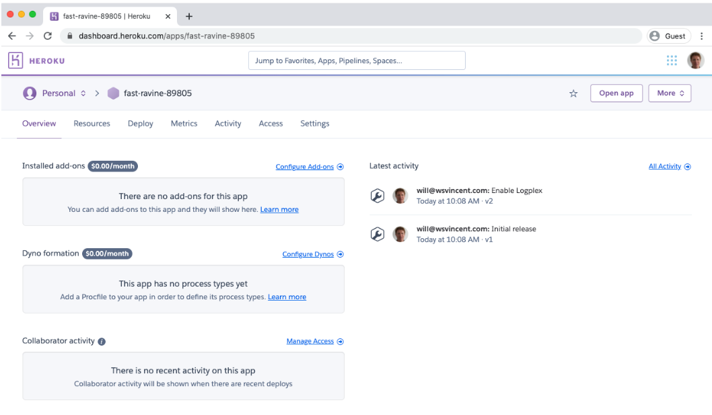
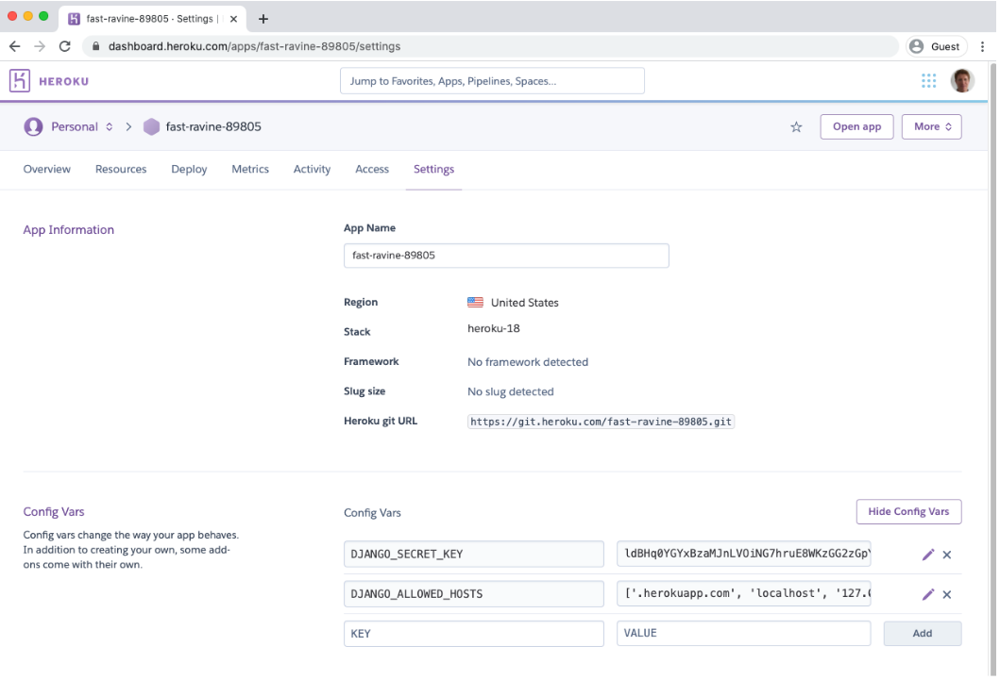
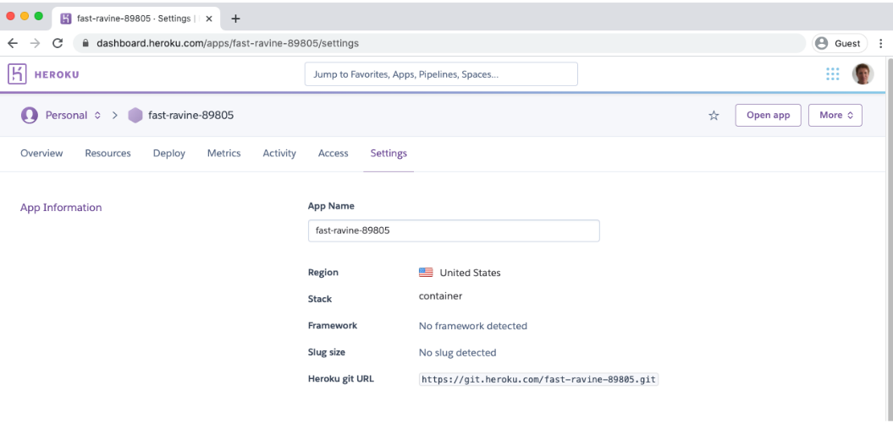
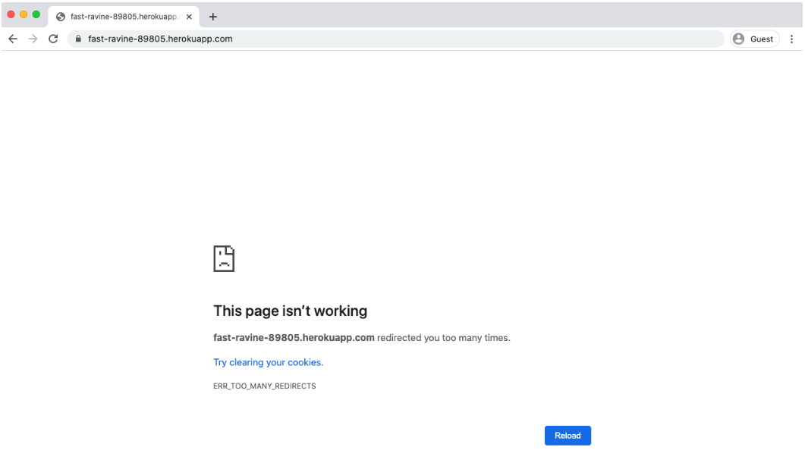
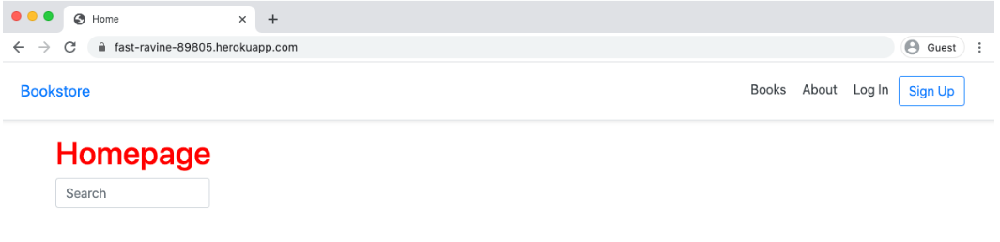

<div dir="rtl">

# Deployment

تا به این جای کار روی سیستم شخصی به عنوان محیط توسعه کار می‌کردیم. حال زمان آن فرا رسیده که پروژه را برای دسترسی عمومی ( دسترسی از طریق اینترنت) نیز دیپلوی کنیم. عنوان دیپلوی موضوع گسترده ای می‌باشد، به گونه ای که می‌توان در کتاب جداگانه‌ای مفصل به توضیح آن پرداخت. در مقایسه با دیگر فریم ورک‌ها، جنگو در این موضوع بسیار کاربردی می‌باشد. امکان دیپلوی اپلیکیشن جنگو تنها با یک کلیک رو اکثر پلتفرم‌های هاستینگ وجود نداشته و همین دلیل نیازمند کار بیشتر سمت توسعه دهندگان می‌باشد، با این حال امکان سفارشی سازی بالایی را در مقایسه با روش معمول در جنگو برای ما فراهم می‌آورد. در فصل قبل با پیکره بندی کامل فایل docker-compose-prod.yml به صورت جداگانه، همچنین به روزرسانی فایل config/setting.py‌، اپلیکیشن جنگو را آماده قرار گیری در محیط پروداکشن کردیم. در این فصل به ترتیب اقدام به بررسی نحوه انتخاب هاستینگ، اضافه کردن وب سرور برای محیط پروداکشن و همچنین اطمینان از پیکره‌بندی فایل‌های static/media ، قبل از استقرار فروشگاه کتاب آنلاین، خواهیم نمود.

### PaaS vs IaaS

اولین سوال این است که از پلتفرم ابری استفاده کنیم یا رایانش ابری. پلتفرم ابری یکی از گزینه‌های هاستینگ معتبر می‌باشد، که اکثر پیکره‌بندی های اولیه آن انجام شده و امکان مقیاس پذیری را نیز برای سایت شما فراهم می‌کند. از سرویس دهنده‌های مشهور پلتفرم ابری،‌می‌توان به Heroku،PythonAnyWhere و Dokku در بین دیگر سرویس دهنده ها اشاره کرد. اگرچه پلتفرم ابری در مقایسه با رایانش ابری دارای هزینه بیشتری می‌با‌شد ولی این سرویس زمان زیادی از توسعه دهندگان را صرفه‌جویی می‌کند. در مقابل پلتفرم ابری، رایانش ابری وجود دارد که اگر چه انعطاف پذیری بیشتری نسبت به پتلفرم ابری داشته و همچنین هزینه کمتری دارد، اما نیازمند دانش فنی بالا و همچنین اطمینان کافی از نصب و راه اندازی را دارد. از سرویس دهندگان رایانش ابری هم می‌توان به DigitalOcean، Linode، Amazon EC2 و Google Compute Engine اشاره کرد.

حال باید از کدام استفاده کرد؟ توسعه دهندگان جنگو تمایل دارند از یکی از این دو سرویس را استفاده کنند: اگر آن ها اقدام به دیپلوی پایپ لاین روی سرویس رایانش ابری کرده باشند، انتخاب آن‌ها رایانش ابری خواهد بود، در غیر این صورت سراغ پلتفرم ابری خواهند رفت.

از آنجایی که استفاده از سرویس رایانش ابری پیچیده بوده و نیازمند پیکره‌بندی‌های زیادی می‌باشد، ما در اینجا از پلتفرم ابری Heroku استفاده خواهیم کرد. اگر چه پلتفرم ابری Heroku یک تکنولوژی بالغ بوده و همچنین این سرویس دهنده دارای پلن رایگان مناسب برای فروشگاه کتاب آنلاین ما می‌باشد، اما انتخاب Heroku یک موضوع اختیاری می‌باشد.

### White Noise

در توسعه لوکال، جنگو بر اساس staticfiles app اقدام به جمع آوری و ارائه فایل های استاتیک در سراسر پروژه می‌کرد، اگر چه راه حل آسانی می‌باشد ولی کاربردی و امن نیست. برای محیط پروداکشن باید collectstatic اجرا شود، تا تمامی فایل‌های استاتیکی که توسط STATIC_ROOT مشخص شده اند را در یک دایرکتوری مشخص کامپایل کند. با به روزرسانی STATICFILES_STORAGE می‌توان آن ها را در یک سرور واحد در کنار اپلیکیشن جنگو یا یک سرورجداگانه و یا همچنین سرویس های ابری مانند CDN، ارائه داد. در این پروژه ما فایل‌های سرور خود را به کمک WhiteNoise ارائه خواهیم داد، که این پکیج کاملا با سرویس Heroku سازگار بوده و سرعت بسیار بیشتری نسبت به جنگو در حالت عادی به ما ارائه می‌دهد. در محله اول اقدام به نصب پکیج whitenoise در داکر و همچنین اقدام به توقف کانتینر خواهیم کرد:

<div dir="ltr">

```shell
$ docker-compose exec web pipenv install whitenoise==5.1.0
$ docker-compose down
```

</div>

تا انجام تغییرات در تنظیمات اپلیکیشن جنگو، ما اقدام به ساخت دوباره کانتینر از ایمیج اپلیکیشن نخواهیم کرد. تا زمانی که که از داکر استفاده می‌کنیم، امکان تغییر به whitenoise به صورت لوکالی همانند محیط پروداکشن را داریم. در حالی که می‌توان با ست کردن آرگومان nostatic-- این کار را انجام داد،‌ولی در عمل این کار خسته کننده خواهد بود. رویکرد بهتر این می‌باشد که در پیکره بندی INSTALLED_APPS دستور whitenoise.runserver_nostatic را قبل از django.contrib.staticfiles اضافه کنیم. ما همچنین برای استفاده از whitenoise پیکره بندی ‌های آن را در بخش MIDDLEWARE دقیقا پایین خط SecurityMiddleware و بخش STATICFILES_STORAGE اضافه می ‌کنیم.
Code

<div dir="ltr">

```python
# config/settings.py
INSTALLED_APPS = [
  'django.contrib.admin',
  'django.contrib.auth',
  'django.contrib.contenttypes',
  'django.contrib.sessions',
  'django.contrib.messages',
  'whitenoise.runserver_nostatic', # new
  'django.contrib.staticfiles',
  'django.contrib.sites',
...
]
MIDDLEWARE = [
  'django.middleware.cache.UpdateCacheMiddleware',
  'django.middleware.security.SecurityMiddleware',
  'whitenoise.middleware.WhiteNoiseMiddleware', # new
...
]
STATICFILES_STORAGE = 'whitenoise.storage.CompressedManifestStaticFilesStorage' # new
```

</div>

با انجام تغییرات، ما می‌توانیم پروژه را در حالت توسعه به صورت لوکال اجرا کنیم.

<div dir="ltr">

```shell
$ docker-compose up -d --build
```

</div>

پکیج whitenoise دارای ویژگی‌های خاص برای ارائه محتوا ‌ به صورت فشرده و همچنین دارای هدرهایی برای کشینگ محتوا داشته، که تغییر نخواهند کرد. اما الان یک بار دیگه دستور collectstatic را مجدد اجرا می‌کنیم:

<div dir="ltr">

```shell
$ docker-compose exec web python manage.py collectstatic
```

</div>

### Media Files

متاسفانه white-noise عملکرد خوبی در مواجه با فایل‌های چندرسانه‌ای آپلود شده توسط کاربران ندارد. کاورهای کتاب ما توسط جنگو ادمین اضافه شده است ولی عمکلرد آن شبیه به فایل های آپلود شده توسط کاربران می‌باشد. در نتیجه، در حالی که در توسعه لوکال به صورت دلخواه ظاهر می‌شوند، ولی در تنظیمات محیط پروداکشن ظاهر نمی‌شوند. رویکرد پیشنهادی استفاده از پکیج محبوب django-storage در کنار یک CDN اختصاصی مانند S3 می‌باشد. این رویکرد نیازمند پیکره‌بندی‌های اضافی که توضیحات مربوط به آن، خارج از محدوده کتاب می‌باشد.

### Gunicorn

وقتی ما در فصل سوم دستور startproject را اجرا کردیم، فایل wsgi.py با پیکره بندی‌ های پیش فرض WGSI (Web Server Gateway Interface) ساخته شد. این مشخصات برای ارتباط بین وب اپ ساخته شده (مانند پروژه فروشگاه کتاب آنلاین) با وب سرور استفاده می‌گردد. برای محیط پروداکشن رایج است که از Gunicorn یا uWSGI به جایWGSI پیش‌فرض استفاده کنیم، هر دو این‌ها باعث بهبود عمکلرد می‌گردند ولی به دلیل سادگی در پیاده سازی انتخاب ما Gunicorn می‌باشد.
مرحله اول نصب پکیج Gunircorn در پروژه و سپس متوقف کردن کانتینرها می‌باشد:

<div dir="ltr">

```shell
$ docker-compose exec web pipenv install gunicorn==20.0.4
$ docker-compose down
```

</div>


از آنجا که ما از داکر استفاده می‌کنیم، محیط لوکال ما می‌توانید نقش محیط پروداکشن را به خوبی ایفا کند،‌ بنابراین ما هر دو فایل docker-compose.yml و docker-compose-prod.yml را برای استفاده از Gunicorn به جای وب سرورقبلی، به روز رسانی می‌کنیم.

<div dir="ltr">

docker-compose.yml
```yml
# command: python /code/manage.py runserver 0.0.0.0:8000
command: gunicorn config.wsgi -b 0.0.0.0:8000 # new
```

</div>

<div dir="ltr">

docker-compose-prod.yml
```shell
# command: python /code/manage.py runserver 0.0.0.0:8000
command: gunicorn config.wsgi -b 0.0.0.0:8000 # new
```

</div>

حال مجدد کانتینر را اجرا می‌کنیم تا دوباره ایمیج جدید به همراه پکیج Gunicorn و همچنین متغیرهای محلی ساخته شود.

<div dir="ltr">

```shell
$ docker-compose up -d --build
```

</div>

### Heroku

وارد وبسایت Heroku شده و به صورت رایگان ثبت نام کنید.بعد تایید ایمیل، Heroku شما رو به داشبورد مدیریتی منتقل خواهد کرد. سپس مطمئن شوید CLI (Command Line Interface) مربوط به Heroku را نصب کنید تا بتوانیم از طریق command line "استقرار را انجام دهیم. جزئیات نصب
مرحله اخر، ورود با مشخصات کاربری از طریق command line با تایپ دستور heroku login می‌باشد. از ایمیل و رمزعبوری که برای ساخت اکانت در Heroku استفاده کرده‌اید، برای لاگین استفاده کنید.

<div dir="ltr">

```shell
$ heroku login
```

</div>

### Deploying with Docker

حال با ما دو انتخاب رو‌به‌رو هستیم: استقرار از طریق راه حل پیشین یا با استفاده از کانتینر داکر. مورد اخر(استفاده از کانتینر داکر) یک رویکرد جدید در Heroku و دیگر ارائه دهندگان خدمات هاستینگ می‌باشد که به تازگی اضافه شده است. همانطور که داکر توسعه لوکال را بر عهده گرفته بود، استقرار را نیز بر عهده خواهد گرفت. اگر شما یک بار پیکره‌بندی های لازم برای استقرار کانتینر را انجام دهید، تعویض هاستینگ بسیار ساده تری در مقایسه با روش ها معمول هر هاستینگ خواهید داشت. پس ما استقرار را با استفاده از کانتینرهای داکر انجام خواهیم داد. با این حال ما با یک انتخابی دیگر در بین ویژگی ها کانتینرها، روبه‌رو هستیم: استفاده از ایمیج ها از پیش ساخته شده موجود در داکر رجیستری( مانند داکرهاب) و یا افزودن فایل heroku.yml. به دلیل اجازه استفاده از دستورات بیشتر و همچنین شباهت بیشتر به رویکرد پیشین Heroku با استفاده از Procfile در پیکره‌بندی، از رویکرد دوم استفاده خواهیم کرد.

### heroku.yml

در استقرارهای غیرداکری Heroku، از فایل Procfile برای استقرار یک سایت استفاده می‌کنیم، برای کانتینرهای Heroku نیز از یک رویکر مشابه استفاده می‌کنیم، در این رویکرد یک فایل سفارشی با نام heroku.yml در دایرکتوری root ساخته می‌شود. این فایل شبیه فایل docker-compose.yml ای که برای ساخت کانتینر در محیط توسعه لوکال استفاده می‌کردیم، می‌باشد.

با دستور زیر فایل heroku.yml را می‌سازیم.

<div dir="ltr">

```shell
$ touch heroku.yml
```

</div>

این فایل دارای چهار قسمت نصب (setup), ساخت(build),انتشار (release) و اجرا(run) می باشد. وظیفه اصلی بخش نصب، مشخص کردن افزونه‌های مورد نیاز می‌باشد.معمولا این افزونه ها توسط Heroku با پرداخت هزینه ارائه می‌شود. بزرگترین آن پایگاه داده ما بوده، که روی افزونه رایگان heroku-postgresql قرار دارد. Heroku با ارائه سرویس و به‌روزرسانی‌های امنیتی آن باعث می‌شود ما به راحتی سایز و دسترسی پذیری سرویس را بر اساس نیاز ارتقا دهیم.
بخش ساخت (build) مشخص می‌کنیم که فایل Dockerfile چگونه باید ساخته شود، این به فایل Dockerfile که در دایرکتوری root قرار دارد، بستگی دارد.

مرحله انتشار برای انجام وظایف قبل از انتشار نسخه جدید، کاربرد دارد. برای مثال، ما باید مطمئن شویم که collectstatic در هر دیپلوی به صورت خودکار اجرا می‌گردد.

در نهایت در مرحله اجرا، ما مشخص می‌کنیم که کدام پروسس باید اپلیکیشن را اجرا کند، به ویژه استفاده از Gunircorn به عنوان وب سرور.

<div dir="ltr">

```yml
setup:
  addons:
    - plan: heroku-postgresql
build:
  docker:
    web: Dockerfile
release:
    image: web
    command:
      - python manage.py collectstatic --noinput
run:
    web: gunicorn config.wsgi
```

</div>

مطمئن شوید که آپدیت‌های‌ جدید مربوط به دیپلوی را به گیت اضافه کرده و آن را کامیت کنید. در مرحله بعدی ما کدهای موجود در محیط لوکال را به Heroku ارسال خواهیم کرد.

<div dir="ltr">

```shell
$ git status
$ git add .
$ git commit -m 'ch17'
```

</div>

### Heroku Deployment

حال یک اپ جدید برای پروژه فروشگاه کتاب ایجاد می‌کنیم. اگر شما عبارت heroku create را تایپ کنید، Heroku یک نام تصادفی به اپ اختصاص خواهد داد. تا زمانی که اسامی در Heroku به صورت سراسری می‌باشند، امکان استفاده از اسامی معمول مانند "blog" یا "webapp" وجود ندارد. نام اپ می‌تواند همیشه در داخل Heroku تغییر یابد تا در فضای نام‌ سراسری در دسترس باشد.

<div dir="ltr">

```shell
$ heroku create
Creating app... done, ⬢ fast-ravine-89805
https://fast-ravine-89805.herokuapp.com/
https://git.heroku.com/fast-ravine-89805.git
```

</div>

در این مورد Heroku نام fast-ravin-89805 را به اپ من اختصاص داده است. اگر داشبورد مدیریتی Heroku را رفرش کنیم، اپی که به تازگی ساخته شده است را مشاهده خواهیم کرد. روی اپ جدید کلیک کنید تا صفحه "Overview" باز شود

[](#)

مرحله بعدی، اضافه کردن متغیرهای محلی مربوط به محیط پروداکشن می‌باشد. در بالای صفحه روی "Settings" کلیک کرده و سپس روی "Reveal Config Vars" کلیک نمایید. به دلیل این که ما به صورت کلی از مقادیر پیش فرض‌ در متغیرها استفاده می‌کنیم، فقط مقادیر دو متغیر DJANGO_SECRET_KEY و DJANGO_ALLOWED_HOSTS را تنظیم خواهیم کرد. از آنجا که ما فقط نام دامنه fast-ravine-89805.herokuapp.com را برای سایت پروداکشن مشخص کرده ایم، برای بالا بردن میزان امنیت، در ALLOWED_HOSTS آن را اضافه می‌کنیم.

[](#)

همچنین امکان اضافه کردن متغیرهای مربوط به پیکره‌بندی از طریق دستورات نیز وجود دارد. هر دو رویکرد عملی می‌باشد.

حالا باید stack را برای استفاده از کانتینر داکر به جای buildpack که به صورت پیش فرض در Heroku استفاده می‌شود، تنظیم کنیم. نام اپ را نیز به انتهای دستور stack:set container -a اضافه کنید.

<div dir="ltr">

```shell
$ heroku stack:set container -a fast-ravine-89805
Setting stack to container... done
```

</div>

برای اطمینان از اجرای درست تغییرات، صفحه داشبورد مدیریتی Heroku را یک بار رفرش کنید. حال در بخش "info"، قسمت "Stack" مقدار آن برابر"Container" باشد.

[](#)

قبل از ارسال کده های مان به Heroku، پایگاه داده PostgreSQL میزبان را مشخص کنید. در مورد ما، نسخه رایگان hobby-dev به خوبی کار می‌کند. همچنین قابلیت آپدیت در آینده را دارد.

<div dir="ltr">

```shell
$ heroku addons:create heroku-postgresql:hobby-dev -a fast-ravine-89805
Creating heroku-postgresql:hobby-dev on ⬢ fast-ravine-89805... free
Database has been created and is available
! This database is empty. If upgrading, you can transfer
! data from another database with pg:copy
Created postgresql-curved-34718 as DATABASE_URL
Use heroku addons:docs heroku-postgresql to view documentation
```

</div>

آیا متوجه شدید متغیر DATABASE_URL چگونه به صورت خودکار تولید شد. این همان دلیلی است که ما مجبور نبودیم این متغیر را در محیط پروداکشن تنظیم کنیم.

ما آماده ایم! با ساخت یک Heroku ریموت، یک نسخه از کدهای ما در سرورهای میزبان Heroku وجود خواهد داشت. مطمئن شوید a- و نام اپ وجود داشته باشد، سپس کدها رو به Heroku ارسال کنید که نتیجه آن ساخت ایمیج و کانتینر داکری خواهد بود.

<div dir="ltr">

```shell
$ heroku git:remote -a fast-ravine-89805
set git remote heroku to https://git.heroku.com/fast-ravine-89805.git
$ git push heroku master
```

</div>

ارسال اولیه ممکن است کمی طول بکشد. شما می‌توانید با کلیک رو تب "Activity" در داشبورد مدیریتی Heroku، میزان پیشرفت هر فعالیت را مشاهده کنید.

حال پروژه فروشگاه کتاب ما به صورت آنلاین در دسترس می‌باشد.به خاطر داشته باشید در حالی که کدهای ما دقیقا در Heroku کپی شده است، ولی پروژه ما در محیط پروداکشن دارای پایگاه داده مخصوص به خود می‌باشد که در حال حاضر هیچ داده‌ای داخل آن قرار ندارد. برای اجرا دستورات در Heroku باید heroku run را اجرا کنید. برای مثال ما باید پایگاه داده اولیه را migrate کرده و سپس یک اکانت superuser بسازیم.

<div dir="ltr">

```shell
$ heroku run python manage.py migrate
$ heroku run python manage.py createsuperuser
```

</div>

دو راه برای باز کردن اپلیکیشن تازه مستقر شده وجود دارد. راه حل اول از طریق command line و تایپ کردن دستور heroku open -a و سپس نام اپ و راه حل دوم روی دکمه "Open app" در گوشه بالا سمت راست داشبورد مدیریتی Heroku کلیک کنید.

<div dir="ltr">

```shell
$ heroku open -a fast-ravine-89805
```

</div>

[](#)

بعد از باز کردن اپ، با خطای ریدایرکت روبه‌رو می‌شویم!

### SECURE_PROXY_SSL_HEADER

بررسی‌های دقیق نشان می‌دهد که این مشکل مربوط به تنظیمات SECURE_SSL_REDIRECT می‌باشد. Heroku از پروکسی‌ها استفاده می‌کند، پس ما باید هدر مربوطه را پیدا کرده و هدر SECURE_PROXY_SSL_HEADER را آپدیت کنیم. به صورت پیش فرض هدر ذکر شده برابر None می‌باشد، به دلیل اعتمادی که به Heroku داریم مقدار آن را برابر ('HTTP_X_FORWARDED_PROTO', 'https') این تنظیمات باعث آسیب به توسعه لوکال ما نشده و ما می‌توانیم به صورت مستقیم آن را در مسیر config/settings.py قرار دهیم:


<div dir="ltr">

```python
# config/settings.py
SECURE_PROXY_SSL_HEADER = ('HTTP_X_FORWARDED_PROTO', 'https') # new
```

</div>

تغییرات را در گیت commit کرده و سپس کدهای به روز شده را به Heroku انتقال دهید:

<div dir="ltr">

```shell
$ git status
$ git commit -m 'secure_proxy_ssl_header and allowed_hosts update'
$ git push heroku master
```

</div>

[](#)

بعد از پایان ساخت اپ، صفحه وب را رفرش کنید تا سایت خود را مشاهده کنید!

### Heroku Logs

بسیار معمول است که گاهی اوقات شما هنگام استقرار اپ با خطاهایی مواجه شوید. کافی است شما دستور heroku logs --tail را وارد کنید تا لاگ های مربوط به خطا‌ها، اطلاعات و دیباگ را مشاهده کنید. امیدوارم روند استقرار بدون مشکل انجام شود، ولی در عمل حتی در سرویس‌های پلتفرمی (PaaS) مانند Heroku نیز، ممکن است مشکلاتی پیش آید. اگر شما صفحه خطا را مشاهده کردید، دستور heroku logs -tail را تایپ کنید تا خطاها را مشاهده کرده و مشکل را تشخیص دهید.

### Heroku Add-ons

Heroku دارای لیست بزرگی سرویس‌های افزونه ای می‌باشد که با پرداخت هزینه آن ، به سرعت می‌توانید آن را به سایت خود اضافه کنید. برای مثال، برای فعالسازی کشینگ با Memcache، افزونه Memcachier نیاز است. پشتیبان گیری روزانه اختیاری می‌باشد ولی یک ویژگی ضروری برای پایگاه‌داده‌های محیط پروداکشن می‌باشد. اگر شما از یک دامنه اختصاصی برای سایت خودتان استفاده می‌کنید، اطمینان از گواهینامه SSL برای هر وبسایتی حیاتی می‌باشد، برای فعال کردن این قابلیت،‌شما باید در یک لایه غیررایگان قرار داشته باشید.

### Conclusion

کدهای بسیار زیادی در فصل وجود داشت، اگر با مشکلی رو‌به‌رو شدید،‌ لطفا official source code on Github را چک کنید. حتی با وجود مزایای بسیاری که سرویس‌هایی پلتفرمی(PaaS) مانند Heroku دارند، استقرار یک کار پیچیده و خسته کننده برای توسعه دهندگان ‌می‌باشد. من شخصا، نیاز دارم که سایت من فقط کار کند، ولی اغلب مهندسان از چالش های ایجاد شده برای بهبود در عملکرد، امنیت و مقیاس پذیری لذت می‌برند. اندازه گیری پیشرفت سایت بسیار آسان می‌باشد: آیا سرعت سایت افزایش یافته است؟ آیا سایت همیشه در دسترس است؟ آیا امنیت آن به روزرسانی شده است؟ کار کردن روی این مشکلات اغلب بهتر از اضافه کردن قابلیت جدید به سایت می‌باشد.


### سرویس ابری لیارا

در این فصل با تفاوت‌های PaaS با IaaS و برخی ارائه‌دهندگان این سرویس‌ها مانند Heroku آشنا شدیم اما بسیاری از توسعه‌دهندگان ایرانی به‌دلیل محدودیت‌های موجود امکان استفاده از این سرویس‌ها را نخواهند داشت، به‌همین دلیل [صفحه‌ی جدیدی](LIARA.md) را برای معرفی و آموزش استقرار برنامه‌های Djagno بر روی [سرویس ابری لیارا](https://liara.ir/) اضافه کردیم.

<p align="center">
  <a href="LIARA.md" target="_blank"> آموزش استقرار برنامه‌های Djagno بر روی سرویس ابری لیارا</a>
</p>

همچنین لیارا برای علاقه‌مندان به توسعه‌ی برنامه‌های Django یک اعتبار اولیه هدیه ۲۰۰ هزارتومانی درنظر گرفته است که برای دریافت آن می‌توانید از طریق لینک زیر، اقدام به ثبت نام کنید.

<p align="center">
  <a href="https://liara.ir/?userToken=djangobook" target="_blank">liara.ir/djangobook</a>
</p>

</div>


