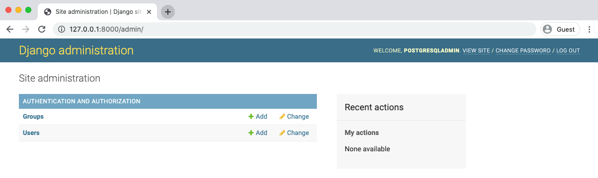
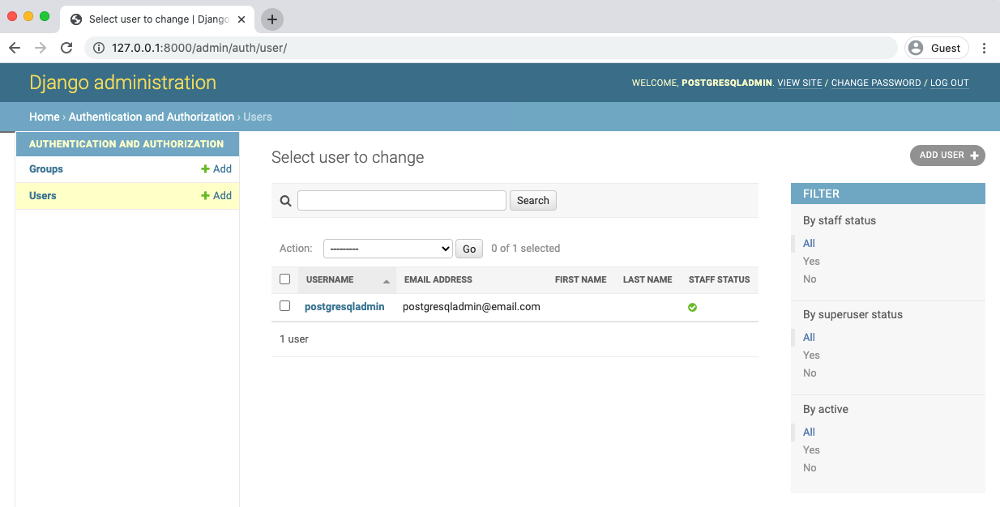

<h1 dir="rtl">فصل دوم : PostgreSQL</h1>

<p dir="rtl">
یکی از تفاوت های اصلی بین یک اپلیکیشن ابتدایی و یک اپلیکیشن آماده به کار(production-ready) جنگو، در دیتابیس های آنان است.  
جنگو بدلیل راحت بودن، سریع بودن و file-based بودن SQLite، از این دیتابیس بصورت پیشفرض برای توسعه ی محلی (local development) بهره می برد و آن را به گزینه ی مناسبی تبدیل می کند. علاوه بر آن،این دیتابیس نیاز به هیچ گونه نصب و پیکربندی ندارد.
</p>

<p dir="rtl">
هرچند این دیتابیس معایب خاص خود را دارد. بطور کلی، SQLite دیتابیس مناسبی برای سایت های رده بالا و حرفه ای نیست. اما برای پیاده کردن ایده های اولیه این دیتابیس می تواند پاسخ گو باشد.بطور کلی SQLite بصورت خیلی کم و محدود برای پروژه های بزرگ مورد استفاده قرار می گیرد.
</p>

<p dir="rtl">
جنگو چهار دیتابیس را پشتیبانی می کند: SQLite, PostgreSQL, MySQL و Oracle.ما در این کتاب از PostgreSQL بدلیل معروف بودن آن استفاده خواهیم کرد. زیبایی Django ORM در آن است که اگر حتی از Oracle یا MySQL به جای PostgreSQL استفاده کنیم؛ تفاوتی در کد ما ایجاد نمی کند. Django ORM  کار ترجمه کد از زبان برنامه نویسی پایتون، به زبان دیتابیس ها را به راحتی مدیریت می کند و این بسیار شگفت انگیز است.
</p>

<p dir="rtl">
چالشی که این سه دیتابیس  برای ما ایجاد می کنند این است که اگر بخواهید یک production environment را بر روی کامپیوتر خود(local computer) ایجاد کنید؛ باید هر کدام از این دیتابیس ها  را نصب  و بصورت محلی(local) آن ها را اجرا نمایید و ما دقیقا می خواهیم همین عمل را انجام دهیم. در حالی که جنگو جزییات سوییچ بین دیتابیس ها را مدیریت می کند اما زمانی که شما از SQLite برای توسعه ی محلی (local development) و از دیتابیسی دیگر برای محصول نهایی استفاده می کنید؛ممکن است به باگ های خیلی کوچک و اجتناب ناپذیر برخورد کنید که پیدا کردن و رفع آن ها ممکن است شما را به دردسر بیندازد. بنابراین استفاده از یک دیتابیس هم برای توسعه ی محلی و هم برای محصول نهایی راه حل بهتری است.
</p>

<p dir="rtl">
در این فصل ابتدا ما یک پروژه ی جنگو را با استفاده از دیتابیس SQLite توسعه می دهیم و سپس بر روی مباحث Docker و PostgreSQL  سوییچ می کنیم.
</p>

<h2 dir="rtl">شروع به کار</h2>
<p dir="rtl">
ابتدا با استفاده از command line بر روی پوشه ی code در desktop سوییچ کنید. شما این کار را می توانید با دو روش انجام دهید.یا با تایپ کردن    <code dir="ltr">cd ..</code> می توانید از  <code dir="ltr">Desktop/code/hello</code>به  <code>Desktop/code</code> هدایت شوید و  یا با تایپ 
 <code dir="ltr">cd ~/Desktop/code/</code>می توانید به آدرس مورد نظرتان هدایت شوید. سپس یک directory به اسم  <code dir="lt">postgresql</code> بسازید.

</p> 

**Command Line**
```bash
$ cd  ..
$ mkdir postgresql && cd postgresql
```
  
<p dir="rtl">
حالا جنگو را نصب کنید،   <code>shell</code>را راه اندازی کنید و یک پروژه ی کوچک به نام <code>postgresql_project</code> بسازید. یادتان باشد که <code>.</code>  را در آخر command وارد کنید 
</p>

**Command Line**
```bash
$ pipenv install django==2.2.7
$ pipenv shell
(postgresql) $ django-admin startproject postgresql_project .
```
<p dir="rtl">
 حالا می توانیم دیتابیس را <code>migrate</code> کنیم تا آن را راه اندازی نماییم و سپس با استفاده از ،<code>runserver</code> سرور محلی(local server) را راه اندازی کنیم.
</p>

<blockquote dir="rtl">
به طور کلی، من اجرای migrate را بر روی پروژه های جدید پیشنهاد نمی کنم؛ مگر این که مدل اختصاصی کاربر پیکربندی شده باشد. در غیر این صورت، جنگو، دیتابیس را به مدل داخلی کاربر  متصل می کند که در این حالت اصلاح و تغییر آن در ادامه ی این پروژه، کار دشوار و پیچیده ای خواهد بود. این مبحث را بصورت جزیی تر در فصل 3 بیان خواهیم کرد. چون قصد اصلی ما در این فصل صرفا پیاده سازی هدفمان می باشد؛ بنابراین استفاده از مدل پیش فرض کاربر یک استثنا می باشد.
</blockquote>
  
**Command Line**
```bash
(postgresql) $ python manage.py migrate
(postgresql) $ python manage.py runserver
```

<p dir="rtl">
اگر دستورات به درستی اجرا شوند، شما به آدرس http://127.0.0.1:8000/  در مرورگرتان هدایت می شوید.شاید نیاز باشد که شما حداقل یک بار صفحه را ریفرش کنید اما بعد از این کار، شما باید با صفحه ی خوش آمد گویی جنگو مواجه شوید.
</p>
  
<p dir="rtl">
سرور محلی  (local server) را با <code>control + c</code> متوقف کنید و سپس با دستور <code>ls</code> همه ی فایل ها و directory ها را لیست کنید.
</p>
 
**Command Line**
```bash
(postresql) $ ls
Pipfile     Pipfile.lock     db.sqlite3     manage.py     postgresql_project.
```
<h2 dir="rtl">Docker</h2>

<p dir="rtl">
برای سوییچ به داکر، ابتدا با تایپ  <code dir=”ltr”>exit</code>از محیط مجازی (virtual environment) خارج شده و سپس فایل هایی با اسم <code dir=”ltr”>Dockerfile</code> و <code dir=”ltr”> docker-compose.yml</code> ایجاد کنید. این فایل ها بترتیب، <code dir=”ltr>Docker image</code> و <code dir=”ltr”>container</code> را کنترل می کنند. 
</p>
 
**Command Line**
```bash
(postgresql) $ exit
$ touch Dockerfile
$ touch docker-compose.yml
```
<p dir="rtl">
<code dir=”ltr”>Dockerfile</code> زیر، همانند فایلی است که در فصل اول مورد استفاده قرار گرفته بود.       
</p>

**Dockerfile**
```docker
# Pull base image
FROM python:3.7

# Set environment variables
ENV PYTHONDONTWRITEBYTECODE 1
ENV PYTHONUNBUFFERED 1

# Set work directory
WORKDIR /code

# Install dependencies
COPY Pipfile Pipfile.lock /code/
RUN pip install pipenv && pipenv install --system

# Copy project
COPY . /code/
```

<p dir="rtl">
حالا image اولیه را با استفاده از دستور <code dir="ltr"> docker build .</code> ایجاد نمایید.
</p>

<p dir="rtl">
آیا متوجه شدید که <code dir="ltr">Dockerfile</code> این بار image را بسیار سریع تر ایجاد کرد؟ این اتفاق به این دلیل است که داکر در همان ابتدا، در کامپیوتر شما بصورت محلی به دنبال یک image خاص می گردد. اگر image مورد نظر را بصورت محلی پیدا نکرد؛سپس آن را دانلود می کند. چون بسیاری از این image ها از فصل قبل بر روی کامپیوتر بوده اند، بنابراین داکر نیازی نمی بیند که آن ها را دوباره دانلود نماید.  
</p>

<p dir="rtl">
حالا نوبت به فایل <code dir="ltr">docker-compose.yml</code> می رسد؛ که این فایل نیز همان فایلی است  در فصل اول مورد استفاده قرار گرفته بود.     
</p>

**docker-compose.yml**
```
version: '3.7'


services:
    web:
        build: .
        command: python /code/manage.py runserver 0.0.0.0:8000
        volumes:
            - .:/code
        ports:
            - 8000:8000			      
```

<h2 dir="rtl">حالت تفکیک شده (Detached Mode)</h2>

<p dir="rtl">
این بار container را با حالت تفکیک شده راه اندازی می کنیم؛ که در این حالت نیاز به یکی از دو فلگ (flag) <code dir="ltr">-d</code>  یا  <code dir="ltr">-detach</code>داریم. لازم بذکر است که این دو فلگ کار مشابه ای را انجام می دهند.

**command line**
```bash
$ docker-compose up -d
```

<p dir="rtl">
حالت تفکیک شده، <a href="https://docs.docker.com/compose/reference/up/">container</a> را در پس زمینه اجرا می کند. این بدان معنی است که ما می توانیم تنها از یک command line استفاده کنیم، بدون این که نیازی به command line دیگری باشد. این مهم باعث می شود که وقت ما بیهوده صرف سوییچ کردن بین command line ها نشود. از طرفی دیگر بدی این روش این است که اگر اروری بوجود آید؛ این ارور همیشه نمایش داده نمی شود. بنابراین اگر،در برخی موارد، صفحه ی نمایش کامپیوتر شما با این کتاب همخوانی نداشت؛ با تایپ کردن <code dir=”ltr”>docker-compose logs</code> خروجی فعلی را چاپ کنید و خطا ها و ارور های آن را برطرف نمایید. 
</p>

<p dir="rtl">
 به احتمای زیاد شما با پیام <code dir="ltr">Warning: Image for service web was built because it did not already exist</code> در زیر command مواجه خواهید شد. داکر بصورت اتوماتیک یک image درون container ساخته است. همانطور که در ادامه ی این کتاب خواهیم دید؛ اضافه کردن فلگ <code dir="ltr">--build</code> ، زمانی که پکیج های نرم افزار (software package) آپدیت هستند، لازم است. چرا که داکر، بصورت پیش فرض، بدنبال کپی حافظه ی محلی (local cached copy) نرم افزار می گردد و از آن برای ارتقا عملکرد استفاده می کند.
</p>

<p dir="rtl">
برای این که اطمینان پیدا کنیم که همه چیز بدرستی کار می کند به آدرس http://127.0.0.1:8000/ در  درون مرورگرتان برگردید؛ صفحه را ریفرش کنید تا دوباره با صفحه ی خوش آمد گویی جنگو مواجه شوید.
</p>

<p dir="rtl">
از آن جایی که از داکر استفاده می کنیم، ما باید دستورات سنتی را با <code dir="ltr">docker-compose exec [service]</code> آغاز کنیم؛ که در آن اسم سرویس را مشخص می نماییم. برای مثال، برای ساختن یک اکانت superuser، به جای وارد کردن <code dir="ltr">python manage.py createsuperuser</code> ،دستور آپدیت شده بصورت زیر می باشد(با استفاده از سرویس <code dir="ltr">web</code>).
</p>

**Command Line**
```bash
$ docker-compose exec web python manage.py createsuperuser
```

<p dir="rtl">
برای یوزرنیم، <code dir="ltr">sqliteadmin, sqliteadmin@email.com</code> را به عنوان ایمیل آدرس و پسورد را بنا بر میل خودتان انتخاب کنید. من معمولا از <code dir="ltr">testpass123</code> استفاده می کنم.
</p>

<p dir="rtl">
پس از اینکار به قسمت ادمین در آدرس http://127.0.0.1:8000/admin  بروید و سپس وارد شوید.
</p>

<p align="center">
  
  <p align="center"><strong>Django admin login</strong></p>
</p>

<p dir="rtl">
سپس شما به صفحه ی اصلی ادمین هدایت می شوید. دقت کنید که <code dir="ltr">sqliteadmin</code>، اسم یوزرنیم شما می باشد.
</p>

<p align="center">
  
  <p align="center"><strong>Django sqliteadmin</strong></p>
</p>

<p dir="rtl">
اگر شما بر روی دکمه ی <code dir="ltr">Users</code> کلیک نمایید؛ شما به صفحه ی یوزر ها هدایت می شوید که در آنجا می توانیم تایید کنیم که تنها یک یوزر ساخته شده است.
</p>

<p align="center">
  
  <p align="center"><strong>Admin Users page</strong></p>
</p>

<p dir="rtl">
 در اینجا مهم است که یکی از جنبه های دیگر جنگو را مورد توجه قرار دهیم: تا به اینجا ما در حال آپدیت کردن دیتابیس – فایل <code dir="ltr">db.sqlite3</code> - در درون داکر بودیم. این بدا معنی است که فایل <code dir="ltr">db.sqlite3</code> به مرور زمان در حال تغییر بوده است. به لطف <code dir="ltr">volumes</code> که بر روی <code dir="ltr">docker-compose.yml</code> سوار است؛ تغییرات هر فایل در فایل <code dir="ltr">db.sqlite3</code> در درون کامپیوتر شما نیز کپی می شود. شما می توانید از داکر خارج شوید؛ <code dir="ltr">shell</code> را راه اندازی، و سرور را با <code dir="ltr">python manage.py runserver</code> راه اندازی کنید. و شما در آخر همان admin login  مشابه را مشاهده می کنید. این اتفاق به این دلیل است که دیتابیس SQLite زیرین یکی است.
</p>

<h2 dir="rtl">PostgreSQL</h2>

<p dir="rtl">
حالا زمان آن فرا رسیده است که برای ادامه ی پروژه به سمت PostgreSQL سوییچ کنیم. این کار سه قدم دیگر را در بر می گیرد:
</p>

<ul dir="rtl">
<li dir="rtl">	وفق دهنده ی دیتابیس (database adapter) <code dir=”ltr”>Psycopg2</code> را نصب کنید. با این کار python می توانید با PostgreSQL ارتباط برقرار کند.</li>

<li dir="rtl">	کانفیگ DATABASE را در فایل <code dir=”ltr”>settings.py</code> آپدیت کنید.</li>

<li dir="rtl">PostgreSQL را بصورت محلی اجرا نمایید.</li>
</ul>

<p dir="rtl">
 حالا اجرای docker container را با استفاده از <code dir="ltr">docker-compose down</code> متوقف کنید.
</p>

**command line**
```bash
$ docker-compose down
Stopping postgresql_web_1 ... done
Removing postgresql_web_1 ... done
Removing network postgresql_default
```

<p dir="rtl">
 سپس در درون فایل <code dir="ltr">docker-compose.yml</code> یک سرویس به نام <code dir="ltr">db</code> اضافه نمایید. این بدان معنی است که دو سرویس کاملا جداگانه وجود خواهد داشت؛ هر کدام دارای یک container که در درون Docker host اجرا می شوند:سرویس <code dir="ltr">web</code> برای سرور محلی Django و سرویس <code dir="ltr">db</code> برای دیتابیس PostgreSQL.
</p>

<p dir="rtl">
PostgreSQL دارای آخرین ورژن است؛ یعنی ورژن 11. اگر ورژن خاصی را مشخص نکنیم و به جای آن تنها از <code dir="ltr">postgres</code> استفاده کنیم؛ آخرین نسخه ی PostgreSQL دانلود خواهد شد. بنابراین در آینده ممکن است PostgreSQL نسخه ی 12 برای شما نصب گردد که پیش نیاز های دیگری خواهد داشت.
</p>

<p dir="rtl">
 در آخر، خط <code dir=”ltr”>depends-on</code> را به سرویس <code dir="ltr">web</code> اضافه خواهیم کرد؛ چرا که این سرویس بنا بر نوع دیتابیس اجرا می گردد. این بدان معنی است که <code dir="ltr">db</code> قبل از <code dir="ltr">web</code> شروع بکار خواهد کرد.
</p>

**docker-compose.yml**
```docker
version: '3.7'


services:
    web:
        build: .
        command: python /code/manage.py runserver 0.0.0.0:8000
        volumes:
            - .:/code
        ports:
            - 8000:8000
        depends_on:
            - db
db:
    image: postgres:11	
```

<p dir="rtl">
 حالا <code dir="ltr">docker-compose up -d</code> را اجرا نمایید. با این کار، docker image ما rebuild خواهد شد و دو container را راه اندازی می کند. یکی PostgreSQL را در <code dir="ltr">db</code> اجرا می کند و دیگری جنگو <code dir="ltr">web</code> سرور را اجرا می کند.
</p>

<p dir="rtl">
 در این جا مهم است به این نکته دقت کنیم که production database هایی نظیر PostgreSQL، file-based نیستند. این دیتابیس کاملا در سرویس <code dir="ltr">db</code> اجرا شده و بصورت موقت می باشد. زمانی که <code dir="ltr">docker-compose down</code> را اجرا می کنیم، تمام دیتای درون آن از بین می رود. این کاملا بر خلاف کد ما در درون web container می باشد که دارای یک <code dir="ltr">volumnes</code> سوار بر سینک محلی (sync local) و کد داکر است.
</p>

<p dir="rtl">
 در فصل بعدی یاد خواهیم گرفت که چگونه volumes mount را برای سرویس <code dir="ltr">db</code> اضافه نماییم که اطلاعات دیتابیس را مقاوم نگه دارد.
</p>

<h2 dir="rtl">Settings</h2>

<p dir="rtl">
 با استفاده از text editor، فایل <code dir="ltr">postgresql-project/settings.py</code> را باز نمایید و سپس به سمت پایین scroll نمایید تا با کانفیگ <code dir="ltr">DATABASE</code> مواجه شوید. Setting فعلی به شرح زیر است:
</p>

**Code**
```python
# postgresql_project/settings.py
DATABASES = {
       'default': {
             'ENGINE': 'django.db.backends.sqlite3',
             'NAME': os.path.join(BASE_DIR, 'db.sqlite3'),
       }
}
```

<p dir="rtl">
 جنگو بصورت پیش فرض از <code dir="ltr">sqlite3</code> به عنوان موتور دیتابیس (database engine) استفاده می کند. آن را <code dir="ltr">db.sqlite3</code> نام گذاری کنید و در <code dir="ltr">BASE_DIR</code> قرار دهید؛ که این دایرکتوری، دایرکتوری پروژه ی ما می باشد.
</p>

<p dir="rtl">
 از آن جایی که ساختار دایرکتوری بگونه ای است که باعث سردرگمی می شود، ضمن این نکته لازم است که دایکرتوری پروژه جایی است که فایل های <code dir="ltr">postgresql_project</code>، <code dir="ltr">manage.py</code> ، <code dir="ltr">Pipfile</code> ، <code dir="ltr">Pipfile.lock</code> و <code dir="ltr">db.sqlite3</code> در آن واقع هستند.
</p>

**command line**
```bash
(postgresql)   $   ls
Dockerfile   Pipfile.lock   docker-compose.yml   postgresql_project
Pipfile   db.sqlite3   manage.py
```

<p dir="rtl">
 برای این که به PostgreSQL سوییچ کنیم، ما کانفیگ <a href="https://docs.djangoproject.com/en/2.2/ref/settings/#std:setting-DATABASE-ENGINE">ENGINE</a> را آپدیت خواهیم کرد.PostgreSQL موارد <code dir="ltr">NAME</code> ،  <code dir="ltr">USER</code> ، <code dir="ltr">PASSWORD</code> ، <code dir="ltr">HOST</code> و <code dir="ltr">PORT</code> را از شما می خواهد.
</p>

<p dir="rtl">
برای راحتی عبارت <code dir="ltr">postgresql</code> را برای سه مورد اول وارد نمایید؛ <code dir="ltr">db</code> که اسم service set در فایل <code dir="ltr">docker-compose.yml</code> می باشد را روبروی HOST وارد نمایید. در آخر <code dir="ltr">PORT</code> را <code dir="ltr">5432</code> قرار دهید؛ که <a href="https://en.wikipedia.org/wiki/Port_(computer_networking)">port</a> پیش فرض PostgreSQL می باشد.
</p>

**Code**
```python
# postgresql_project/settings.py
DATABASES = {
    'default': {
        'ENGINE': 'django.db.backends.postgresql',
        'NAME': 'postgres',
        'USER': 'postgres',
        'PASSWORD': 'postgres',
        'HOST': 'db',
        'PORT': 5432
    }
}
```


<p dir="rtl">
اگر پیج را ریفرش کنید، با ارور مواجه خواهید شد.
</p>

<p align="center">
  
  <p align="center"><strong>Django error</strong></p>
</p>

<p dir="rtl">
 چه اتفاقی افتاده است؟ زمانی که ما Docker را در حالت detached mode همراه با فلگ <code dir="ltr">-d</code> اجرا می کنیم، ممکن است خطا در وهله ی اول برای ما واضح و روشن نباشد. نوبت آن است که log ها را بررسی نماییم.
</p>

**Command Line**
```
$ docker-compose logs
...
web_1 | django.core.exceptions.ImproperlyConfigured: Error loading psycopg2
module: No module named 'psycopg2'
```

<p dir="rtl">
همانطور که می بینید، خروجی های زیادی تولید شده اند؛ اما اگر به قسمت پایین web_1 دقت نمایید، خطا به ما می گوید که درایور <code dir="ltr">Psycopg</code> هنوز نصب نشده است.
</p>

<h2 dir=”rtl”>Psycopg</h2>

<p dir="rtl">
PostgreSQL دیتابیسی است که از آن می توان تقریبا در هر زبان برنامه نویسی استفاده کرد. اما به این مورد فکر کنید که چگونه یک زبان برنامه نویسی می تواند به دیتابیس متصل گردد.
</p>

<p dir="rtl">
جواب database adaptor است. دقیقا کاری است که <a href="http://initd.org/psycopg/">Psycopg</a> انجام می دهد. Psycopg معروف ترین و پرطرفدار ترین database adaptor در python می باشد. اگر مایل هستید که اطلاعات بیشتری را در مورد کارکرد Psycopg بدانید، می توانید <a href="https://www.psycopg.org/docs/index.html">توضیحات بیشتری</a> را در سایت رسمی دنبال نمایید.
</p>

<p dir="rtl">
 Psycopg را می توان با Pipenv نصب کرد. در command line دستور زیر را وارد نمایید. با این کار Psycopg در درون Docker host نصب می گردد.
</p>

**Command Line**
```bash
$ docker-compose exec web pipenv install psycopg2-binary==2.8.3
```

<p dir="rtl">
 ممکن است بپرسید که چرا Psycopgباید در Docker نصب گردد؟ جواب کوتاه این است که نصب پکیج های نرم افزاری در درون Docker و rebuild کردن image از اول باعث می شود که از اختلالات احتمالی ناشی از <code dir="ltr">Pipfile.lock</code> در امان بمانیم.
</p>

<p dir="rtl">
 تولید <code dir="ltr">Pipfile.lock</code> شدیدا به نوع سیستم عامل (os) مورد استفاده بستگی دارد. ما کل سیستم عامل  را در درون Docker تعریف می کنیم؛ به علاوه ی <code dir="ltr">Python 3.7</code>. اما اگر شما Psycopg2 را بصورت محلی بر روی کامپیوترتان نصب کنید، که دارای environment متفاوتی می باشد؛<code dir="ltr">Pipfile.lock</code> منتج شده بصورت دیگری خواهد شد. بعد از آن <code dir="ltr">volumes</code> بر روی فایل <code dir="ltr">docker-compose.yml</code> سوار می گردد؛ که بصورت اتوماتیک فایل های سیستمی Docker و فایل های محلی را سینک می کند. این کار باعث می گردد که <code dir="ltr">Pipfile.lock</code> محلی ورژن را در درون Docker باز نویسی کند. بعد از آن، docker container سعی در اجرا کردن فایل اشتباهی <code dir="ltr">Pipfile.lock</code> می کند!
</p>

<p dir="rtl">
 یک راه برای جلوگیری کردن از این مشکل، نصب کردن پکیج های نرم افزاری در درون Docker به جای نصب محلی می باشد.
</p>

<p dir="rtl">
 اگر شما صفحه را ریفرش نمایید، دوباره با خطا روبرو خواهید شد. اجازه دهید log ها را چک کنیم.
</p>

**Command Line**
```bash
$ docker-compose logs
```

<p dir="rtl">
 دقیقا مشابه قبلی است. چرا این اتفاق رخ داد؟ Docker بصورت اتوماتیک image ها را cache می کند. مگر این که به دلایل عملکردی، موردی تغییر کند. ما این را می خواهیم که همراه با <code dir="ltr">Pipfile</code> و Pipfile.lock بصورت اتوماتیک image مان rebuild شوند. اما بدلیل این که خط آخر <code dir="ltr">Dockerfile</code> ، <code dir="ltr"> COPY . /code/</code> می باشد؛ فقط فایل ها کپی می شوند. بنابراین image در ساختار داخلی خودش rebuild نمی کند. مگر این که ما این کار را بصورت دستی و با اضافه کردن فلگ  <code dir="ltr">--build</code> انجام دهیم.
</p>

<p dir="rtl">
 به عنوان یادآوری: زمانی که می خواهید یک پکیج نرم افزاری را اضافه کنید؛ ابتدا آن را در درون Docker نصب نمایید؛ Container ها را متوقف و بصورت دستی image را rebuild کنید. سپس Container را مجددا راه اندازی نمایید. در طول این کتاب، این چرخه را بار ها و بار ها تکرار خواهیم کرد.
</p>

**Command Line**
```bash
$ docker-compose down
$ docker-compose up -d --build
```
<p dir="rtl">
 اگر صفحه را مجددا ریفرش کنید، در آدرس http://127.0.0.1:8000/ با صفحه ی خوش آمد گویی جنگو مواجه خواهید شد. به این دلیل که این بار، جنگو، بصورت موفقیت آمیز بوسیله ی Docker به PostgreSQL متصل شده است.
</p>

<p dir="rtl">
</p>

<p dir="rtl">
</p>


<div dir='rtl' align='right'>

### دیتابیس جدید
با این حال از آنجا که ما از PostgreSQL استفاده می کنیم نه SQLite دیتابیس ما خالی است . اگر نگاه کنید گزارش های فعلی را دوباره با تایپ کردن 
  `docker-compose logs` مشاهده خواهید کرد . شکایاتی مانند "شما 18 مهاجرت (migrations) های اعمال نشده دارید".
  
برای تقویت این نکته به admin در http://127.0.0.1:8000/admin/ مراجعه کنید و وارد شوید . آیا حساب کاربری superuser ما از `sqliteadmin` و `testpass123`
  کار می کند ؟
  
پاسخ منفی است ! ما در `admin/` ارور `ProgrammingError` میبینیم . برای حل کردن این مشکل , ما میتوانیم هم مهاجرت بکنیم و هم یک کاربر superuser
  در داخل داکر بسازیم که به دیتابیس PostgreSQL دسترسی خواهد داشت .

<div dir='ltr' align='left'>

```shell
$ docker-compose exec web python manage.py migrate
$ docker-compose exec web python manage.py createsuperuser
```

</div>  

  
  ما باید چگونه superuser را بنامیم (صدا بزنیم) ؟ بیایید از `postgresqladmin` استفاده کنیم و برای آزمایش ایمیل را به `postgresqladmin@email.com`
  و رمز عبور را به `testpass123` تنظیم کنید .
  
  در مرورگر خود به صفحه `admin` در آدرس http://127.0.0.1:8000/admin/ بروید و اطلاعات superuser جدید را وارد کنید .
  
  

  
  در گوشه سمت راست بالا نشان می دهد که ما با `postgresadmin` وارد شده ایم نه با `sqliteadmin` 
  همچنین ، می توانید بر روی برگه کاربران در صفحه اصلی کلیک کرده
  و از قسمت کاربران دیدن کنید تا مشاهده کنید که تنها کاربر ما حساب superuser جدید است .
  
  
  
  به یاد داشته باشید که ظرف در حال اجرا را با دستور `docker-compose down` متوقف کنید .
  
  
  
  <div dir='ltr' align='left'>
  
  ```shell
  $ docker-compose down
  ```
    
  </div> 
  
  
  ### گیت
  
  
  بیاید تغیرات خود را با راه اندازی اولیه Git  برای این پروژه جدید ذخیره کنیم , اضافه کردن تغیرات خود, و از جمله یک پیام کامیت.
  
  <div dir='ltr' align='left'>
  
  ```shell
  $ git init
  $ git status
  $ git add .
  $ git commit -m 'ch2'
  ```
  
  </div> 
  
  کد های رسمی فصل ۲ در <a href="https://github.com/wsvincent/djangoforprofessionals/tree/master/ch2-postgresql">گیتهاب</a> در دسترس است .
  
  
  ### نتیجه
  
  هدف اصلی این فصل نشان دادن نحوه همکاری docker و PostgreSQL در پروژه جنگو بود .
  تغییر دیتابیس SQLite به PostgreSQL برای بسیاری از توسعه دهندگان در ابتدا یک جهش ذهنی است .
  
  نکته کلیدی این است که با داکر دیگر نیازی به حضور در یک محیط مجازی محلی نداریم.
  داکر محیط مجازی ما و ... و همچنین دیتابیس ما و در صورت تمایل بیشتر . هاست داکر اساسا جایگزین سیستم عامل ما شده است 
  و در داخل آن میتوانیم چندین ظرف (containers) را اجرا کنیم ,
  مانند برنامه وب و دیتابیس ما , که همه می توانند جدا شوند و جداگانه اجرا شوند . 
  
  در فصل بعدی ما پروژه کتابفروشی آنلاین خود را آغاز می کنیم . بزن بریم !
  
  
  
</div>


