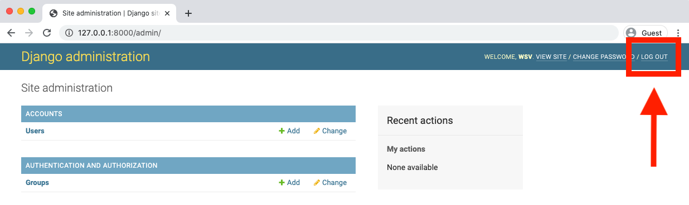
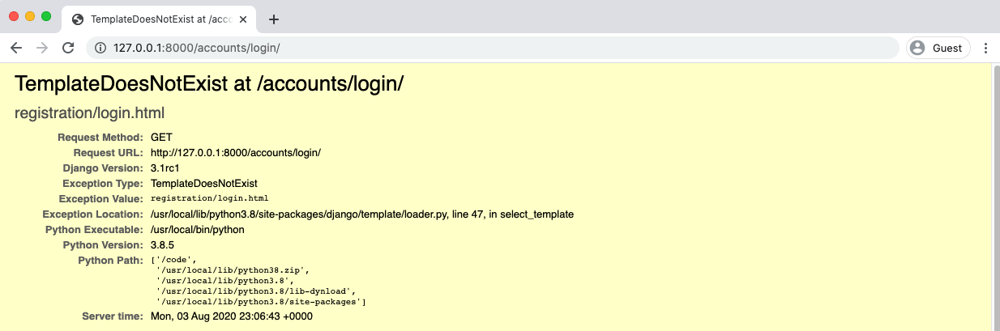
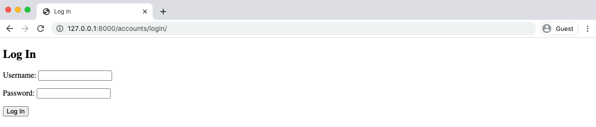
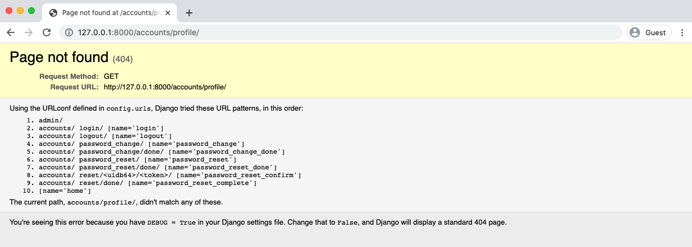
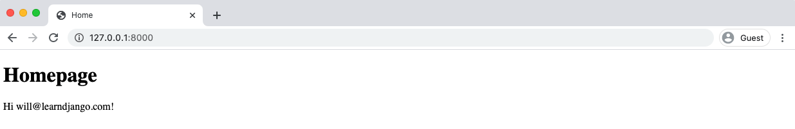
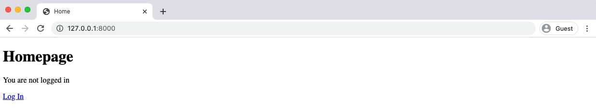
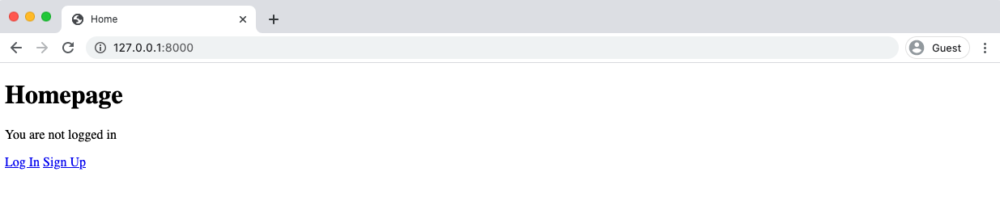
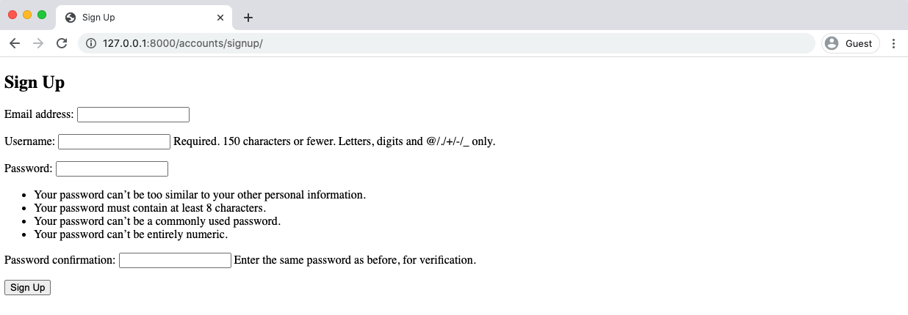
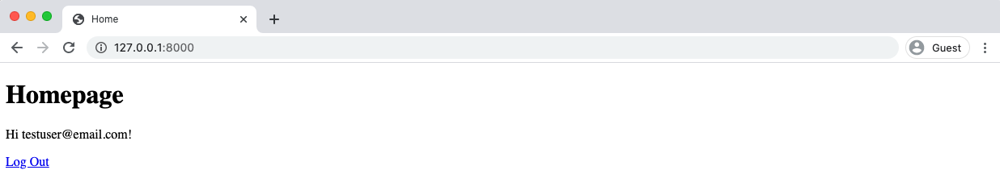

## فصل  پنجم : User Registeration

    
یک ویژگی مهم در وب سایت های پویا، بحث ثبت نام کاربران است. این مسئله در پروژه فروشگاه کتاب مورد نظر ما نیز وجود دارد. در این فصل به پیاده سازی موارد ورود به سایت، خروج از سایت و ثبت نام در سایت می پردازیم. از آنجایی که جنگو ویوها و url لازم برای دو مورد ورود و خروج از سایت را در اختیار ما قرار می دهد، پیاده سازی دو مورد اول نسبتا راحت است اما پیاده سازی مورد ثبت نام به دلیل اینکه هیچ راه حل داخلی از پیش تعریف شده ای برای آن در جنگو وجود ندارد، چالش برانگیز است.

### Auth App

بیایید با پیاده سازی دو مورد ورود به سایت و خروج از سایت با استفاده از سیستم احراز هویت [auth](https://docs.djangoproject.com/en/3.1/topics/auth/default/) appجنگو شروع کنیم. جنگو، ویو ها و url های مهمی را دراختیارمان قرار میدهد و این یعنی ما فقط به یک template ای برای بروزرسانی کارهایی که میبایست انجام دهیم نیاز داریم. این کار زمان زیادی را برای ما به عنوان یک توسعه دهنده ذخیره کرده و تضمین میکند که مرتکب اشتباهی نخواهیم شد. زیرا کد اصلی قبلا توسط میلیونها توسعه دهنده مورد آزمایش و بهره برداری قرار گرفته است.


با این حال این سادگی در پیاده سازی موجب میشود افرادی که در جنگو تازه کار هستند دچار حس "جادویی بودن" شوند. ما برخی از این موارد را در کتاب خود  [Django for Beginnets](https://djangoforbeginners.com/)، پوشش داده ایم اما با این وجود سرعت خود را کاهش نداده و کد منبع اصلی نگاه نکرده ایم. مقصود برای یک تازه کار این بود که به صورت گسترده توضیح داده و نشان دهیم که "چگونه" به درستی ثبت نام کاربر را پیاده سازی نماییم اما این واقعا به قیمت فرو رفتن در اینکه "چرا" از آن کد استفاده کرده ایم تمام شد. 


از آنجایی که این یک کتاب بسیار پیشرفته است ما برای فهم بهتر کد منبع عمیق تر خواهیم شد. رویکردی که در اینجا مطرح میشود میتواند برای کشف سایر عملکردهای داخلی جنگو هم به تنهایی مورد استفاده قرار گیرد.

اولین کاری که نیاز به انجام آن داریم این است که مطمئن شویم `auth` app  به تنظیمات `INSTALLED_APPS` اضافه شده است. ما قبلا appهای خود را به اینجا افزوده ایم، اما آیا تابه حال به app های داخلی که جنگو به صورت خودکار برایمان اضافه مینماید توجه کرده اید؟ به نظر میرسد جواب خیر باشد. بیایید حالا این کار را انجام دهیم.


<div dir="ltr">

Code
```python
# config/settings.py
INSTALLED_APPS = [
    'django.contrib.admin',
    'django.contrib.auth', # Yoohoo!!!!
    'django.contrib.contenttypes',
    'django.contrib.sessions',
    'django.contrib.messages',
    'django.contrib.staticfiles',
    
    # Local
    'accounts',
    'pages',
]
```

</div>


درواقع جنگو 6app برایمان آماده نموده است که باعث قدرتمندی سایت می شود. اولین آن admin و دومی auth است. ما به این شکل متوجه شدیم که auth app اکنون در پروژه جنگو ما وجود دارد.


وقتی که ما برای بار اول دستور migrate را اجرا میکنیم، تمامی این Appها با هم در پایگاه داده اولیه لینک و متصل شده اند. و به خاطر داشته باشید که ما از تنظیمات `AUTH_USER_MODEL` استفاده نموده ایم تا به جنگو اعلام کنیم تا از user model خودمان استفاده کند نه user model پیش فرضی که اینجا وجود دارد. به همین دلیل باید قبل از اولین اجرای migrate ، تا زمانی که این 
پیکره بندی کامل شود، صبر نماییم. 


### Auth URLs and Views

به منظور استفاده از auth app داخلی جنگو، ما باید آن را به فایل `config/urls.py` اضافه کنیم. ساده ترین روش این است که فایل `accounts/` به عنوان پیشوند قرار بگیرد چون عموما در جامعه جنگو از این حالت استفاده می شود. یک خط را در زیر تغییر دهید. توجه کنید که هر چقدر طول فایل `urls.py` افزایش یابد، افزودن کامنت برای هر بخشی از URL-admin, user management, local apps,... به خوانایی کد کمک خواهد کرد.


<div dir="ltr">

Code
```python
# config/urls.py
from django.contrib import admin
from django.urls import path, include

urlpatterns = [
    # Django admin
    path('admin/', admin.site.urls),
    
    # User management
    path('accounts/', include('django.contrib.auth.urls')), # new
    
    # Local apps
    path('', include('pages.urls')),
]
```

</div>


چه چیزی به auth app اضافه شده است؟ به نظر می رسد چیزهای زیادی اضافه شده باشد. قبل از همه تعداد زیادی url های مرتبط وجود دارد. 


<div dir="ltr">

Code
```python
accounts/login/ [name='login']
accounts/logout/ [name='logout']
accounts/password_change/ [name='password_change']
accounts/password_change/done/ [name='password_change_done']
accounts/password_reset/ [name='password_reset']
accounts/password_reset/done/ [name='password_reset_done']
accounts/reset/<uidb64>/<token>/ [name='password_reset_confirm']
accounts/reset/done/ [name='password_reset_complete']
```

</div>


من این را چطور متوجه شدم؟ به دو روش. اولین روش [official auth docs](https://docs.djangoproject.com/en/3.1/topics/auth/default/#module-django.contrib.auth.views) این را به ما می گوید. اما دومی، روش عمیق تر این است که به کد منبع جنگو که در [در گیت هاب قرار دارد](https://github.com/django/django) است نگاهی بیاندازیم. اگر آن را بالا و پایین و جستجو کنیم راه خودمان به [auth app](https://github.com/django/django/tree/b9cf764be62e77b4777b3a75ec256f6209a57671/django/contrib/auth) را پیدا خواهیم کرد و می توانیم فایل `urls.py` را [در این لینک](https://github.com/django/django/blob/b9cf764be62e77b4777b3a75ec256f6209a57671/django/contrib/auth/urls.py) بیابیم که کد منبع کامل را نمایش می دهد.
    

فهمیدن کد اصلی جنگو نیازمند تمرین است، اما ارزش وقت گذاشتن را دارد.
    
### Homepage

مرحله بعدی چیست؟ بیایید هوم پیج خود را به روز کنیم تا اگر کاربری لاگین نمود یا نه به ما اطلاع دهد که در حال حاضر فقط از طریق ادمین امکانپذیر است.

    
اینجا کد جدیدی برای فایل `templates/home.html` وجود دارد که از تگ های [if/else](https://docs.djangoproject.com/en/3.1/ref/templates/builtins/#if) موجود در template engin جنگو برای منطق اصلی استفاده می کند.


<div dir="ltr">

Code
```html
<!-- templates/home.html -->


Home


  <h1>Homepage</h1>
  
    Hi {{ user.email }}!
  
    <p>You are not logged in</p>
    <a href="">Log In</a>
  

```

</div>

اگر کاربر وارد سیستم شده باشد(تایید شده باشد)، ما پیامی شامل "سلام" و آدرس ایمیل است را به او نشان می دهیم.
هر دوی اینها [متغیرهایی](https://docs.djangoproject.com/en/3.1/topics/templates/#variables) هستند که ما می توانیم با template engine جنگو از طریق دو براکت باز {{ و بسته }} استفاده کنیم.

کاربر پیش فرض شامل فیلدهای متعددی از جمله [is_authenticated](https://docs.djangoproject.com/en/3.1/ref/contrib/auth/#django.contrib.auth.models.User.is_authenticated) و [email](https://docs.djangoproject.com/en/3.1/ref/contrib/auth/#django.contrib.auth.models.User.email) می باشد. که به آن ها ارجاع داده شده است. 

و logout و login اسامی URL هستند. تگ [url](https://docs.djangoproject.com/en/3.1/ref/templates/builtins/#url) به این معناست که اگر ما نام URL را مشخص نمودیم، لینک به طور خودکار به مسیر آن URL متصل شود. به عنوان مثال در فصل قبلی ما نام URL صفحه homepage خودمان را به home تنظیم نمودیم. بنابراین یک لینک به homepage به فرمت `` خواهد بود.در ادامه بیشتر به این موضوع می پردازیم.

اگر حالا به homepage در http://127.0.0.1:8000/ نگاهی بیاندازید به احتمال زیاد آدرس ایمیل حساب کاربری ابرکاربر(superuser) شما را نشان خواهد داد چون قبلا برای لاگین شدن از آن استفاده کرده بودیم.  


    
در بخش admin در http://127.0.0.1:8000/admin/، اگر روی دکمه "log out"  که در گوشه ی بالا سمت راست قرار دارد کلیک کنید، میتوانیم از admin خارج شویم. 



    
به هوم پیج در http://127.0.0.1:8000/ بازگردید و پیج را رفرش کنید.


### Django Source Code

ممکن است بتوانید این مراحل را از طریق خواندن [داکیومنت رسمی](https://docs.djangoproject.com/en/3.1/topics/auth/default/) به تنهایی کنار هم قرار دهید اما رویکرد عمیق و بهتر این است که یاد بگیرید چگونه کد منبع جنگو را خودتان بخوانید.

یک سوال این است که، چطور `user` و متغیرهای مرتبط با آن در تمپلیت ظاهر شده اند؟ پاسخ این است که جنگو مفهومی به نام [template context](https://docs.djangoproject.com/en/3.1/topics/auth/default/#authentication-data-in-templates) دارد و به این معناست که هر تمپلیتی با داده هایی از فایل `views.py` مربوطه بارگذاری شده است. ما میتوانیم از یوزر درون template tag برای دسترسی به ویژگی های User استفاده کنیم. به عبارت دیگر، جنگو این را به طور خودکار برایما محیا می سازد.


حال برای این که بدانیم یک یوزر وارد سایت شده است یا نه، به `user` دسترسی پیدا می کنیم و پس از آن می توانیم از [is_authenticated](https://docs.djangoproject.com/en/3.1/ref/contrib/auth/#django.contrib.auth.models.User.is_authenticated) که یک ویژگی بولین می باشد، استفاده کنیم. اگر کاربری وارد شده باشد مقدار True برگردانده شده و ما می توانیم کارهایی مانند نمایش ایمیل کاربر را اجرا کنیم. یا اگر هیچ کاربری وارد نشده باشد، نتیجه False خواهد بود. 


در ادامه ما URL به نام  login `` را بخش به بخش باز کنیم.را داریم. این اسم از کجا می آید؟ البته که از خود جنگو!بیایید قطعه کد 


در ابتدا ما از [url template tag](https://docs.djangoproject.com/en/3.1/ref/templates/builtins/#url) استفاده کرده ایم که آرگومان اول آن یک [named URL pattern](https://docs.djangoproject.com/en/3.1/topics/http/urls/#naming-url-patterns) می باشد. این یک بخش دلخواه است که به عنوان تمرین به تمامی مسیرهای URL خود اضافه نموده ایم. بنابراین باید یک نام `login` ضمیمه ی URL شده باشد!   

دو راه وجود دارد که ما باید با آن ها آشنا باشیم. به عبارت دیگر اگر من به شما نمی گفتم که می خواهیم از `` استفاده کنید، چطور متوجه آن می شدید؟ 

در ابتدا به [داکیومنت رسمی](https://docs.djangoproject.com/en/3.1/) نگاه کنید. من به شخصه اغلب اوقات از قابلیت جستجو استفاده می کنم و چیزی مثل "login" را تایپ نموده و جستجو می کنم تا زمانی که توصیفی از login بیابم. چیزی که ما می خواهیم [authentication views](https://docs.djangoproject.com/en/3.1/topics/auth/default/#module-django.contrib.auth.views) نام دارد و الگوهای URL مربوطه را برایمان لیست می کند.


<div dir="ltr">

Code
```python
accounts/login/ [name='login']
accounts/logout/ [name='logout']
accounts/password_change/ [name='password_change']
accounts/password_change/done/ [name='password_change_done']
accounts/password_reset/ [name='password_reset']
accounts/password_reset/done/ [name='password_reset_done']
accounts/reset/<uidb64>/<token>/ [name='password_reset_confirm']
accounts/reset/done/ [name='password_reset_complete']
```

</div>

This tells us at the path accounts/login/ is where “login” is located and its name is 'login'. A
little confusing at first, but here is the info we need.

Going a step deeper to phase two, we can investigate the underlying Django source code to see
“logout” in action. If you perform a search [over on Github](https://github.com/django/django) you’ll eventually 
find the [auth app itself](https://github.com/django/django/tree/b9cf764be62e77b4777b3a75ec256f6209a57671/django/contrib/auth). 
Ok, now let’s start by investigating the `urls.py` file.
[Here is the link](https://github.com/django/django/blob/b9cf764be62e77b4777b3a75ec256f6209a57671/django/contrib/auth/urls.py) to the complete code:


<div dir="ltr">

Code
```python
# django/contrib/auth/urls.py
from django.contrib.auth import views
from django.urls import path

urlpatterns = [
    path('login/', views.LoginView.as_view(), name='login'),
    path('logout/', views.LogoutView.as_view(), name='logout'),

    path('password_change/', views.PasswordChangeView.as_view(),
        name='password_change'),
    path('password_change/done/', views.PasswordChangeDoneView.as_view(),
        name='password_change_done'),
    path('password_reset/', views.PasswordResetView.as_view(),
        name='password_reset'),
    path('password_reset/done/', views.PasswordResetDoneView.as_view(),
        name='password_reset_done'),
    path('reset/<uidb64>/<token>/', views.PasswordResetConfirmView.as_view(),
        name='password_reset_confirm'),
    path('reset/done/', views.PasswordResetCompleteView.as_view(),
        name='password_reset_complete'),
]
```

</div>


Here is the underlying code Django uses itself for the auth app. I hope you can see that the
“logout” route is not magic. It’s right there in plain sight, it uses the view LogoutView and has the
URL name 'logout'. Not magic at all! Just a little challenging to find the first time.

This three-step process is a great way to learn: either remember the Django shortcut, look it
up in the docs, or on occasion dive into the source code and truly understand where all this
goodness comes from.


### Log In
Back on our basic homepage, click on the “Log In” link and… it results in an error!





Django is throwing a TemplateDoesNotExist error at us. Specifically, it seems to expect a log in
template at registration/login.html. In addition to Django telling us this, we can look in the
[documentation](https://docs.djangoproject.com/en/3.1/topics/auth/default/#all-authentication-views) and see that the desired `template_name` has that location .


But let’s really be sure and check the source code so we can remove any perceived magic here.
After all, it’s just Django.


Back in the [auth/views.py](https://github.com/django/django/blob/b9cf764be62e77b4777b3a75ec256f6209a57671/django/contrib/auth/views.py)
file we can see on line 47 for LoginView that the template_name is
'registration/login.html'. So if we wanted to change the default location we could, but it
would mean overriding LoginView which seems like overkill. Let’s just use what Django gives us
here.

Create a new `registration` folder within the existing templates directory and then add our
login.html file there, too.


<div dir="ltr">

Command Line
```shell
$ mkdir templates/registration
$ touch templates/registration/login.html
```

</div>

The actual code is as follows. We extend our base template, add a title, and then specify that we
want to use a form that will “post” or send the data.


<div dir="ltr">

Code
```html
<!-- templates/registration/login.html -->


Log In


  <h2>Log In</h2>
  <form method="post">
    
    {{ form.as_p }}
    <button type="submit">Log In</button>
  </form>


```

</div>


You should **always** add [CSRF protection](https://docs.djangoproject.com/en/3.1/ref/csrf/)
on any submittable form. Otherwise a malicious website
can change the link and attack the site and the user. Django has CSRF middleware to handle this
for us; all we need to do is add `` tags at the start of the form.

Next we can control the look of the form contents. For now we’ll use [as_p()](https://docs.djangoproject.com/en/3.1/ref/forms/api/#as-p) so that each form
field is displayed within a paragraph p tag.

With that explanation out of the way, let’s check if our new template is working correctly. Refresh
the web page at http://127.0.0.1:8000/accounts/login/.





And there is our page! Lovely. You can navigate back to the homepage and confirm that the “Log
In” link works, too, if you like. As a final step, go ahead and try to log in with your superuser
account on the log in page.


### Redirects

Did you notice I said “try” in that last sentence? If you click on the “Log In” link it brings up a
Page not found (404) error.




Django has redirected us to 127.0.0.1:8000/accounts/profile/ yet no such page exists. Now
why would Django do this? Well, if you think about it, how does Django know where we want to
redirect the user after log in? Maybe it’s the homepage. But maybe it’s a user profile page. Or any
number of options.


The final piece of the log in puzzle is to set the proper configuration for
[LOGIN_REDIRECT_URL](https://docs.djangoproject.com/en/3.1/ref/settings/#login-redirect-url)
because by default it redirects to `accounts/profile`.


Fortunately, this is a quick fix. We’ll send the user to our homepage. And since we specified a
URL name of home that’s all we need to redirect logged in users to the homepage.

At the bottom of the `config/settings.py` file add this one line.


<div dir="ltr">

Code
```python
# config/settings.py
LOGIN_REDIRECT_URL = 'home'
```

</div>

Attempt to log in again at http://127.0.0.1:8000/accounts/login/. Upon success it redirects
the user to the homepage greeting the superuser account you just logged in with!




### Log Out


Now let’s add a log out option to our homepage since only a superuser will have access to the
admin. How do we do this?


If you look at the `auth` views above we can see that logout uses LogoutView, which we could
explore in the source code, and has a URL name of logout. That means we can refer to it with a
template tag as just logout


But we can set this ourself, if desired, using [LOGOUT_REDIRECT_URL](https://docs.djangoproject.com/en/3.1/ref/settings/#logout-redirect-url)
which can be added to
the bottom of our `config/settings.py` file. Let’s do that so a logged out user is redirected to the
homepage


<div dir="ltr">

Code
```python
# config/settings.py
LOGIN_REDIRECT_URL = 'home'
LOGOUT_REDIRECT_URL = 'home' # new
```

</div>

Then add the logout link to `templates/home.html`.

<div dir="ltr">

Code
```html
<!-- templates/home.html -->


Home


  <h1>Homepage</h1>
  
    Hi {{ user.email }}!
    <p><a href="">Log Out</a></p>
  
    <p>You are not logged in</p>
    <a href="">Log In</a>
  

```

</div>


Refresh the homepage at http://127.0.0.1:8000/ and the “Log out” link is now visible.


If you click on it you will be logged out and redirected to the homepage, which has the “Log In”
link visible.




### Sign Up


Implementing a sign up page for user registration is completely up to us. We’ll go through the
standard steps for any new page:

- create an app-level `accounts/urls.py` file
- update the project-level `config/urls.py` to point to the accounts app
- add a view called `SignupPageView`
- create a `signup.html` template
- update `home.html` to display the sign up page


A common question is: what’s the right order for implementing these steps? Honestly it doesn’t
matter since we need all of them for the sign up page to work properly. Generally, I like to start
with urls, then switch to views, and finally templates but it’s a matter of personal preference.


To start create a `urls.py` file within the accounts app. Up to this point it only contains our
CustomUser in the `models.py` file; we haven’t configured any routes or views.


<div dir="ltr">

Command Line
```shell
$ touch accounts/urls.py
```

</div>


The URL path for the sign up page will take a view called SignupPageView (which we’ll create
next), at the route signup/, and have a name of signup which we can later use to refer to the
page with a url template tag. The existing url names for login and signup are written within the
built-in Django app file `django/contrib/auth/urls.py` we saw above.


<div dir="ltr">

Code
```python
# accounts/urls.py
from django.urls import path
from .views import SignupPageView

urlpatterns = [
    path('signup/', SignupPageView.as_view(), name='signup'),
]
```

</div>


Next update the `config/urls.py` file to include the `accounts` app. We can create any route we
like but it’s common to use the same accounts/ one used by the default auth app. Note that it’s
important to include the path for `accounts.urls` below: URL paths are loaded top-to-bottom so
this ensures that any auth URL paths will be loaded first.


<div dir="ltr">

Code
```python
# config/urls.py
from django.contrib import admin
from django.urls import path, include

urlpatterns = [
    # Django admin
    path('admin/', admin.site.urls),
    
    # User management
    path('accounts/', include('django.contrib.auth.urls')),
    
    # Local apps
    path('accounts/', include('accounts.urls')), # new
    path('', include('pages.urls')),
]
```

</div>

Now create the view SignupPageView. It references the CustomUserCreationForm and has a
`success_url` that points to the login page, meaning after the form is submitted the user will
be redirected there. The template_name will be `signup.html`.


<div dir="ltr">

Code
```python
# accounts/views.py
from django.urls import reverse_lazy
from django.views import generic
from .forms import CustomUserCreationForm


class SignupPageView(generic.CreateView):
    form_class = CustomUserCreationForm
    success_url = reverse_lazy('login')
    template_name = 'registration/signup.html'
]
```

</div>


As a final step create a file called signup.html file within the existing registration/ directory.


<div dir="ltr">

Command Line
```shell
$ touch templates/registration/signup.html
```

</div>

The code is basically identical to the log in page.


<div dir="ltr">

Code
```html
<!-- templates/registration/signup.html -->


Sign Up


<h2>Sign Up</h2>
  <form method="post">
    
    {{ form.as_p }}
    <button type="submit">Sign Up</button>
  </form>

```

</div>

As a final step we can add a line for “Sign Up” to our `home.html` template right below the link for
“Log In”. This is a one-line change.


<div dir="ltr">

Code
```html
<!-- templates/home.html -->


Home


  <h1>Homepage</h1>
  
    Hi {{ user.email }}!
    <p><a href="">Log Out</a></p>
  
    <p>You are not logged in</p>
    <a href="">Log In</a>
    <a href="">Sign Up</a>
  

```

</div>


All done! Reload the homepage to see our work.



The “Sign Up” link will redirect us to http://127.0.0.1:8000/accounts/signup/.




Create a new user with the email address `testuser@email.com`, username of testuser, and
testpass123 for the password. Upon submission it will redirect us to the Log In page. Log in
with the new account and it redirects to the homepage with a personalized greeting.



### Tests

For tests we do not need to test log in and log out features since those are built into Django and
already have tests. We do need to test our sign up functionality though!

Let’s start by creating a setUp method that loads our page. Then we’ll populate test_signup_template 
with tests for the status code, template used, and both included and excluded text
similarly to how we did it in the last chapter for the homepage.

In your text editor, update the `accounts/tests.py` file with these changes.


<div dir="ltr">

Code
```python
# accounts/tests.py
from django.contrib.auth import get_user_model
from django.test import TestCase
from django.urls import reverse # new


class CustomUserTests(TestCase):
    ...
    
    
class SignupPageTests(TestCase): # new

    def setUp(self):
        url = reverse('signup')
        self.response = self.client.get(url)
    
    def test_signup_template(self): # new
        self.assertEqual(self.response.status_code, 200)
        self.assertTemplateUsed(self.response, 'registration/signup.html')
        self.assertContains(self.response, 'Sign Up')
        self.assertNotContains(
            self.response, 'Hi there! I should not be on the page.')
```

</div>

Then run our tests.

<div dir="ltr">

Command Line
```shell
$ docker-compose exec web python manage.py test
Creating test database for alias 'default'...
System check identified no issues (0 silenced).
........
----------------------------------------------------------------------
Ran 8 tests in 0.329s

OK
Destroying test database for alias 'default'...
```

</div>

Next we can test that our CustomUserCreationForm is being used and that the page resolves to
SignupPageView.


<div dir="ltr">

Code
```python
# accounts/tests.py
from django.contrib.auth import get_user_model
from django.test import TestCase
from django.urls import reverse,  resolve # new
from .forms import CustomUserCreationForm # new
from .views import SignupPageView # new


class CustomUserTests(TestCase):
    ...
    
    
class SignupPageTests(TestCase):

    def setUp(self):
        url = reverse('signup')
        self.response = self.client.get(url)
    
    def test_signup_template(self):
        self.assertEqual(self.response.status_code, 200)
        self.assertTemplateUsed(self.response, 'registration/signup.html')
        self.assertContains(self.response, 'Sign Up')
        self.assertNotContains(
            self.response, 'Hi there! I should not be on the page.')
            
    def test_signup_form(self): # new
        form = self.response.context.get('form')
        self.assertIsInstance(form, CustomUserCreationForm)
        self.assertContains(self.response, 'csrfmiddlewaretoken')
        
    def test_signup_view(self): # new
        view = resolve('/accounts/signup/')
        self.assertEqual(
            view.func.__name__,
            SignupPageView.as_view().__name__
        )
```

</div>

Run our tests again.


<div dir="ltr">

Command Line
```shell
$ docker-compose exec web python manage.py test
Creating test database for alias 'default'...
System check identified no issues (0 silenced).
..........
----------------------------------------------------------------------
Ran 10 tests in 0.328s

OK
Destroying test database for alias 'default'...

```

</div>

All done.


### setUpTestData()

Django 1.8 introduced a [major update to TestCase](https://docs.djangoproject.com/en/3.1/releases/1.8/#testcase-data-setup)
that added the ability to run tests both within
a whole class and for each individual test. In particular,
[setUpTestData()](https://docs.djangoproject.com/en/3.1/topics/testing/tools/#django.test.TestCase.setUpTestData)
allows the creation of
initial data at the class level that can be applied to the entire TestCase. This results in much
faster tests than using setUp(), however, care must be taken not to modify any objects created
in setUpTestData() in your test methods.


We will use setUp() in this book, but be aware that if your test suite seems sluggish a potential
optimization to look into is using setUpTestData()


### Git

As ever make sure to save our work by adding changes into Git.


<div dir="ltr">

Command Line
```shell
$ git status
$ git add .
$ git commit -m 'ch5'
```

</div>


The official source code is [located on Github](https://github.com/wsvincent/djangoforprofessionals/tree/master/ch5-user-registration)
if you want to compare your code.


### Conclusion

Our Bookstore project is not the most beautiful site in the world, but it is very functional at
this point. In the next chapter we’ll configure our static assets and add Bootstrap for improved
styling.


</div>
