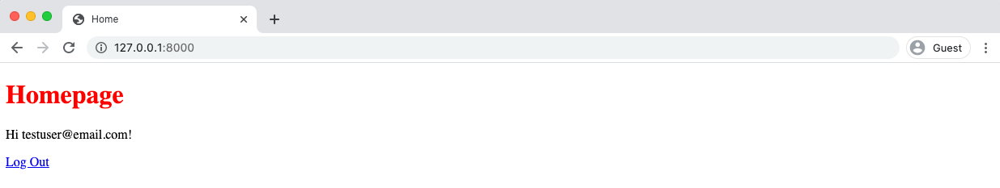
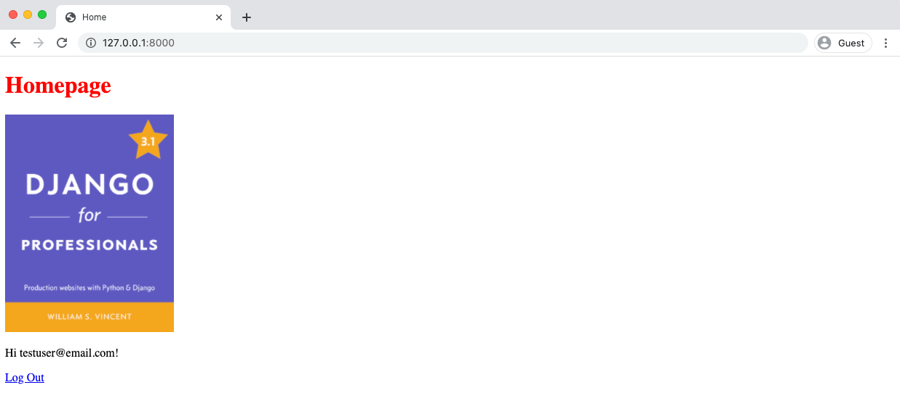
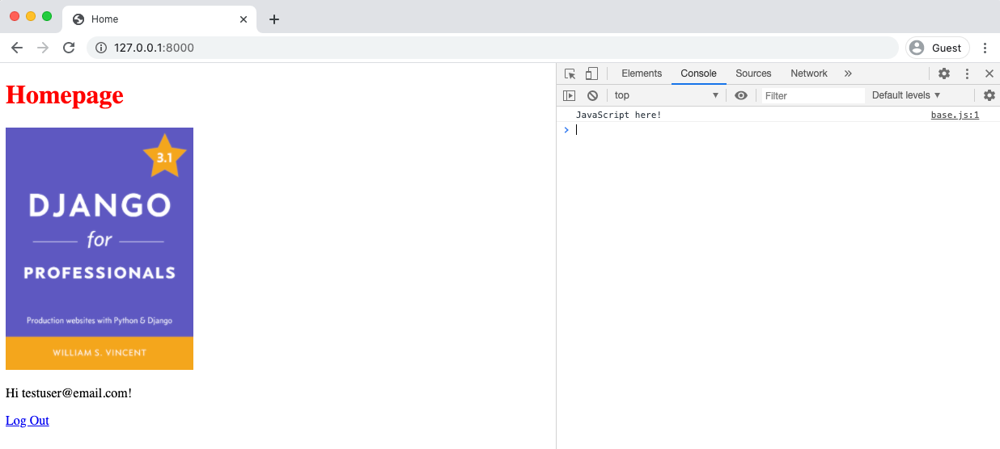
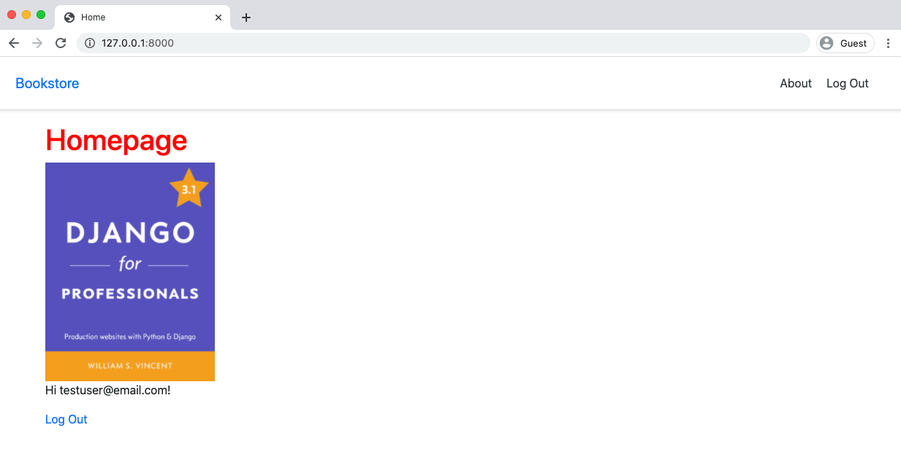
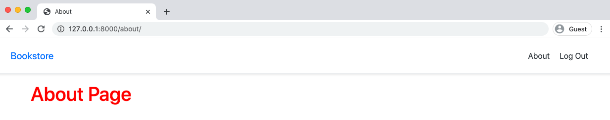
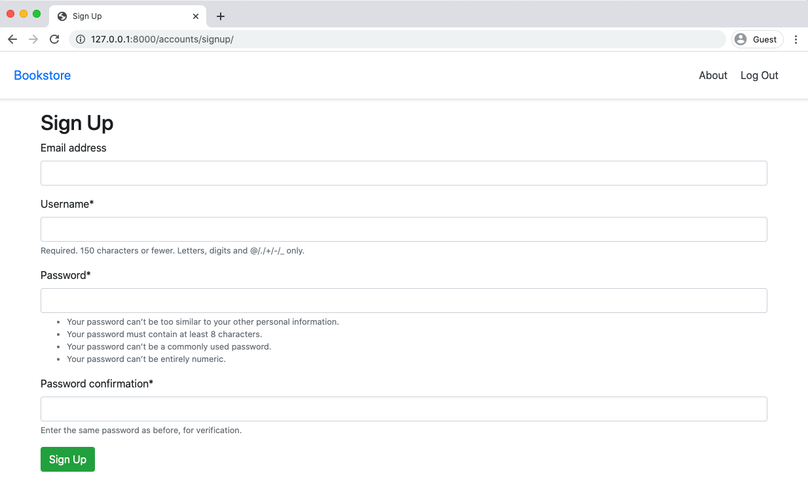
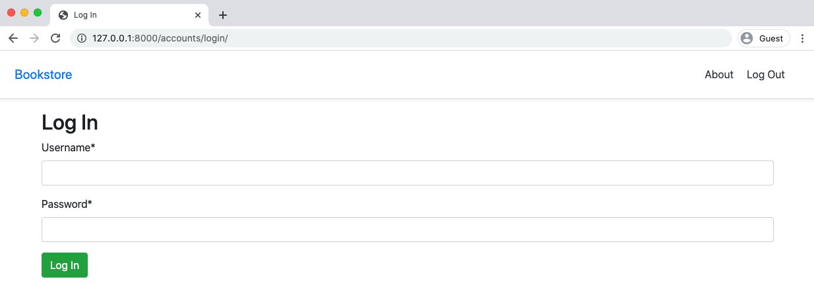

<div dir="rtl">

# فصل ششم: Static Assets

فایل های استاتیک مثل CSS ، JavaScript و تصاویر جزء اصلی هر وب سایت هستند جنگو انعطاف پذیری زیادی را در پیکربندی و ذخیره آنها در اختیار ما قرار می دهد. در این فصل ما فایل های استاتیک اولیه خود را پیکربندی می کنیم و Bootstrap را برای استایل دهی به پروژه اضافه می کنیم.

### برنامه staticfiles

جنگو برای مدیریت فایل های استاتیک از کل پروژه ما ، به برنامه staticfiles متکی است، همچنین دسترسی به این فایل‌ها را در جهت توسعه سریعتر تسهیل می‌گرداند، بگونه‌ای که برای عملکرد بهتر، تمامی فایل ها با یکدیگر ترکیب و در یک مکان واحد ارائه می‌کند. گاهاً تمایز بین فایل های استاتیک local و فایل تولیدشده حاصله از این پروسه، بسیاری از تازه‌واردان جنگو را گیج می کند.

برای شروع ، تنظیمات برنامه staticfiles را در settings.py بروزرسانی می کنیم

### STATIC_URL

تنظیمات اولیه فایل‌های استاتیک (STATIC_URL) ، در حال حاضر برای ما در config/settings.py گنجانده شده است.

<div dir="ltr">

```python
#config/settings.py
STATIC_URL = '/static/'
```

</div>

این ثابت، یک URL را تعیین میکند که می توانیم از آن برای ارجاع فایل های استاتیک استفاده کنیم. توجه داشته باشید، که در آخر آدرس دایرکتوری، حتما کاراکتر اسلش ( / ) نوشته شود.

### STATICFILES_DIRS

قدم بعدی STATICFILES_DIRS است، که موقعیت فیزیکی فایل های استاتیک را در مود development بصورت top-level و ثابت مشخص می کند.

<div dir="ltr">

```python
#config/settings.py
STATIC_URL = '/static/'
STATICFILES_DIRS = (str(BASE_DIR.joinpath('static')),) # new
```

</div>

همچنین در اغلب اوقات چندین دایرکتوری با فایلهای استاتیک در یک پروژه وجود دارد ، بنابراین پایتون براکت [ ] را که نشانه‌گر list است، در اینجا به جهت افزودن موارد بیشتر اضافه می‌کند .

### STATIC_ROOT

STATIC_ROOT محل ذخیره فایل های استاتیک برای خروجی نهایی به‌جهت مود production است و باید بر روی مسیر دیگری تنظیم شود.

به طور معمول فایل‌های استاتیک هنگامی که زمان deploy پروژه فرا می رسد ، با دستور collectstatic به طور خودکار تمام فایل‌های استاتیک موجود در تمامی بخش‌های پروژه را در نهایت به یک دایرکتوری واحد کامپایل می کند، این روش بسیار سریعتر از استفاده پراکنده فایلهای استاتیک از سراسر پروژه بصورت جدا از هم (که صرفا در مود development از آن استفاده می‌شود) می‌باشد.

<div dir="ltr">

```python
#config/settings.py
STATIC_URL = '/static/'
STATICFILES_DIRS = (str(BASE_DIR.joinpath('static')),)
STATIC_ROOT = str(BASE_DIR.joinpath('staticfiles')) # new
```

</div>

### STATICFILES_FINDERS

و در آخرین قسمت تنظیمات می‌رسیم به STATICFILES_FINDERS، که به جنگو می‌فهماند چطور باید مستقیماً به دنبال آدرس فایل استاتیک بگردد، این بخش به طور آپشنال برای ما تنظیم شده است، گرچه این یک مرحله اختیاری است ترجیحاً آن را در پروژه ها استفاده نمایید

<div dir="ltr">

```python
#config/settings.py
STATICFILES_FINDERS = [
  "django.contrib.staticfiles.finders.FileSystemFinder",
  "django.contrib.staticfiles.finders.AppDirectoriesFinder",
]
```

</div>

بنظر می‌رسد FileSystemFinder را در تنظیماتِ STATICFILES_DIRS برای هر فایل استاتیک بصورت استاتیک تنظیم کرده ایم. همچنین در AppDirectoriesFinder نیز بنظر می‌رسد که هر دایرکتوری از یک ثابت به همراه یک app نام گرفته است، بر خلاف واقع که در project-level و درون یک دایرکتوری استاتیک قرار گرفته است. این تنظیمات از بالا به پایین به این صورت تفسیر می‌شوند که اگر یک فایل با نام static/img.png فراخوانی شود،

ابتدا توسط FileSystemFinder به گونه‌ای یافت شود
که

در آدرس تعیین شده یک فایل به نام img.png قرار دارد، اما بعنوان یک صفحه از برنامه آدرس را به فرم

pages/static/img.png تحویل بده

در نهایت تنظیمات این بخش باید به شکل زیر باشد:

<div dir="ltr">

```python
#config/settings.py
STATIC_URL = '/static/'
STATICFILES_DIRS = (str(BASE_DIR.joinpath('static')),)
STATIC_ROOT = str(BASE_DIR.joinpath('staticfiles')) # new
STATICFILES_FINDERS = [ # new
  "django.contrib.staticfiles.finders.FileSystemFinder",
  "django.contrib.staticfiles.finders.AppDirectoriesFinder",
]

```

</div>

### دایرکتوری‌های استاتیک

اکنون بیایید چند فایل استاتیک را در پروژه خود افزوده و از آنها استفاده کنیم. بدین منظور برای نظم بهتر از یک ساختار فهرست مانند استفاده میکنم، بنابراین کاری که هم اکنون انجام می‌دهیم ایجاد زیر پوشه‌های جدید برای CSS ، JavaScript و تصاویر است.

<div dir="ltr">

```shell
$ mkdir static
$ mkdir static/css
$ mkdir static/js
$ mkdir static/images
```

</div>

در قدم بعد یک فایل استایل به نام base.css می‌سازیم.

<div dir="ltr">

```shell
$ touch static/css/base.css
```

</div>

با ساده‌ترین استایل‌ شروع می‌کنیم، تیتر h1 را برای شروع قرمز می‌کنیم. هدف ما نشان دادن چگونگی افزودن css به پروژه است و عمیقاً وارد خود CSS نمیشویم

<div dir="ltr">

```css
/* static/css/base.css */
h1 {
  color: red;
}
```

</div>

اگر صفحه اصلی را refresh کنید ، خواهید دید که چیزی تغییر نکرده است. دلیلش این است که assetsها باید به صراحت درتمپلیت‌ها load شود. ابتدا همه فایلهای استاتیک را در بالای صفحه با {٪ load static٪} بارگزاری میکنیم سپس فایل base.css را اضافه میکنیم.
تمپلیت static از STATIC_URL استفاده می‌کند که ما آن را به آدرس /static/ تنظیم کردیم، بنابراین به جای نوشتن static/css/base.css ما می توانیم به سادگی از css/base.css استفاده کنیم.

<div dir="ltr">

```html
<!-- templates/_base.html -->


<!DOCTYPE html>
<html>
  <head>
    <meta charset="utf-8" />
    <title>Bookstore</title>
    <!-- CSS -->
    <link rel="stylesheet" href="" />
  </head>
  ...
</html>
```

</div>

اکنون برای دیدن نتایج صفحه اصلی را refresh می‌کنیم.

[](#)

اگر در عوض یک صفحه خطا می بینید که می‌گوید Invalid block tag on line 7: 'static' بدین معنی است که شما احتمالا فراموش کردید که تگ static را در بالای صفحه include کنید پس خط {٪ load static٪} را در بالای صفحه وارد کنید. معمولا این خطا زیاد رخ می‌دهد.

### تصاویر

شما می توانید تصویر جلد همین کتاب (Django for Professionals) را از این لینک load کنید. آن را در آدرس books/static/images با نام dfp.png ذخیره کنید. برای نمایش آن در صفحه اصلی ، templates/home.html را باید ویرایش کنید و {٪ load static٪} را به بالای صفحه اضافه و مقدار static را در آدرس‌دهی فایل مانند مثال زیر، برای تگ  درج کنید.

<div dir="ltr">

```html
<!-- templates/home.html -->
  Home 

<h1>Homepage</h1>


<p>Hi {{ user.email }}!</p>
<p><a href="">Log Out</a></p>

<p>You are not logged in</p>
<p>
  <a href="">Log In</a> |
  <a href="">Sign Up</a>
</p>
 
```

</div>

با refresh کردن صفحه میبینید که عکس بصورت خام و بدون استایل بارگزاری می‌شود. اکنون مقداری استایل به آن اضافه می‌کنیم.

<div dir="ltr">

```css
/* static/css/base.css */
h1 {
  color: red;
}
.bookcover {
  height: 300px;
  width: auto;
}
```

</div>

با یک refresh مجدد میتوانید نتیجه را با استایل جدید ببینید.

[](#)

### جاوا اسکریپت

برای افزودن جاوا اسکریپت به تمپلیت مراحل مشابه قدم قبلی است. اکنون یک فایل به نام base.js می‌سازیم.

<div dir="ltr">

```shell
$ touch static/js/base.js
```

</div>

معمولا کدهای آماری را در اینجا قرار می دهیم ، مانند Google Analytics. برای اهداف نمایشی بطور مثال یک console.log اضافه می کنیم تا بتوانیم جاوا اسکریپتی که به درستی load شده را ببینیم.

<div dir="ltr">

```js
// static/js/base.js
console.log("JavaScript is Here!");

```

</div>

حالا آن را به تمپلیت خود یعنی base.html_ اضافه کنید. توجه کنید جاوا اسکریپت باید در پایین فایل اضافه شود. فایلهای جاوا اسکریپت‌ در آخر کار و بعد از HTML ، CSS و سایر assetsها که ابتدا بارگزاری و در مرورگر render می‌شوند بارگزاری خواهند شد. این مدل کاری به بهبود سرعت بارگزاری قسمت های بصری سایت کمک می‌کند.

<div dir="ltr">

```html
<!-- templates/_base.html -->


<!DOCTYPE html>
<html>
  <head>
    <meta charset="utf-8" />
    <title>Bookstore</title>
    <!-- CSS -->
    <link rel="stylesheet" href="" />
  </head>
  <body>
    <div class="container"> </div>
    <!-- JavaScript -->
    <script src=""></script>
  </body>
</html>
```

</div>

در مرورگر وب خود ، کنسول جاوا اسکریپت را باز کنید. برای این کار در فایرفاکس از قسمت "Developer Tools" به تب "console" بروید. و در کروم کلید f12 را بفشارید و از پنل باز شده باز به تب console بروید.

در صورت فراخوانی صفحه console ،باید تصویری مانند زیر را مشاهده کنید:

[](#)

### collectstatic

فرض کنید می‌خواهیم وبسایتمان را همین حالا دیپلوی کنیم. میان تمام مراحل، ما نیاز داریم collectstatic

را اجرا کنیم تا یک دایرکتوری واحد آماده به کار از تمام فایل‌های استاتیک (static assets) پروژه بسازیم.

<div dir="ltr">

```shell
$ docker-compose exec web python manage.py collectstatic

result: 135 static files copied to '/code/staticfiles'.
```

</div>

اگر به ide خود نگاه کنید، یک دایرکتوری جدید به نام staticfiles با چهار زیر پوشه به نام‌های admin و css و images و js وجود دارد. و سه تای دیگر هم توضیح داده شده. به همین دلیل 122 فایل کپی شدند.

### Bootstrap

نوشتن CSS شخصی‌ برای وبسایت یک راهکار قدرتمند است که همیشه به تمامی توسعه‌دهندگان نیز توصیه می‌شود، زمانی آن را امتحان کنند و استایل‌ های پروژه توسط خوده شخص(یا تیم) تولید شوند. ولی در عمل دلیلی وجود دارد که فریمورک‌های فرانت-اند مثل Bootstrap در این زمینه بیشتر کاربرد دارند و آن هم صرفه جویی در زمان است. اما همچنین اگر شما با یک طراح حرفه‌ای همکاری ندارید نیز توصیه می‌شود که از فریم‌ورک ها برای نسخه‌های اولیه‌ی وبسایتتان استفاده کنید.

در این بخش ما Bootstrap را به همراه فایل base.css سابق به پروژه‌ی خودمان اضافه خواهیم کرد. تایپ کردن دستی همه‌ کدها طول می‌کشد و ممکن است باعث خطای زیادی شود. پس این جا از معدود موقعیت‌هایی است که توصیه می‌شود از سورس کد رسمی

copy / paste کنید.

به یاد داشته باشید که اینجا برای CSS و JavaScript ترتیب مهم است. فایل‌ها از بالا به پایین بارگذاری خواهند شد پس فایل base.css ما بعد از Bootstrap CSS بارگذاری خواهد شد و استایلِ h1

ما بر استایل پیش‌فرضِ Bootstrap غالب می‌شود.

مانند قبل، در پایین فایل مهم است که اول jQuery بارگذاری شود، سپس PopperJs و بعد از آن فایل جاوا اسکریپتِ Bootstrap.

در نهایت، مطمئن باشید که در header یک navbar حداقلی داشته باشید تا اگر یک کاربر LogIn شده، فقط لینک "Log Out" دیده شود. و زمانی که یک کاربر هنوز LogIn نشده دو عبارت "Log In" و "Sign Up" را ببیند.

<div dir="ltr">

```html
<!-- templates/_base.html -->


<!DOCTYPE html>
<html>
  <head>
    <meta charset="utf-8" />
    <title>Bookstore</title>
    <meta
      name="viewport"
      content="width=device-width, initial-scale=1,
    shrink-to-fit=no"
    />
    <!-- CSS -->
    <link
      rel="stylesheet"
      href="https://stackpath.bootstrapcdn.com/bootstrap/\
    4.5.0/css/bootstrap.min.css"
      integrity="sha384-9aIt2nRpC12Uk9gS9baDl411\
    NQApFmC26EwAOH8WgZl5MYYxFfc+NcPb1dKGj7Sk"
      crossorigin="anonymous"
    />
    <link rel="stylesheet" href="" />
  </head>
  <body>
    <header>
      <!-- Fixed navbar -->
      <div
        class="d-flex flex-column flex-md-row align-items-center p-3 px-md-4
        mb-3 bg-white border-bottom shadow-sm"
      >
        <a
          href=""
          class="navbar-brand my-0 mr-md-auto
        font-weight-normal"
          >Bookstore</a
        >
        <nav class="my-2 my-md-0 mr-md-3">
          <a class="p-2 text-dark" href="#">About</a>
          
          <a class="p-2 text-dark" href="">Log Out</a>
          
          <a class="p-2 text-dark" href="">Log In</a>
          <a class="btn btn-outline-primary" href=""
            >Sign Up</a
          >
          
        </nav>
      </div>
    </header>
    <div class="container"> </div>
    <!-- JavaScript -->
    <!-- jQuery first, then Popper.js, then Bootstrap JS -->
    <script
      src="https://code.jquery.com/jquery-3.5.1.slim.min.js"
      integrity="sha384-VCmXjywReHh4PwowAiWNagnWcLhlEJLA5buUprzK8rxF\
    geH0kww/aWY76TfkUoSX"
      crossorigin="anonymous"
    ></script>
    <script
      src="https://cdn.jsdelivr.net/npm/popper.js@1.16.1/dist/umd/\
    popper.min.js"
      integrity="sha384-9/reFTGAW83EW2RDu2S0VKaIzap3H66lZ\
    H81PoYlFhbGU+6BZp6G7niu735Sk7lN"
      crossorigin="anonymous"
    ></script>
    <script
      src="https://stackpath.bootstrapcdn.com/bootstrap/4.5.1/js/\
    bootstrap.min.js"
      integrity="sha384-1CmrxMRARb6aLqgBO7yyAxTOQE2AKb\
    9GfXnEo760AUcUmFx3ibVJJAzGytlQcNXd"
      crossorigin="anonymous"
    ></script>
  </body>
</html>
```

</div>

همچنین بهتر است که این کد را تایپ نکنید. به جایش کد را از مخزن رسمی کپی و پیست کنید. در خط 18 کد، مطمئن شوید که تگ href را به # تغییر دهید، نه  به عبارت دیگر، باید با کد بالا تطابق داشته باشد و به این شکل باشد:

<div dir="ltr">

```html
<!-- templates/_base.html -->
<a class="p-2 text-dark" href="#">About</a>
```

</div>

ما مسیر URL صفحه‌ی "About" را بعداً اضافه خواهیم کرد. اگر شما پس از این تغییرات صفحه‌ی خانه را دوباره refresh کنید، باید به این شکل باشد:

[](#)

### صفحه‌ی About

آیا متوجهِ لینک "About" در نوار هدایت شدید؟ مشکل این است که صفحه و لینک هنوز وجود ندارند. ولی از آنجایی که ما از قبل یک اَپ pages دم دست داریم، ساختن صفحه و لینک زمان کمی می‌برد.

از آنجایی که این یک صفحه‌ی استاتیک خواهد بود، ما نیازی به مدل پایگاه داده نداریم. با این حال، به یک تمپلیت، ویو (View) و URL نیاز خواهیم داشت. بیاید با یک تمپلیت به نام about.html شروع کنیم.

<div dir="ltr">

```shell
$ touch templates/about.html
```

</div>

فعلاً صفحه فقط شامل "About Page" خواهد شد و از _base.html ارث‌بری خواهد کرد.

<div dir="ltr">

```html
<!-- templates/about.html -->
 About 

<h1>About Page</h1>

```

</div>

ویو می‌تواند از TemplateView داخلی خوده جنگو استفاده کند مانند صفحه‌ی home.

<div dir="ltr">

```python
#pages/views.py
from django.views.generic import TemplateView

class HomePageView(TemplateView):
template_name = 'home.html'

class AboutPageView(TemplateView): # new
template_name = 'about.html'
```

</div>

مسیر URL هم مشابه خواهد بود: URL را در about/ قرار دهید، ویوی مناسب را ایمپورت کنید و یک URL برای about فراهم کنید.

<div dir="ltr">

```python
#pages/urls.py
from django.urls import path

from .views import HomePageView, AboutPageView # new

urlpatterns = [
  path('about/', AboutPageView.as_view(), name='about'), # new
  path('', HomePageView.as_view(), name='home'),
]
```

</div>

حالا اگر به http://127.0.0.1:8000/about/ بروید، می‌توانید صفحه‌ی About را ببینید.

[](#)

به عنوان قدم نهایی، لینک نوار هدایت را به‌روز کنید. چون ما یک نام در مسیر URL صفحه‌ی about فراهم کردیم که از همان استفاده خواهیم کرد.

در خط 18 فایل _base.html ، خط را با استفاده از لینک صفحه‌ی About تغییر دهید. مانند زیر:

<div dir="ltr">

```html
<!-- templates/_base.html -->
<a class="p-2 text-dark" href="">About</a>
```

</div>

### فرم‌های کریسپی جنگو

یک به‌روز رسانی پایانی به فرم‌های ما مربوط می‌شود. بسته‌ی محبوب third-party بنام

django-crispy-forms

تغییرات خوب زیادی دارد.

ما الگوی معمول را برای نصب آن دنبال می‌کنیم: یک داکر نصب کنید، کانتینر داکر را متوقف کنید و سپس آن را rebuilt کنید.

<div dir="ltr">

```shell
$ docker-compose exec web pipenv install django-crispy-forms==1.9.2
$ docker-compose down
$ docker-compose up -d --build
```

</div>

حالا فرم‌های کریسپی را به INSTALLED_APPS در تنظیمات اضافه کنید. به یاد داشته باشید که در اینجا نامش باید crispy_forms باشد. یک ویژگی اضافه‌ی خوب این است که bootstrap4 را ذیل CRISPY_TEMPLATE_PACK مشخص کنید. این کار فرم‌های از پیش استایل شده برای ما فراهم می‌کند.

<div dir="ltr">

```python
#config/settings.py
INSTALLED_APPS = [
'django.contrib.admin',
'django.contrib.auth',
'django.contrib.contenttypes',
'django.contrib.sessions',
'django.contrib.messages',
'django.contrib.staticfiles',

    #Third-party
    'crispy_forms', #new

    #Local
    'accounts',
    'pages',

]

#django-crispy-forms

CRISPY_TEMPLATE_PACK = 'bootstrap4' #new
```

</div>

برای استفاده از فرم‌های کریسپی، ما crispy_forms_tags را بالای یک تمپلیت بارگذاری می‌کنیم و {{ form|crispy }} را بارگذاری می‌کنیم تا برای نمایش فیلدهای فرم جایگزین {{ form.as_p }} شود. ما همچنین این زمان را برای اضافه کردن استایل Bootstrap به دکمه‌ی Submit صرف می‌کنیم.

با signup.html شروع کنید. به‌روز رسانی‌های زیر را ایجاد کنید.

<div dir="ltr">

```html
<!-- templates/registration/signup.html -->
  Sign
Up 

<h2>Sign Up</h2>
<form method="post">
   {{ form|crispy }}
  <button class="btn btn-success" type="submit">Sign Up</button>
</form>

```

</div>

[](assets/100.png)

login.html را هم با crispy_forms_tags در بالایش و {{ form|crispy }} در فرم به‌روز کنید.

<div dir="ltr">

```html
<!-- templates/registration/login.html -->
  Log
In 

<h2>Log In</h2>
<form method="post">
   {{ form|crispy }}
  <button class="btn btn-success" type="submit">Log In</button>
</form>

```

</div>

[](assets/100.png)

### تست ها

زمان تست‌هایی است که خیلی شبیه به تست‌هایی خواهند بود ما قبلاً برای صفحه‌ی home اضافه کردیم.

<div dir="ltr">

```python
#pages/tests.py
from django.test import SimpleTestCase
from django.urls import reverse, resolve
from .views import HomePageView, AboutPageView #new

class HomepageTests(SimpleTestCase):
...

class AboutPageTests(SimpleTestCase): #new

    def setUp(self):
        url = reverse('about')
        self.response = self.client.get(url)

    def test_aboutpage_status_code(self):
    	self.assertEqual(self.response.status_code, 200)

    def test_aboutpage_template(self):
    	self.assertTemplateUsed(self.response, 'about.html')

    def test_aboutpage_contains_correct_html(self):
    	self.assertContains(self.response, 'About Page')

    def test_aboutpage_does_not_contain_incorrect_html(self):
        self.assertNotContains(
        self.response, 'Hi there! I should not be on the page.')

    def test_aboutpage_url_resolves_aboutpageview(self):
        view = resolve('/about/')
        self.assertEqual(
          view.func.__name__,
          AboutPageView.as_view().__name__
        )
```

</div>

تست ها را اجرا کنید.

<div dir="ltr">

```shell
$ docker-compose exec web python manage.py test
Creating test database for alias 'default'...
System check identified no issues (0 silenced).
...............

---
Ran 15 tests in 0.433s
OK
Destroying test database for alias 'default'...
```

</div>

### گیت

وضعیت تغییرات (changes) را در این بخش بررسی کنید، همه را اضافه (add) کنید، و سپس یک comment برای commit بنویسید.

<div dir="ltr">

```shell
$ git status
$ git add .
$ git commit -m 'ch6'
```

</div>

مانند همیشه اگر مشکلی داشتید، می‌توانید کد خود را با کد رسمی در Github مقایسه کنید.

### نتیجه‌گیری

فایل‌های استاتیک یک بخش اصلی هر وبسایتی است و در جنگو ما باید چند قدم اضافه برداریم تا به شکل کارا در محیط پروداکشن (production) گرداوری و میزبانی شوند. بعداً در این کتاب ما یادخواهیم گرفت که چگونه از شبکه تحویل محتوا (CDN) برای میزبانی و نمایش فایل‌های استاتیک پروژه‌ی خود استفاده کنیم.

</div>
