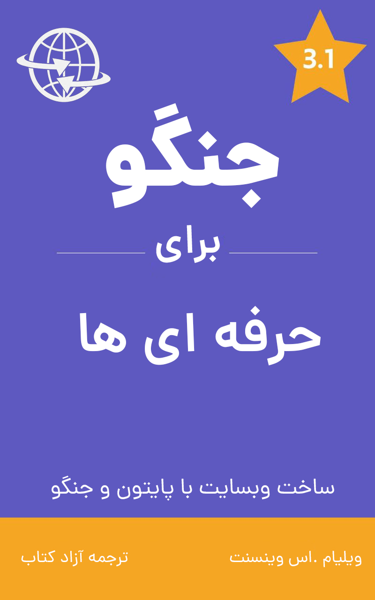

<h1 dir="rtl"> ترجمه آزاد کتاب  Django for Professionals</h1>

قبل از شروع فهرست کتاب اگر، اگر مایل به مشارکت هستید، [نحوه مشارکت](https://github.com/mthri/dfp-persian/blob/main/CONTRIBUTING.md) را حتما مطالعه کنید.

شما می توانید برای کمک کردن و خشنود کردن و انگیزه دادن به تیم ما، اهدای مالی به خیریه محک داشته باشید.
لینک درگاه خیریه محک در سمت راست صفحه درج شده است. لازم به ذکر است که اگر مبلغی را اهدا کرده اید چون ما بی خبر از آن کار هستیم، یک رسید از آن داخل [گروه تلگرامی ما](https://t.me/dfp_farsi) آپلود کنید.

همچنین میتوانید برای دانلود کتاب (نسخه اصلی) از [این لینک](https://github.com/mthri/dfp-persian/raw/main/book/Django_for_Professionals_Production_websites_with_Python_and_Django.pdf) اقدام کنید.

[خواندن کتاب به صورت آنلاین](https://github.com/mthri/dfp-persian/blob/main/book/Django_for_Professionals_Production_websites_with_Python_and_Django.pdf)
  

  
<a href="https://github.com/ftg-iran/dfp-persian/tree/main/0-%20Introduction#%D9%85%D9%82%D8%AF%D9%85%D9%87">مقدمه </a> ✓

   
    
  - <a href="https://github.com/mthri/dfp-persian/tree/main/0-%20Introduction#%D9%BE%DB%8C%D8%B4%D9%86%DB%8C%D8%A7%D8%B2-%D9%87%D8%A7">پیشنیاز ها </a> ✓
  - <a href="https://github.com/mthri/dfp-persian/tree/main/0-%20Introduction#%D8%B3%D8%A7%D8%AE%D8%AA%D8%A7%D8%B1-%DA%A9%D8%AA%D8%A7%D8%A8">ساختار کتاب </a> ✓
  - <a href="https://github.com/mthri/dfp-persian/tree/main/0-%20Introduction#%D8%A2%D8%B1%D8%A7%DB%8C%D8%B4-%DA%A9%D8%AA%D8%A7%D8%A8">آرایش کتاب </a> ✓
  - <a href="https://github.com/mthri/dfp-persian/tree/main/0-%20Introduction#%D9%88%DB%8C%D8%B1%D8%A7%DB%8C%D8%B4%DA%AF%D8%B1-%D9%85%D8%AA%D9%86">ادیتور متن </a> ✓
  - <a href="https://github.com/mthri/dfp-persian/tree/main/0-%20Introduction#%D8%AC%D9%85%D8%B9-%D8%A8%D9%86%D8%AF%DB%8C">نتیجه گیری </a> ✓
    

  
  

  
<a href="https://github.com/mthri/dfp-persian/tree/main/1-%20Docker#%D8%AF%D8%A7%DA%A9%D8%B1">فصل اول : داکر </a> ✓

   

  - <a href="https://github.com/mthri/dfp-persian/tree/main/1-%20Docker#%D8%AF%D8%A7%DA%A9%D8%B1-%DA%86%DB%8C%D8%B3%D8%AA">داکر چیست </a> ✓
  - <a href="https://github.com/mthri/dfp-persian/tree/main/1-%20Docker#%DA%A9%D8%A7%D9%86%D8%AA%DB%8C%D9%86%D8%B1-%D9%87%D8%A7-containers-%D8%AF%D8%B1-%D9%85%D9%82%D8%A7%DB%8C%D8%B3%D9%87-%D8%A8%D8%A7-%D9%85%D8%AD%DB%8C%D8%B7-%D9%87%D8%A7%DB%8C-%D9%85%D8%AC%D8%A7%D8%B2%DB%8C">تفاوت کانتینر ها و Virtual Environments </a> ✓
  - <a href="https://github.com/mthri/dfp-persian/tree/main/1-%20Docker#%D9%86%D8%B5%D8%A8-%D8%AF%D8%A7%DA%A9%D8%B1">نصب داکر </a> ✓
  - <a href="https://github.com/mthri/dfp-persian/tree/main/1-%20Docker#hello-world">Hello World با داکر </a> ✓
  - <a href="https://github.com/mthri/dfp-persian/tree/main/1-%20Docker#%D8%AC%D9%86%DA%AF%D9%88-hello-world">Hello World با جنگو </a> ✓
  - <a href="https://github.com/mthri/dfp-persian/tree/main/1-%20Docker#%D8%A7%D9%BE-pages">اپ pages </a> ✓
  - <a href="https://github.com/mthri/dfp-persian/tree/main/1-%20Docker#%D8%A7%DB%8C%D9%85%DB%8C%D8%AC-%D9%87%D8%A7-%DA%A9%D8%A7%D9%86%D8%AA%DB%8C%D9%86%D8%B1-%D9%87%D8%A7-%D9%88-%D9%85%DB%8C%D8%B2%D8%A8%D8%A7%D9%86%DB%8C-%D8%AF%D8%A7%DA%A9%D8%B1">تصاویر و کانتینر ها و میزبانی داکر </a> ✓
  - <a href="https://github.com/mthri/dfp-persian/tree/main/1-%20Docker#%DA%AF%DB%8C%D8%AA">گیت </a> ✓
  - <a href="https://github.com/mthri/dfp-persian/tree/main/1-%20Docker#%D9%86%D8%AA%DB%8C%D8%AC%D9%87-%DA%AF%DB%8C%D8%B1%DB%8C">جمع بندی </a> ✓

  
<a href="https://github.com/mthri/dfp-persian/tree/main/2-%20PostgreSQL#%D9%81%D8%B5%D9%84-%D8%AF%D9%88%D9%85--postgresql">فصل دوم : PostgreSQL </a> ✓

   
  
  - <a href="https://github.com/mthri/dfp-persian/tree/main/2-%20PostgreSQL#%D8%B4%D8%B1%D9%88%D8%B9-%D8%A8%D9%87-%DA%A9%D8%A7%D8%B1">شروع به کار </a> ✓
  - <a href="https://github.com/mthri/dfp-persian/tree/main/2-%20PostgreSQL#docker">داکر ✓ </a>
  - <a href="https://github.com/mthri/dfp-persian/tree/main/2-%20PostgreSQL#%D8%AD%D8%A7%D9%84%D8%AA-%D8%AA%D9%81%DA%A9%DB%8C%DA%A9-%D8%B4%D8%AF%D9%87-detached-mode">حالت تفکیک شده (Detached Mode) </a> ✓
  - <a href="https://github.com/mthri/dfp-persian/tree/main/2-%20PostgreSQL#postgresql">PostgreSQL </a> ✓
  - <a href="https://github.com/mthri/dfp-persian/tree/main/2-%20PostgreSQL#settings">تنظیمات </a> ✓
  - <a href="https://github.com/mthri/dfp-persian/tree/main/2-%20PostgreSQL#psycopg">Psycopg </a> ✓
  - <a href="https://github.com/mthri/dfp-persian/tree/main/2-%20PostgreSQL#%D8%AF%DB%8C%D8%AA%D8%A7%D8%A8%DB%8C%D8%B3-%D8%AC%D8%AF%DB%8C%D8%AF">دیتابیس جدید </a> ✓
  - <a href="https://github.com/mthri/dfp-persian/tree/main/2-%20PostgreSQL#%DA%AF%DB%8C%D8%AA">گیت </a> ✓
  - <a href="https://github.com/mthri/dfp-persian/tree/main/2-%20PostgreSQL#%D9%86%D8%AA%DB%8C%D8%AC%D9%87">جمع بندی </a> ✓
    

  
<a href="https://github.com/mthri/dfp-persian/tree/main/3-%20Bookstore%20Project%20#%D9%BE%D8%B1%D9%88%DA%98%D9%87-%DA%A9%D8%AA%D8%A7%D8%A8-%D9%81%D8%B1%D9%88%D8%B4%DB%8C">فصل سوم : پروژه فروشگاه کتاب </a> ✓

   
    
  - <a href="https://github.com/mthri/dfp-persian/tree/main/3-%20Bookstore%20Project%20#%D8%AF%D8%A7%DA%A9%D8%B1">داکر </a> ✓
  - <a href="https://github.com/mthri/dfp-persian/tree/main/3-%20Bookstore%20Project%20#postgresql">PostgreSQL </a> ✓
  - <a href="https://github.com/mthri/dfp-persian/tree/main/3-%20Bookstore%20Project%20#%D9%85%D8%AF%D9%84-%DB%8C%D9%88%D8%B2%D8%B1-%D8%B3%D9%81%D8%A7%D8%B1%D8%B4%DB%8C">مدل کاربر شخصی سازی شده (Custom User Model) </a> ✓
  - <a href="https://github.com/mthri/dfp-persian/tree/main/3-%20Bookstore%20Project%20#%D9%81%D8%B1%D9%85-%D8%B3%D9%81%D8%A7%D8%B1%D8%B4%DB%8C-%DB%8C%D9%88%D8%B2%D8%B1">فرم های کاربر شخصی سازی شده (Custom User Forms) </a> ✓
  - <a href="https://github.com/mthri/dfp-persian/tree/main/3-%20Bookstore%20Project%20#%D8%B3%D8%B1%D9%BE%D8%B1%D8%B3%D8%AA-%DA%A9%D8%A7%D8%B1%D8%A8%D8%B1-%D8%B3%D9%81%D8%A7%D8%B1%D8%B4%DB%8C">پنل ادمین کاربر شخصی سازی شده (Custom User Admin) </a> ✓
  - <a href="https://github.com/mthri/dfp-persian/tree/main/3-%20Bookstore%20Project%20#%D8%A7%D8%A8%D8%B1-%DA%A9%D8%A7%D8%B1%D8%A8%D8%B1">سوپریوزر (Superuser) </a> ✓
  - <a href="https://github.com/mthri/dfp-persian/tree/main/3-%20Bookstore%20Project%20#%D8%AA%D8%B3%D8%AA">تست </a> ✓
  - <a href="https://github.com/mthri/dfp-persian/tree/main/3-%20Bookstore%20Project%20#%D8%AA%D8%B3%D8%AA-%D9%87%D8%A7%DB%8C-%D9%88%D8%A7%D8%AD%D8%AF">یونیت تست ها </a> ✓
  - <a href="https://github.com/mthri/dfp-persian/tree/main/3-%20Bookstore%20Project%20#%DA%AF%DB%8C%D8%AA">گیت </a> ✓
  - <a href="https://github.com/mthri/dfp-persian/tree/main/3-%20Bookstore%20Project%20#%D9%86%D8%AA%DB%8C%D8%AC%D9%87-%DA%AF%DB%8C%D8%B1%DB%8C">جمع بندی </a> ✓
    

  
<a href="https://github.com/mthri/dfp-persian/tree/main/4-%20Pages%20App#%D9%81%D8%B5%D9%84--%DA%86%D9%87%D8%A7%D8%B1%D9%85--pages-app">فصل چهارم : اپ Pages </a> ✓

   
    
  - <a href="https://github.com/mthri/dfp-persian/tree/main/4-%20Pages%20App#templates">تمپلیت ها </a> ✓
  - <a href="https://github.com/mthri/dfp-persian/tree/main/4-%20Pages%20App#urls-and-views">ٰViewها و URL ها </a> ✓
  - <a href="https://github.com/mthri/dfp-persian/tree/main/4-%20Pages%20App#tests">تست ها </a> ✓
  - <a href="https://github.com/mthri/dfp-persian/tree/main/4-%20Pages%20App#testing-templates">تست کردن تمپلیت ها </a> ✓
  - <a href="https://github.com/mthri/dfp-persian/tree/main/4-%20Pages%20App#testing-html">تست کردن HTML </a> ✓
  - <a href="https://github.com/mthri/dfp-persian/tree/main/4-%20Pages%20App#setup-method">متد setUP </a> ✓
  - <a href="https://github.com/mthri/dfp-persian/tree/main/4-%20Pages%20App#resolve">Resolve </a> ✓
  - <a href="https://github.com/mthri/dfp-persian/tree/main/4-%20Pages%20App#git">گیت </a> ✓
  - <a href="https://github.com/mthri/dfp-persian/tree/main/4-%20Pages%20App#%D8%AE%D9%84%D8%A7%D8%B5%D9%87">جمع بندی </a> ✓
    

  

  
<a href="https://github.com/mthri/dfp-persian/tree/main/5-%20User%20Registration#%D9%81%D8%B5%D9%84--%D9%BE%D9%86%D8%AC%D9%85--user-registeration">فصل پنجم : ثبت نام کاربر (مقدماتی)</a> ✓

   
    
  - <a href="https://github.com/mthri/dfp-persian/tree/main/5-%20User%20Registration#auth-%D8%A7%D9%BE">اپ Auth</a> ✓
  - <a href="https://github.com/mthri/dfp-persian/tree/main/5-%20User%20Registration#auth-%D9%87%D8%A7%DB%8C-%D8%A7%D9%BEurl-%D9%87%D8%A7-%D9%88-view">View ها و URL های اپ Auth</a> ✓
  - <a href="https://github.com/mthri/dfp-persian/tree/main/5-%20User%20Registration#%D8%B5%D9%81%D8%AD%D9%87-%D8%A7%D8%B5%D9%84%DB%8C-homepage">صفحه اصلی (Homepage)</a> ✓
  - <a href="https://github.com/mthri/dfp-persian/tree/main/5-%20User%20Registration#%D8%B3%D9%88%D8%B1%D8%B3-%DA%A9%D8%AF-%D8%AC%D9%86%DA%AF%D9%88">سورس کد جنگو</a> ✓
  - <a href="https://github.com/mthri/dfp-persian/tree/main/5-%20User%20Registration#%D9%84%D8%A7%DA%AF%DB%8C%D9%86-%DA%A9%D8%A7%D8%B1%D8%A8%D8%B1">لاگین کاربر</a> ✓
  - <a href="https://github.com/mthri/dfp-persian/tree/main/5-%20User%20Registration#%D8%B1%DB%8C%D8%AF%D8%A7%DB%8C%D8%B1%DA%A9%D8%AA-%D9%87%D8%A7redirects">ریدارکت ها (Redirects)</a> ✓
  - <a href="https://github.com/mthri/dfp-persian/tree/main/5-%20User%20Registration#%D9%84%D8%A7%DA%AF-%D8%A7%D9%88%D8%AA-%DA%A9%D8%A7%D8%B1%D8%A8%D8%B1-log-out">لاگ اوت کاربر (Log Out)</a> ✓
  - <a href="https://github.com/mthri/dfp-persian/tree/main/5-%20User%20Registration#%D8%AB%D8%A8%D8%AA-%D9%86%D8%A7%D9%85-%DA%A9%D8%A7%D8%B1%D8%A8%D8%B1">ثبت نام کاربر</a> ✓
  - <a href="https://github.com/mthri/dfp-persian/tree/main/5-%20User%20Registration#%D8%AA%D8%B3%D8%AA-%D9%87%D8%A7">تست ها</a> ✓
  - <a href="https://github.com/mthri/dfp-persian/tree/main/5-%20User%20Registration#setuptestdata">setUpTestData()</a> ✓
  - <a href="https://github.com/mthri/dfp-persian/tree/main/5-%20User%20Registration#%DA%AF%DB%8C%D8%AA">گیت</a> ✓
  - <a href="https://github.com/mthri/dfp-persian/tree/main/5-%20User%20Registration#%D8%AC%D9%85%D8%B9-%D8%A8%D9%86%D8%AF%DB%8C">جمع بندی</a> ✓
    

  

  
<a href="https://github.com/mthri/dfp-persian/tree/main/6-%20Static%20Assets#%D9%81%D8%B5%D9%84-%D8%B4%D8%B4%D9%85-static-assets">فصل ششم : اشیاء استاتیک (Static Assets)</a> ✓

   
  
  - <a href="https://github.com/mthri/dfp-persian/tree/main/6-%20Static%20Assets#%D8%A8%D8%B1%D9%86%D8%A7%D9%85%D9%87-staticfiles">اپ staticfiles</a> ✓
  - <a href="https://github.com/mthri/dfp-persian/tree/main/6-%20Static%20Assets#static_url">STATIC_URL</a> ✓
  - <a href="https://github.com/mthri/dfp-persian/tree/main/6-%20Static%20Assets#staticfiles_dirs">STATICFILES_DIR</a> ✓
  - <a href="https://github.com/mthri/dfp-persian/tree/main/6-%20Static%20Assets#static_root">STATIC_ROOT</a> ✓
  - <a href="https://github.com/mthri/dfp-persian/tree/main/6-%20Static%20Assets#staticfiles_finders">STATIC_FINDERS</a> ✓
  - <a href="https://github.com/mthri/dfp-persian/tree/main/6-%20Static%20Assets#%D8%AF%D8%A7%DB%8C%D8%B1%DA%A9%D8%AA%D9%88%D8%B1%DB%8C%D9%87%D8%A7%DB%8C-%D8%A7%D8%B3%D8%AA%D8%A7%D8%AA%DB%8C%DA%A9">پوشه استاتیک (Static directory)</a> ✓
  - <a href="https://github.com/mthri/dfp-persian/tree/main/6-%20Static%20Assets#%D8%AA%D8%B5%D8%A7%D9%88%DB%8C%D8%B1">تصاویر</a> ✓
  - <a href="https://github.com/mthri/dfp-persian/tree/main/6-%20Static%20Assets#%D8%AC%D8%A7%D9%88%D8%A7-%D8%A7%D8%B3%DA%A9%D8%B1%DB%8C%D9%BE%D8%AA">جاوا اسکریپت</a> ✓
  - <a href="https://github.com/mthri/dfp-persian/tree/main/6-%20Static%20Assets#collectstatic">collectstatic</a> ✓
  - <a href="https://github.com/mthri/dfp-persian/tree/main/6-%20Static%20Assets#bootstrap">بوت استرپ (Bootstrap)</a> ✓
  - <a href="https://github.com/mthri/dfp-persian/tree/main/6-%20Static%20Assets#%D8%B5%D9%81%D8%AD%D9%87%DB%8C-about">صفحه درباره ما (About Page)</a> ✓
  - <a href="https://github.com/mthri/dfp-persian/tree/main/6-%20Static%20Assets#%D9%81%D8%B1%D9%85%D9%87%D8%A7%DB%8C-%DA%A9%D8%B1%DB%8C%D8%B3%D9%BE%DB%8C-%D8%AC%D9%86%DA%AF%D9%88">کار باDjango Crispy Forms</a> ✓
  - <a href="https://github.com/mthri/dfp-persian/tree/main/6-%20Static%20Assets#%D8%AA%D8%B3%D8%AA-%D9%87%D8%A7">تست ها</a> ✓
  - <a href="https://github.com/mthri/dfp-persian/tree/main/6-%20Static%20Assets#%DA%AF%DB%8C%D8%AA">گیت</a> ✓
  - <a href="https://github.com/mthri/dfp-persian/tree/main/6-%20Static%20Assets#%D9%86%D8%AA%DB%8C%D8%AC%D9%87%DA%AF%DB%8C%D8%B1%DB%8C">حمع بندی</a> ✓
  

  

  
فصل هفتم : ثبت نام کاربر (پیشرفته) &check;

   
  
  - django-allauth &check;
  - AUTHENTICATION_BACKENDS &check;
  - EMAIL_BACKEND &check;
  - ACCOUNT_LOGOUT_REDIRECT &check;
  - URL ها &check;
  - تمپلیت ها &check;
  -  ورود کاربر (Log in) &check;
  - خروج کاربر (Log Out) &check;
  - ثبت نام کاربر (Sign Up) &check;
  - تنظیمات پنل ادمین &check;
  - ورود کاربر فقط با ایمیل (Email Only Login) &check;
  - تست ها &check;
  - احراز هویت با شبکه های اجتماعی &check;
  - گیت &check;
  - جمع بندی &check;
  

  

  
فصل هشتم : متغییر های Environment &check;

   
  
  - environs[django] &check;
  - SECRET_KEY &check;
  - DEBUG و ALLOWED_HOSTS &check;
  - DATABASES &check;
  - گیت &check;
  - جمع بندی &check;
  

  

  
فصل نهم : ایمیل &check;

   
  
  - تایید ایمیل شخصی سازی شده &check;
  - صفحه تایید ایمیل &check;
  - تغییر و بازنشانی رمز &check;
  - سرویس ایمیل در جنگو &check;
  - گیت &check;
  - جمع بندی &check;
  

  

  
فصل دهم : اپ Books &check;

   
  
  - Model ها &check;
  - پنل ادمین &check;
  - URL ها &check;
  - View ها &check;
  - تمپلیت ها &check;
  - object_list &check;
  - صفحه جداگانه برای هر کتاب &check;
  - context_object_name &check;
  - get_absolute_url &check;
  - تفاوت Primary Keys با ID ها &check;
  - تفاوت Slug ها با UUID ها &check;
  - نوار پیمایش (Navbar) &check;
  - تست ها &check;
  - گیت &check;
  - جمع بندی &check;
    

  

  
فصل یازدهم : اپ Reviews &check;

   
  
  - Foreign Key ها &check;
  - مدل Review ها &check;
  - تنظیم ادمین پنل &check;
  - تمپلیت ها &check;
  - تست ها &check;
  - گیت &check;
  - جمع بندی &check;
  

  

  
فصل دوازدهم : اپلود فایل ها و تصاویر &check;

   
  
  - فایل های رسانه ای (Media Files) &check;
  - Model ها &check;
  - تنظیم پنل ادمین &check; 
  - تمپلیت ها &check;
  - قدم های فراتر &check;
  - گیت &check;
  - جمع بندی &check;
  

  
فصل سیزدهم : دسترسی ها (Permissions) &check;

   
  
  - فقط کاربر های وارد شده مجازند (Logged-In Users Only) &check;
  - دسترسی ها &check;
  - دسترسی های شخصی سازی شده (Custom Permissions) &check;
  - دسترسی های کاربر &check;
  - PermissionRequiredMixin &check;
  - گروه ها و UserPassesTestMixin &check;
  - تست ها &check;
  - گیت &check;
  - جمع بندی &check;
    

  

  
فصل چهاردهم : جستوجو &check;

   
  
  - صفحه نتایج جستوجو &check;
  - فیلتر های مقدماتی (Basic Filtering) &check;
  - اشیاء Q (Q Objects) &check;
  - Form ها &check;
  - Form جستوجو &check;
  - گیت &check;
  - جمع بندی &check;
    

  

  
فصل پانزدهم : کارایی &check;

   
  
  - ابزار django-debug-toolbar &check;
  - آنالیز صفحه ها &check; 
  - select_related و prefetch_related &check;
  - کشینگ (Caching) &check;
  - ایندکس ها (Indexes) &check;
  - django-extensions &check;
  - فرانت اند و متعلقات آن &check;
  - گیت &check;
  - جمع بندی &check;
    

  

  
فصل شانزدهم : امینت &check;

   
  
  - مهندسی اجتماعی (Social Engineering) &check;
  - آپدیت های جنگو &check;
  - چک لیست های دیپلویمنت (Deployment Checklist) &check;
  - docker-compose-prod.yml &check;
  - DEBUG &check;
  - پیش فرض ها (Defaults) &check;
  - SECRET_KEY &check;
  - امنیت وب &check;
  - تزریق SQL (SQL injection) &check;
  - تزریق اسکریپت از طریق وبگاه (XSS) &check;
  - جعل درخواست میان وبگاهی (CSRF) &check;
  - مقابله با کلیک دزدی (Clickjacking Protection) &check;
  - HTTPS/SSL &check;
  - انتقال اکیدا ایمن HTTP (HSTS) &check;
  - ایمن کردن کوکی ها  &check;
  - ارتقا امنیت ادمین (Admin Hardening) &check;
  - گیت &check;
  - جمع بندی &check;
    

  
  

  
فصل هفدهم : دیپلویمنت &check;

   
  
  -  تفاوت PasS و IasS &check;
  - WhiteNoise &check;
  - فایل های رسانه ای (Media Files) &check;
  - Gunicorn &check;
  - Heroku &check;
  - دیپلویمنت با داکر &check;
  - heroku.yml &check;
  - دیپلوی Heroku &check;
  - SECURE_PROXY_SSL_HEADER &check;
  - لاگ های Heroku &check;
  - افزونه های Heroku &check;
  - جمع بندی &check;
  

  

  
جمع بندی نهایی &check;

   
  
  - منابع یادگیری بیشتر &check;
  - بازخورد ها &check;
  

  
<h2 dir="rtl">
مشارکت کنندگان
</h2>

  
|نام همکار|راه های ارتباطی|نوع مشارکت
|:-:|:-:|:-:|
|امیر مطهری|[گیتهاب](https://github.com/mthri) [لینکدین](https://www.linkedin.com/in/amir-motahari-963689138/) [توییتر](https://twitter.com/a_mthri) [تلگرام](https://t.me/a_motahari)|اداره مخزن - مترجم فصل ۱۶|
|امید شهبازی|[گیتهاب](https://github.com/themaximalist) [لینکدین](https://linkedin.com/in/omid-shahbazi-76635b21b)| اداره مخزن - مترجم مقدمه|
|حدیث سادات موسوی|[گیتهاب](https://github.com/cemusavi) [لینکدین](https://linkedin.com/in/hadis-sadat-mousavi-178108219)|مترجم فصل های ۱و۳|
|خلیل فراشیانی|[گیتهاب](https://github.com/khalil-farashiani) [لینکدین](https://linkedin.com/in/khalil-farashiani-36393b21a)|مترجم فصل های۷ و جمع بندی|
|مائده شهابی|[گیتهاب](https://github.com/mashahabi15)|مترجم فصل ۹|
|سید محمد حسین طباطبایی|[گیتهاب](https://github.com/smhtbtb) [لینکدین](https://linkedin.com/in/mohammad-hosein-tabatabaei)|مترجم فصل ۱۲|
|آرین قوچانی|[گیتهاب](https://github.com/arianghoochani) [لینکدین](https://linkedin.com/in/arian-ghoochani-690980168)|مترجم فصل ۱۳|
|امین مرادی|[گیتهاب](https://github.com/aminmoradim) [توییتر](https://twitter.com/amin_moradim) [تلگرام](https://t.me/amin_moradim)|مترجم فصل ۸ |
|کسری صادقیان پور|[گیتهاب](https://github.com/Kasra1377) [لینکدین](https://linkedin.com/in/kasra-sadeghian-pour-87a928204)|مترجم فصل ۲|
|علی لویویی|[گیتهاب](https://github.com/aliloloee)|مترجم فصل ۱۰|
|رضا مبارکی|[گیتهاب](https://github.com/MrRezoo) [لینکدین](https://www.linkedin.com/in/mrrezoo/) |مترجم ۱۵|
|سحر مکرمی|[گیتهاب](https://github.com/mokarramis)|مترجم فصل ۵|
|مهدی شیر خدایی|[گیتهاب](https://github.com/Mimshimzim)|مترجم ۱۷|
|مهدی اسد زاده|[گیتهاب](https://github.com/mahdi-asadzadeh) [تلگرام](https://t.me/mahdi_asadzadeh)|مترجم فصل ۱۱|
|امیرحسین صالحی|[گیتهاب](https://github.com/Amir796-hash)|مترجم فصل ۴|
|امیرحسین محمدی|[گیتهاب](https://github.com/BlackIQ) [لینکدین](https://linkedin.com/in/amirhosseinmohammadi) [توییتر](https://twitter.com/GNU_Amir)  [تلگرام](https://t.me/BlackIQ)| اداره مخزن|
|محمدرضا ارغشی|[گیتهاب](https://github.com/phpreza)|مترجم فصل ۶| 
|امیررضا پاسندی|[گیتهاب](https://github.com/amirpsd) [تلگرام](https://t.me/amir_psd2)|مترجم فصل ۱۴|
|شمیم صنیع ثالث|[گیتهاب](https://github.com/smimahs) [لینکدین](https://www.linkedin.com/in/shsanisales/)|مترجم فصل ۳|
  

